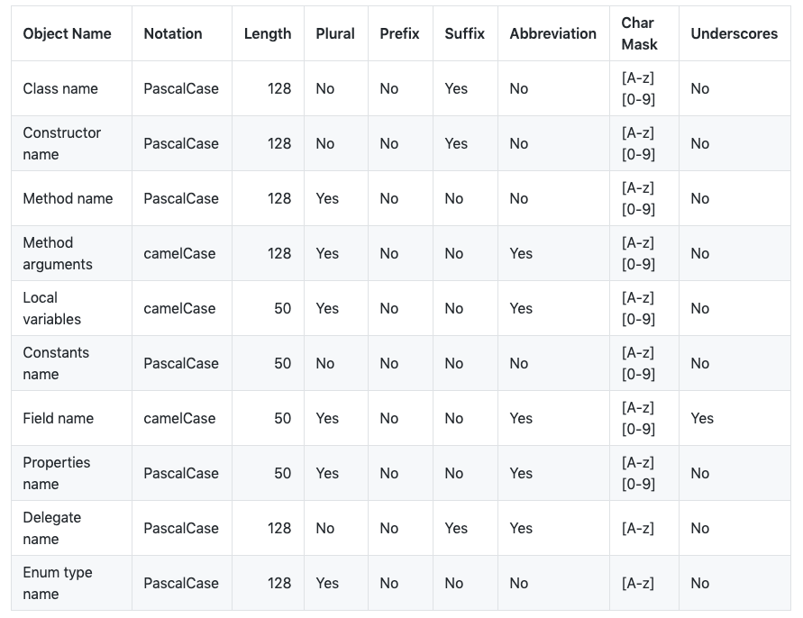

# 第一月：

**时间：2019.05.20-2019.06.20**

**目标：能够独立完成基本的问题解决和开发工作，融入团队**

---

# Day 1 - 2: 05.20 - 05.21

入职并配置环境

# Day 3: 05.22

**今天主要的成绩是熟悉了开发环境，领到了任务，并且完成了提交。**

**同时希望仿照[_马里奥制造2_](https://www.youtube.com/watch?v=jPi-u0D8sQ4)，开发一个地图编辑器的拖拽放置功能。**

## 开发环境

开发过程中主要用到的软件包括：Unity、RIder、IntelliJ、Excel、Terminal、Jira、SourceTree

* Unity：预览各类游戏场景和进行试玩
* Rider：编写和调试Unity工程中涉及的C_#_代码
* IntelliJ：编写和调试Unity工程中涉及的Lua代码
* Excel：查看游戏策划维护的各种表格
* Terminal：运行脚本，用于将excel表格转化为json和lua等游戏中可以被读取的格式
* Jira：在线协作平台，用于领取和完成任务
* SourceTree：拉取和推送代码

## Terminal转化表格

在`wod-shared`目录下运行`./conv.sh all`命令即可

## IntelliJ与Unity的协作

1. 搜索并安装_AmmyLua_插件，可以让Lua代码高亮显示

   

2. 在IntelliJ中选择从源码新建工程，然后根目录选择Unity工程中的Lua目录

   

## Rider 与Unity的协作

1. 如果安装了Rider，可以直接在Unity中双击C_#_文件，即可自动打开Rider

2. 在Rider中，可以通过输出或者加入断点的方式来进行代码调试，输出除了使用标准的`print()`之外，还可以使用定义好的`Debug.Log(Message)`方法来输出Message信息。如果是添加断点，在添加之后，需要开启调试模式，即右上角的绿色Bug，之后在Unity中运行游戏，即可在断点中停止。

   

## 提交任务

1. 今天还改了一个Bug，是关于地图中建筑物种类的，建筑物共有21种，种类编号为1到21，而数组从0-20，所以编号作为数组下标时需要进行`-1`操作，而代码漏掉了`-1`，导致删除出错。

2. 修改代码并确认没问题后就可以进行提交了，提交时注意在暂存区只保留自己修改的代码，并且在右侧确认所有修改部分都是正确的，都确认好后，在commit中输入注释，提交即可。

3. 今天在拉取时出现了另一种冲突，即本地文件比远端文件多的情况，在SourceTree中以蓝色形式展现，不同于黄色的相异，这种冲突不能通过重置解决，解决方式为删除本地的文件，选择移除即可。

   


# Day 4 - 6: 05.24, 05.27 - 05.28

## Unity中物体的选取

理解鼠标选取和拾取物体的逻辑

1. 思想为：鼠标点击时，从观察摄像机中发射一条射线，通过判断射线接触到的模型是否为可以被拾取的物体，来确定最终的结果

2. 代码如下：

   ```c#
   private Ray _ray;
   private Vector3 hitPoint;
   public void OnTouchDown(Ray ray)
   {
     _ray = ray;
     RaycastHit hit;
     // hit是击中的物体，判断是否是可以被拾取的物体
     if (Physics.Raycast(ray, out hit) && 
         (hit.collider.gameObject.tag == "ObjectCanBePicked"))
     {
       
       // 记录射线击中的位置
       hitPoint = hit.point;
       // 对选中物体进行操作
       MouseClickedObject = Ground.instance.ObjectsList(hit.collider.gameObject);
     }
     else
     {
       // 没有选中任何物体
       MouseClickedObject = null;
     }
   }
    
   // 将射线可视化
   private void OnDrawGizmos()
   {
     Gizmos.color = Color.red;
     Gizmos.DrawLine(_ray.origin, hitPoint);
   }
   ```
   
3. 设置物体tag：

   

4.拾取物体逻辑图


```flow
st=>start: 点击事件

cond1=>condition: 判断被点击物体是否可被拾取

op1=>operation: 选中地面，清空当前选中物体

cond2=>condition: 判断与当前选中物体是否相同

op2=>operation: 选中新物体，更新当前选中物体

e=>end: 结束框

st->cond1

cond1(yes)->cond2

cond1(no)->op1->e

cond2(yes)->op1->e

cond2(no)->op2->e

```

## Rider中一些使用技巧

1. 使用`Ctrl+Shift+F`，可以进行跨文件查找

2. 在菜单栏中的View中，勾选Toolbar，可以显示更多功能，其中有一个十分实用的功能：跳回上次代码的位置，应用在查看某个函数的实现后，回到原始位置。快捷键为`Command+减号`和`Command+Shift+减号`，如果鼠标支持侧键，则可以更方便的在代码间跳转。

3. 调试模式中，有时断点打上后会变成灰色。这种情况不用担心，只是说明程序目前不一定会执行到这里

   
# Day 7: 05.29

## 在Scene中进行对象的绑定

首先我们有一个定义在脚本中的场景类，类中有一些成员变量，比如一个`Text`，叫`textForShow`，我们希望通过这个`Text`来直接控制Unity中某个场景中显示的文本，比如UI中的一个信息`ButtonText`，除了在脚本中动态获得这个`GameObject`以外，我们还可以直接在Unity中进行可视化的绑定。方法如下：

1. 找到这个场景对应的`GameObject`，这时如果它绑定了场景脚本，就能够看到它对应的成员；

2. 之后同样在Hierarchy栏中找到希望绑定的UI；

3. 将UI拖动到成员变量之后即可完成绑定；

4. 绑定后，可以在代码中通过对成员变量的修改，直接控制UI界面。

   


## SourceTree 提交前需要先拉取并解决冲突

每次进行提交前，务必进行拉取操作，否则就会使得代码流进行分流，如下图所示。原因在于，提交前，你的代码并不是最新的，所以你提交之后会从旧版本中新增一个分支。


解决方法：选择分叉的点，然后选择"回退"，之后选择软合并即可。


# Day 8-9: 05.30 - 05.31

**今天已经开始接到策划的需求，开始着手实现了，而且不仅局限在_NoBuild_部分的代码，也包括核心的_Scripts_代码**

## Git&SourceTree理解

目前我对git和SourceTree的理解是：git是一套代码版本控制方案，而SourceTree是应用这套方案实现的可视化工具。git中，为了保证每个人的代码都是最新的，需要在提交之前进行一次拉取操作，保证代码先与远端代码一致，之后再提交自己的修改。提交时出错一般是由于代码不是最新版本导致的，这时可以重置到提交以前，再次拉取。而拉取时经常出现的问题就是冲突，原因是我拉取了一个旧版本的代码，并在上面做了一些修改，而这时远端代码突然有了一个新版本，对这个文件同样进行了修改。这样就会导致，如果我直接拉取，则本地的修改就会被覆盖，因此需要先将本地修改的内容重置，再进行拉取即可。

工作中，策划一般负责表格部分，一切对表格的修改，要先跟策划说，让策划提交修改后的表格，而不是自己改好之后提交。程序负责提交所有的代码部分，包括表格导出的代码。

## Rider中一些使用技巧

1. 使用`Ctrl+T`，搜索文件名、函数名等，并直接跳转到文件；
2. 使用`Ctrl+Shift+F`可以跨文件搜索文本；
3. 使用`Ctrl+G`，打开跳转菜单，输入行号可以直接跳转到指定行；
4. 

## 编码经验

1. 数据结构很重要。针对不同的目标，使用不同的数据结构，比如项目中存储不同类型的建筑物，每个建筑物有一个_索引ID_，就比较适合用Dictionary_，_ID_为_Key，而如果用list存储，用下标在list中查找，就会导致后期对ID有一些要求，比如必须跟下标一致等，导致编码繁琐。
2. 多增少改。如果需要改接口，尽量在原有基础上增加一个新的，而不是直接修改旧的接口。因为旧的接口可能被很多地方使用，而新的接口只需要当前使用，当然如果是1中所说的情况，则最好从本质上解决问题。

# Day 10-11: 06.03 - 06.04

## Jira协作平台的使用&提交前保存Unity场景

这两天主要完成了两个工作：

- 地图编辑器建筑物新增位置的bug修改，不会新增在原点。
- 地图编辑器的批量新增和删除功能。

因此也完成了之前Jira中策划提出的一些需求，在提交代码的同时，也需要修改一下Jira中任务的状态，主要就是将状态修改为"验收中"即可。

另外需要注意的一点是，提交前一定要在Unity中进行一次保存操作，主要针对场景文件的保存。

## Unity中对摄像机的固定

当前项目中，一个拖动动作主要涉及两种情况，一种是拖动整个场景，类似于软件中常见的"抓手"功能，需要移动整个相机，另一种就是拖动场景中的某个物体，这时摄像机应该是固定的，改变的是物体与场景的相对位置关系。项目中涉及的区分两种情况的代码：

```c#
// 两项设置为false可以锁定摄像
// 设置为true则可以保持鼠标与相机的相对移动

BECameraRTS.instance.camPanningUse = false;
BECameraRTS.instance.InertiaUse = false;
```


# Day 12-22: 06.05 - 06.20

## Rider中对变量的重命名

如果需要修改一个变量的名称，而且希望同步修改所有引用到的位置，在选中变量之后使用`Command+R+R`可以一次性完成所有修改，该方法也可以通过右键变量，找到`Refactor`中的`Rename`即可。


## C#命名规范



更多规则详见[github]([https://github.com/ktaranov/naming-convention/blob/master/C%23%20Coding%20Standards%20and%20Naming%20Conventions.md](https://github.com/ktaranov/naming-convention/blob/master/C%23 Coding Standards and Naming Conventions.md)).

## Unity中对Prefab加锁的前端实现

需求：

> xlock
>
> - 每个锁都有名字（字符串，比较时大小写不敏感，存储、显示时有大小写）
>
> - 所有 api 的返回值都用 json 表示
>
> - 可以通过 lock 加锁，参数：lockName、userName
>
>   - 如获取成功，返回 {"result": "ok"}
>
>   - 同一 userName 可重复获取已持有的锁，返回 {"result": "already"}
>
>   - 如果该锁已被他人获取，返回 {"error": "the lock is being hold by xxx"}，xxx 是持有者 userName
>
>   - 其它错误，返回 {"error": "..."}，填充实际错误信息
>
> - 可以通过 unlock 解锁，参数：lockName、userName
>
>   - 如该用户持有该锁，执行解锁，如果成功，返回 {"result": "ok"}
>
>   - 对于同一个锁，不管之前曾重复执行过多少次 lock，一次 unlock 就解锁
>
>   - 如果该锁未被任何用户持有，返回 {"error": "the lock is not being hold by anyone"}
>
>   - 如果该锁正被其他用户持有，返回 {"error": "the lock is being hold by xxx"}，xxx 是持有者 userName
>
>   - 其它错误，返回 {"error": "..."}，填充实际错误信息
>
> - 可以通过 steal 偷锁，参数：lockName、userName
>
>   - 如果该锁正被他人持有，改换持有者，如成功，返回 {"result": "ok"}
>
>   - 如果该锁无人持有，返回 {"error": "the lock is not being hold by anyone"}
>
>   - 同一 userName 可重复偷已持有的锁，返回 {"result": "already"}
>
>   - 其它错误，返回 {"error": "..."}，填充实际错误信息
>
> - 可以通过 lockInfo 查询指定锁的状态
>
>   - 如果未被任何人持有，返回 {"result": "free"}
>
>   - 如果正被某人持有，返回 {"result": "being hold by xxx"}
>
>   - 如发生意外，返回 {"error": "..."}，填充实际错误信息
>
> - 可以通过 list 查询指定用户持有的锁，参数：userName
>
>   - 如果该用户持有锁，返回一个锁名数组：
>   
>   ```
> 	"abc/ddd/file1",
>
> 	"abc/ddd/file2",
>
> 	"abc/ddd/file9"
> 	```
>   
> - 如果未持有任何锁，返回 []
>   
> - 如发生意外，返回 {"error": "..."}，填充实际错误信息
>   
> - 可以通过 listAll 查询所有上锁的锁，无参数
>
>   - 如果有上锁的的锁，返回一个数组：
>
> 	```
> {"lockName": "abc/ddd/file1", "userName": "abc"},
> 	
> 	{"lockName": "abc/ddd/file2", "userName": "abc"},
> 	
> 	{"lockName": "abc/ddd/file9", "userName": "ddd"}
> 	```
> 	
> - 如发生意外，返回 {"error": "..."}，填充实际错误信息
>   
> - 可以通过 log 查询（查询以外的）操作日志，参数：n（默认 100）
>
>   - 返回最后 n 条操作日志（按时间正序排列）：
>   
>   
>   ```
>     "2018-12-13 12:10:15 zhangsan locked abc/ddd/file1",
>
>     "2018-12-13 12:10:18 zhangsan unlocked abc/ddd/file1",
>
>     "2018-12-13 15:10:15 lisi stole abc/ddd/file2",
>
>     "2018-12-13 18:10:15 zhansan tried to lock abc/ddd/file2, but failed, because it was being hold by lisi",
>   ...
>   ```
>   
> - 可以采用任意本地存储保存当前锁状态，极端情况下，可通过删除本地文件清除所有锁
>
> - 查询以外的所有操作都要有日志

后端实现的接口：

> - 所有的请求都是post类型
>
> - 所有的响应都是text/plain 内容都是json格式的
>
> 1. 锁文件 
>
> ```
> request:
> 
> http:10.0.34.161:8899/cmd/lock
> 
> body：”args=-UserName ztr -Note xx -GUID ww"
> 
> response :
> 
> {“Code”:1, “Result”:”ok”}
> ```
>
> 
>
> 2. 解锁文件 
>
> ```
> request:
> 
> http:10.0.34.161:8899/cmd/unlock
> 
> body：”args=-UserName ztr  -GUID ww"
> 
> response:
> 
>  {“Code”:1, “Result”:”ok”}
> ```
>
> 
>
> 3. 偷锁
>
> ```
> request:
> 
> http:10.0.34.161:8899/cmd/stealLock
> 
> body：”args=-UserName ztr  -GUID ww"
> 
> response:
> 
>  {“Code”:1, “Result”:”ok”}
> ```
>
> 
>
> 4. 查询锁的拥有者
>
> ```
> request:
> 
> http:10.0.34.161:8899/cmd/findLockOwner
> 
> body：”args=-GUID ww"
> 
> response:
> 
>  {“Code”:1, “Result”:”ok”， “Data”:owner}
> ```
>
> 
>
> 5. 查询某个人的所有锁
>
> ```
> request:
> 
> http:10.0.34.161:8899/cmd/listOwnLock
> 
> body：”args=-UserName ztr”
> 
> response:
> 
>  {“Code”:1, “Result”:”ok”， “Data”:[]string{“lockOwner”:qtr, “lockName”:xxx, “note”:xxxx}}
> ```
>
> 
>
> 6. 查询所有的锁
>
> ```
> request:
> 
> http:10.0.34.161:8899/cmd/listAll
> 
> response:
> 
>  {“Code”:1, “Result”:”ok”， “Data”:[]string{“lockOwner”:qtr, “lockName”:xxx, “note”:xxxx}}
> ```
>
> 
>
> 7. 查询最近n条的操作log
>
> ```
> request:
> 
> http:10.0.34.161:8899/cmd/listOpLog
> 
> body: “args=-Num 10”
> 
> response:
> 
>  {“Code”:1, “Result”:”ok”， “Data”:[]string{}}
> ```
>
> 