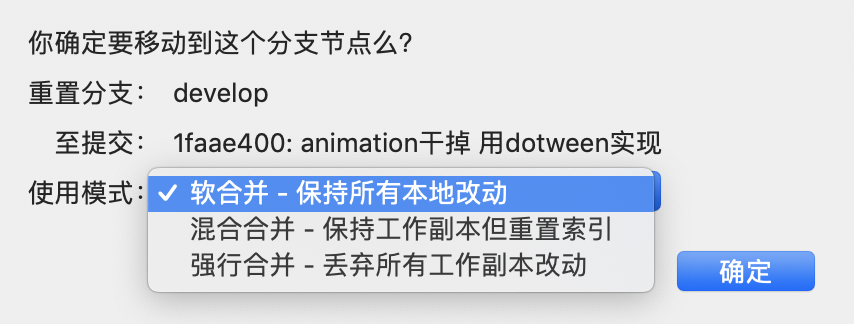

# 第一月：

**时间**：2019.05.20-2019.06.20

**目标**：能够独立完成基本的问题解决和开发工作，融入团队

---

# Day1-2: 05.20 - 05.21

入职并配置环境


# Day 3: 05.22

**今天主要的成绩是熟悉了开发环境，领到了任务，并且完成了提交。**

**同时希望仿照[_马里奥制造2_](https://www.youtube.com/watch?v=jPi-u0D8sQ4)，开发一个地图编辑器的拖拽放置功能。**

## 开发环境

开发过程中主要用到的软件包括：Unity、RIder、IntelliJ、Excel、Terminal、Jira、SourceTree

* Unity：预览各类游戏场景和进行试玩
* Rider：编写和调试Unity工程中涉及的C_#_代码
* IntelliJ：编写和调试Unity工程中涉及的Lua代码
* Excel：查看游戏策划维护的各种表格
* Terminal：运行脚本，用于将excel表格转化为json和lua等游戏中可以被读取的格式
* Jira：在线协作平台，用于领取和完成任务
* SourceTree：拉取和推送代码

## Terminal转化表格

在`wod-shared`目录下运行`./conv.sh all`命令即可

## IntelliJ与Unity的协作

1. 搜索并安装_AmmyLua_插件，可以让Lua代码高亮显示

   

2. 在IntelliJ中选择从源码新建工程，然后根目录选择Unity工程中的Lua目录

   

## Rider 与Unity的协作

1. 如果安装了Rider，可以直接在Unity中双击C_#_文件，即可自动打开Rider

2. 在Rider中，可以通过输出或者加入断点的方式来进行代码调试，输出除了使用标准的`print()`之外，还可以使用定义好的`Debug.Log(Message)`方法来输出Message信息。如果是添加断点，在添加之后，需要开启调试模式，即右上角的绿色Bug，之后在Unity中运行游戏，即可在断点中停止。

   

## 提交任务

1. 今天还改了一个Bug，是关于地图中建筑物种类的，建筑物共有21种，种类编号为1到21，而数组从0-20，所以编号作为数组下标时需要进行`-1`操作，而代码漏掉了`-1`，导致删除出错。

2. 修改代码并确认没问题后就可以进行提交了，提交时注意在暂存区只保留自己修改的代码，并且在右侧确认所有修改部分都是正确的，都确认好后，在commit中输入注释，提交即可。

3. 今天在拉取时出现了另一种冲突，即本地文件比远端文件多的情况，在SourceTree中以蓝色形式展现，不同于黄色的相异，这种冲突不能通过重置解决，解决方式为删除本地的文件，选择移除即可。

   


# Day4-6: 05.24, 05.27 - 05.28

## Unity中物体的选取

理解鼠标选取和拾取物体的逻辑

1. 思想为：鼠标点击时，从观察摄像机中发射一条射线，通过判断射线接触到的模型是否为可以被拾取的物体，来确定最终的结果

2. 代码如下：

   ```c#
   private Ray _ray;
   private Vector3 hitPoint;
   public void OnTouchDown(Ray ray)
   {
     _ray = ray;
     RaycastHit hit;
     // hit是击中的物体，判断是否是可以被拾取的物体
     if (Physics.Raycast(ray, out hit) && 
         (hit.collider.gameObject.tag == "ObjectCanBePicked"))
     {
       
       // 记录射线击中的位置
       hitPoint = hit.point;
       // 对选中物体进行操作
       MouseClickedObject = Ground.instance.ObjectsList(hit.collider.gameObject);
     }
     else
     {
       // 没有选中任何物体
       MouseClickedObject = null;
     }
   }
    
   // 将射线可视化
   private void OnDrawGizmos()
   {
     Gizmos.color = Color.red;
     Gizmos.DrawLine(_ray.origin, hitPoint);
   }
   ```
   
3. 设置物体tag：

   

4.拾取物体逻辑图

```flow

st=>start: 开始框

op=>operation: 处理框

cond=>condition: 判断框(是或否?)

sub1=>subroutine: 子流程

io=>inputoutput: 输入输出框

e=>end: 结束框

st->op->cond

cond(yes)->io->e

cond(no)->sub1(right)->op

```
## Rider中一些使用技巧

1. 使用`Ctrl+Shift+F`，可以进行跨文件查找

2. 在菜单栏中的View中，勾选Toolbar，可以显示更多功能，其中有一个十分实用的功能：跳回上次代码的位置，应用在查看某个函数的实现后，回到原始位置。快捷键为`Command+减号`和`Command+Shift+减号`，如果鼠标支持侧键，则可以更方便的在代码间跳转。

3. 调试模式中，有时断点打上后会变成灰色。这种情况不用担心，只是说明程序目前不一定会执行到这里

   
# Day7: 05.27

## 在Scene中进行对象的绑定

首先我们有一个定义在脚本中的场景类，类中有一些成员变量，比如一个`Text`，叫`textForShow`，我们希望通过这个`Text`来直接控制Unity中某个场景中显示的文本，比如UI中的一个信息`ButtonText`，除了在脚本中动态获得这个`GameObject`以外，我们还可以直接在Unity中进行可视化的绑定。方法如下：

1. 找到这个场景对应的`GameObject`，这时如果它绑定了场景脚本，就能够看到它对应的成员；

2. 之后同样在Hierarchy栏中找到希望绑定的UI；

3. 将UI拖动到成员变量之后即可完成绑定；

4. 绑定后，可以在代码中通过对成员变量的修改，直接控制UI界面。

   


## SourceTree 提交前需要先拉取并解决冲突

每次进行提交前，务必进行拉取操作，否则就会使得代码流进行分流，如下图所示。原因在于，提交前，你的代码并不是最新的，所以你提交之后会从旧版本中新增一个分支。


解决方法：选择分叉的点，然后选择"回退"，之后选择软合并即可。




# Day 8: 05.31

SourceTree理解，提交cs，表格不要自己提交

## Rider中一些使用技巧

1. 使用`Ctrl+T`，搜索文件名，并直接跳转到文件；
2. 使用`Ctrl+G`，打开跳转菜单，输入行号可以直接跳转到指定行

## 编码经验

1. 数据结构很重要。针对不同的目标，使用不同的数据结构，比如项目中存储不同类型的建筑物，每个建筑物有一个_索引ID_，就比较适合用Dictionary_，_ID_为_Key，而如果用list存储，用下标在list中查找，就会导致后期对ID有一些要求，比如必须跟下标一致等，导致编码繁琐。
2. 多增少改。如果需要改接口，尽量在原有基础上增加一个新的，而不是直接修改旧的接口。因为旧的接口可能被很多地方使用，而新的接口只需要当前使用，当然如果是1中所说的情况，则最好从本质上解决问题。

