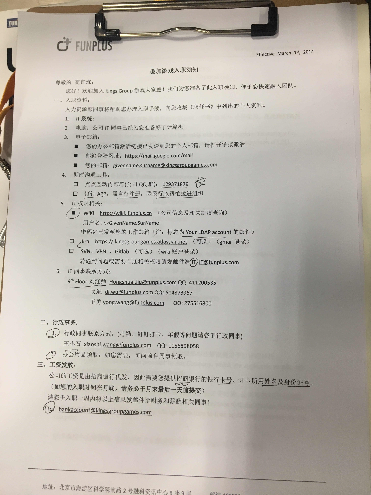

* 入职前

	* 参加OpenDay，并现场笔试
	* 笔试后接到电话通知，参加面试
	* 两轮面试之后，口头确认接收offer
	* 收到offer邮件，包含入职登记表和确认信，需要48小时内回复邮件确认接收
	* 根据确认信中要求准备材料，实习生主要包括一张招商银行卡、身份证和学生证的复印件
* 入职
  * 与HR沟通好入职时间，之后公司会再次发送入职后需要的信息，包括Google企业邮箱和LDAP账号密码等
  * 当天上午十点之前，携带对应材料入职。入职时会签署各种文件，包括入职介绍信、登记表（二者均与邮件中一致）、薪资保密协议等
  * 之后到会有人带你到自己的工位，需要自己组装电脑和配置环境
* 入职后的第一步
  * 公司会给一份入职须知，按照上面流程走完即可完成大部分工作
  
    
  
  * 企业邮箱：
  
    > 	yichen.gao@kingsgroup.com
    > Gmail密码
  
    该邮箱可用于登录[项目Jira](https://kingsgroupgames.atlassian.net/secure/RapidBoard.jspa?rapidView=213&projectKey=WD)(整个项目组的在线协作平台)、接受项目组相关信息，类似于校园网邮箱
  
  * 加入公司QQ群：129371879
  
  * 下载钉钉APP和Mac应用，联系前台帮忙拉到群里，然后扫描人脸以便后期进行打卡
  
  * LDAP账号：
  
    > yichen.gao
    >
    > A10rVgIH
  
    该账号可用于登录无线网、[企业wiki]( http://wiki.ifunplus.cn)(用于查询公司信息及相关制度，需要申请开通)
  
  * 企业NAS账号：
    
  	> yichen.gao
    >
    > funplus@2019
    
    该账号可以用于登录企业公共存储服务器，类似于ftp。登录方式有两种，一种是在浏览器中打开链接: [http://nas.funplus.io:5000/](http://nas.funplus.io:5000/), 另一种是在Mac系统的网络中找到名为"FunplusNAS"的地址，然后在连接中输入用户名和密码
  
  * git账号：使用企业邮箱注册，注册后填写用户名：
  
    > kg-gaoyichen
  
    之后it人员会帮助开通相关的权限，即可开始使用git
  
  * 将招商银行卡信息包括银行卡号、开卡姓名及身份证号发送至财务邮箱
  

