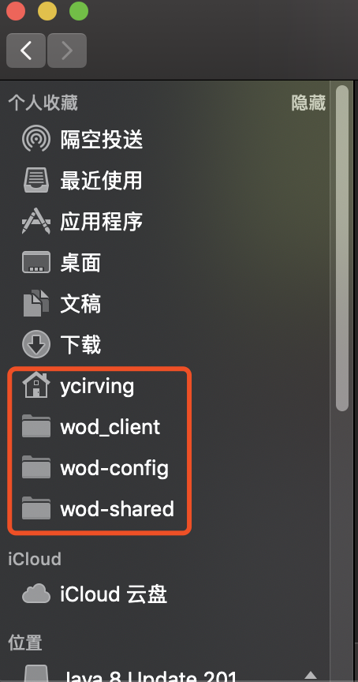

* 
  
* Source Tree使用：
  
  * 新建一个连接：找到对应仓库的网页连接，如github或bitbucket，之后复制下来
  
  * 找到主页菜单栏中的新建->从URL克隆
  
    
  
  * 在源URL中填入网址，之后在本地工作区新建一个跟仓库同名的文件夹，选择为目标路径，软件会自动填写名称区域，之后点开高级选项，找到里面的对应的分支。一般来说研发阶段选择develop分支，而master分支内容很少，因为在研发完成阶段才会merge到master分支。这里如果缺省则会默认检出master分支。
  
    
  
  * 检出后也可以在远端中的origin下查看不同分支，双击后就能完成切换。
  
    
  
  * 开发初期主要用到拉取和推送两个功能。
  
  * 拉取时直接拉取就可以，下面四个选项不要勾
  
    
  
  * 推送时，确保已暂存文件中只存在自己修改过的文件，类似于 `git add` 命令，同时在下方填写注释，可以勾选立即推送，这样可以点击后直接提交，否则会出现本地仓库超前远端仓库的情形，也需要后期再次进行push
  
    
  
    
  
* Unity布局：
	
	
	注意在WIndows中，将Console Enhanced调出来，并与原来的Console放置在一起
	
* App Store安装：Office 365、QQ、微信、钉钉、网易云音乐

* 命令行安装：oh my zsh `sh -c "$(curl -fsSL https://raw.githubusercontent.com/robbyrussell/oh-my-zsh/master/tools/install.sh)"`

* 下载安装（注意将应用移动至应用程序目录下）：搜狗输入法、Unity、Jet Brain Rider、Jet Brain IntelliJ IDEA（这两个用学生邮箱可以免费使用）、Java、JDK、Typora、iGetter、anydesk、Shadowsocks、VS code、Source Tree

* 将个人和项目文件夹添加至个人收藏

  

* Mac中，按下_Option_键后，会发现窗口左上角的最大化按钮会变成加号，点击后的最大化不会将菜单栏隐藏

* 使用_shift+command+3_可以全屏截图，_shift+command+4_可以自由截图