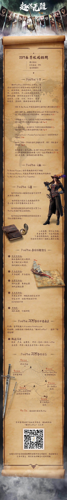

# 一面

前端面试，问了一些基础问题：

- TCP和UDP的区别
- 进程和线程的区别
- 手写了一下二叉树的层次遍历

# 二面

后端面试，同样是基础题：

- 如何在一堆数据中找到第k大的元素：快速选择算法
- 逻辑题：有两个人A和B，A需要通过信件把信息传给B，二人各有一把锁和一把钥匙，自己的钥匙只能打开自己的锁，已知信件在传递过程中必须加密，问如何实现可靠的通信。一个人将信件上锁，传给B，B再上锁，传给A，A解开锁，传给B，B解开自己的锁即可。

# 三面&四面

是大Leader来面试，基本没有什么技术性面试，主要是聊对游戏的看法等等。

