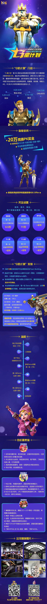

> 

# 一面

一面主要是HR面试，问了一些跟个人品质相关的问题，包括：

- 喜欢什么游戏
- 遇到压力怎么解决
- 如果你是Team Leader，怎么协调人际关系(两个同学意见不合)
- 有没有什么领导经历

感觉聊得还可以，没有问技术相关的。

# 二面

二面是技术面试，面得很差，问题包括：

- 编程语言
- C++里的内存泄漏和内存溢出
- C++里的内存碎片
- 设计模式中的观察者模式
- MVC架构中，数据存储在哪个层
- C++中的map和unordered_map是什么
- 引擎底层的渲染和管线是什么
- TCP和UDP的区别
- 基本的网络同步怎么实现
- UDP中的滑窗实现
- MMO中使用的网络传输技术(UDP还是TCP)，哪些行为适合UDP