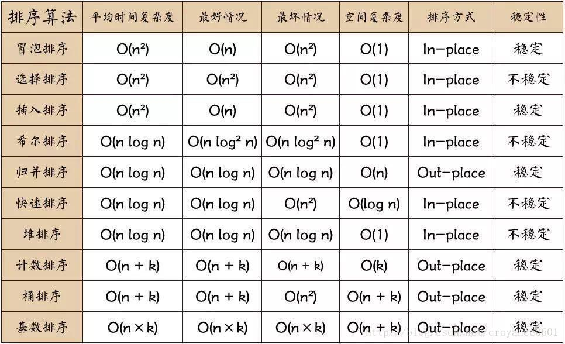
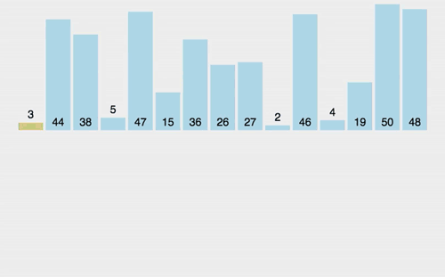
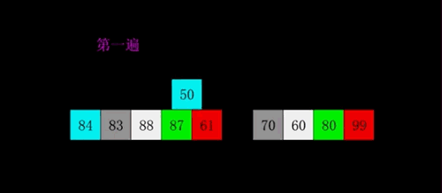
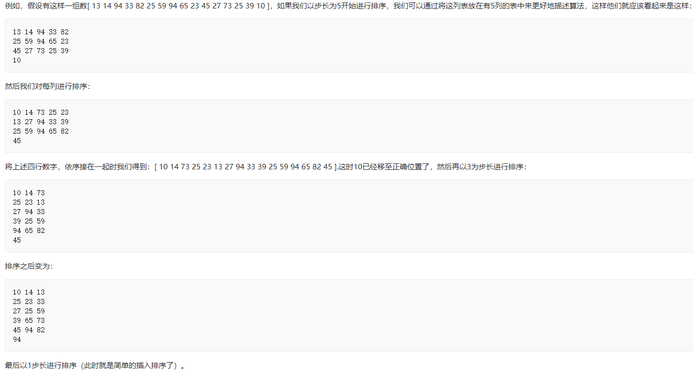
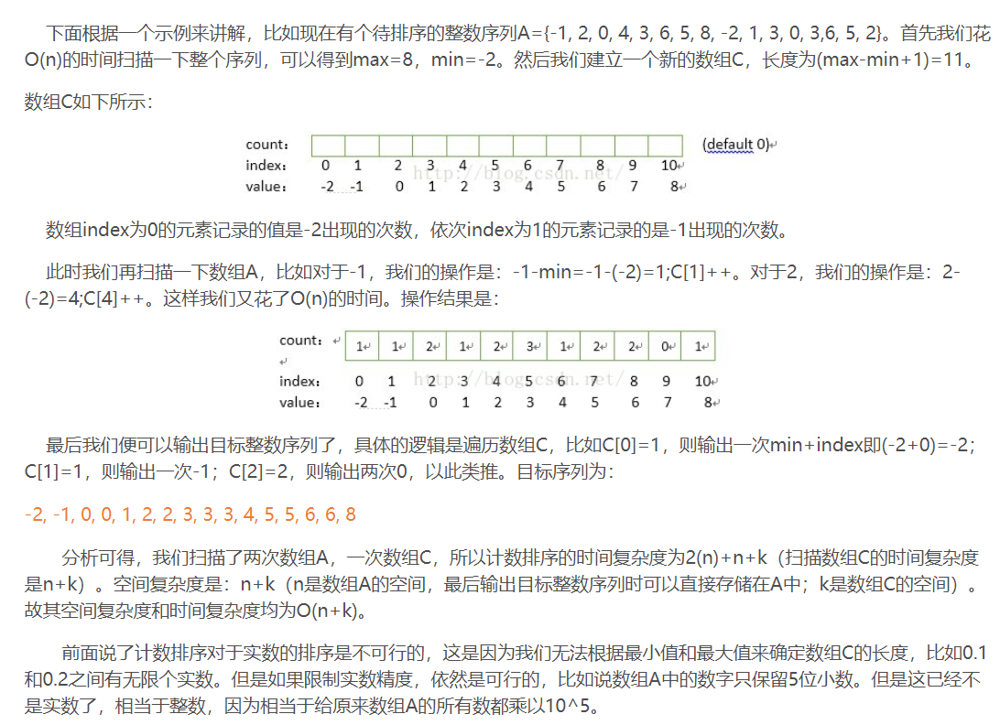

# 常见排序算法总结与实现

对比图：



[再来一篇知乎](https://zhuanlan.zhihu.com/p/52884590)


提前约定一下，`swap(int a, int b)`负责交换两个数，下面统一用这种方法来写。

1. 冒泡排序

    

    比较相邻两项，如果逆序，则对它们进行交换，每次将更大的放到后面。同时，在某一轮中如果没发生交换，则说明已经排好，直接退出即可。

    ```c++
    void bubbleSort(vector &<nums>)
    {
        bool didSwap = true;
        int length = nums.size();
        // *M* 表示终点，这里是倒着遍历的（只需要n-1次遍历即可，所以下面是i>0）
        for(int i=length-1; i>0; --i)
        {
            didSwap = false;
            for(int j =0; j<i; ++j)
            {
                if(nums[j]>nums[j+1])
                {
                    swap(nums[j], nums[j+1]);
                    didSwap = true;
                }
            }
            if(didSwap == false) break;
        }
    }
    ```

2. 选择排序

    

    每次遍历时找到最大的项，完成遍历后，把它换到正确的位置。因此可以看成是冒泡排序在交换次数上的优化
    但要注意一点，选择排序是不稳定的，这点同冒泡排序有所区别。
    ```c++
    void selectionSort(vector &<nums>)
    {
        int length = nums.size();
        // *M* i表示待交换的位置
        for(int i=length-1; i>0; --i)
        {
            int maxNumID = i;
            // *M* 从前到后找到最大的
            for(int j=0; j<i; j++)
            {
                if(nums[j]>nums[maxNumID])
                {
                    maxNumID = j;
                }
            }
            swap(nums[maxNumID], nums[i]);
        }
    }
    ```

3. 插入排序

    

    每次遍历找到第i个数在前i-1个有序数中的位置，然后插入，同样第一个数可以跳过，所以也执行n-1轮循环。

    一般来说，为了写起来简便，我们从另外一个角度来实现插入排序：将待插入数同前面的数进行比较，如果比前面的数小，则交换两个数，类似于在小范围对一个数进行冒泡排序。

    ```c++
    void insertionSort(vector &<nums>)
    {
        int length = nums.size();
        for(int i=1; i<length; ++i)
        {
            // *M* 注意这里时j>0
            for(int j=i; j>0; --j)
            {
                if(nums[j] < nums[j-1])
                {
                    swap(nums[j], nums[j-1]);
                }
                else break;
            }
        }
    }
    ```

4. 希尔排序

    

    

    >- 插入排序在对几乎已经排好序的数据操作时，效率高，即可以达到线性排序的效率
    >- 但插入排序一般来说是低效的，因为插入排序每次只能将数据移动一位

    又称**“递减增量排序算法”**，是对插入排序算法的一种优化，最开始以一个较大的间隔来对元素进行排序，之后不断缩小间隔，直到间隔为1时，就是普通的插入排序了。这样做的好处是，元素每次比较后可以移动更大的步长，因此**假设有一个很小的数据在一个已按升序排好序的数组的末端。如果用复杂度为O(n2)的排序（冒泡排序或插入排序），可能会进行n次的比较和交换才能将该数据移至正确位置。而希尔排序会用较大的步长移动数据，所以小数据只需进行少数比较和交换即可到正确位置。**

    ```c++
    void shellSort(vector<int> &nums)
    {
        int length = nums.size();
        // *M* 选择步长
        for (int gap = length >> 1; gap > 0; gap >>= 1) 
        {
            // *M* 比较gap之后的每个元素和前面相差同样步长元素的大小
            for (int i = gap; i < length; i++) 
            {
                // *M* j-gap为左边的数，同样是小范围冒泡
                for (int j = i-gap; j >= 0; j -= gap) 
                {
                    if(nums[j+gap] < nums[j])
                    {
                        swap(nums[j+gap], nums[j]);
                    }
                    else break;
                }
                
            }
        }
    }
    ```


5. 归并排序

    

    归并排序思想是分治，将数组不断进行拆分，排序后然后再进行合并。

    ```c++

    void mergeSortMerge(vector<int> &nums, int left, int mid, int right)
    {
        vector<int> temp(right - left + 1);
        int pos1 = 0, pos2 = mid+1, pos = 0;
        while(pos1 <=mid && pos2 <= right)
        {
            if(nums[pos1]< nums[pos2])
            {
                temp[pos] = nums[pos1];
                pos1 ++;
            }
            else
            {
                temp[pos] = nums[pos2];
                pos2++;
            }
            pos ++;
        }
        while(pos1<=mid)
        {
            temp[pos] = nums[pos1];
            pos1++;
            pos++;
        }
        while(pos2<=right)
        {
            temp[pos] = nums[pos2];
            pos2++;
            pos++;
        }
        for(int i=left; i<=right; i++)
        {
            nums[i] = temp[i-left];
        }
    }

    void mergeSortSort(vector<int> &nums, int left, int right)
    {
        // *M* 记住这里的返回条件即可
        if(left >= right) return;
        int mid = left + (right - left)/2;
        mergeSortSort(nums, left, mid);
        mergeSortSort(nums, mid+1, right);
        mergeSortMerge(nums, left, mid, right);
    }

    void mergeSort(vector<int> &nums)
    {
        mergeSort(nums, 0, nums.size()-1);
    }

    ```

6. 快速排序

    最经典的排序算法，每次选取一个轴，将所有元素同轴进行比较并放在轴的左右两边，之后再一次对轴两边的数组进行递归调用。


    ```c++

    void quickSortPartition(vector<int> &nums, int left, int right)
    {
        int pivot = nums[right];
        // *M* 当pi和i不相等时，pi指向的一定是大于轴的元素
        int pi = left;
        for(int i=left; i<right; i++)
        {
            if(nums[i]<pivot)
            {
                swap(nums[pi], nums[i]);
                // *M* 只有发生了交换pi才进行移动
                pi++;
            }
        }
        swap(nums[pi], nums[right]);
        return pi;
    }

    void quickSortSort(vector<int> &nums, int left, int right)
    {
        if(left>=right) return;
        int mid = quickSortPartition(nums, 0, nums.size()-1);
        quickSortSort(nums, 0, mid-1);
        quickSortSort(nums, 0, mid+1);
    }

    void quickSort(vector<int> & nums)
    {
        quickSortSort(nums, 0, nums.size()-1);
    }
    ```
    
    优化点

    当数列近乎有序的时，由于每次选取的都是第一个数，所以造成数列分割的极其不等，此时快排蜕化成O (n * n)的算法， 此时只要随机选取基准点即可

    当数列中包含大量的重复元素的时候，这一版的代码也会造成"分割不等“的问题，此时需要将重复元素均匀的分散的自数列旁

    使用三路快排，分为小于、等于和大于三个子序列

7. 堆排序

    堆排序经常用于求一个数组中最大k个元素时。因为堆实际上是一个完全二叉树，所以用它可以用一维数组来表示。因为最大堆的第一位总为当前堆中最大值，所以每次将最大值移除后，调整堆即可获得下一个最大值，通过一遍一遍执行这个过程就可以得到前k大元素，或者使堆有序。

    在了解算法之前，首先了解在一维数组中节点的下标：

    i节点的父节点 parent(i) = floor((i-1)/2)
    i节点的左子节点 left(i) = 2i + 1
    i节点的右子节点 right(i) = 2i + 2
    步骤

    构造最大堆（Build Max Heap）：首先将当前元素放入最大堆下一个位置，然后将此元素依次和它的父节点比较，如果大于父节点就和父节点交换，直到比较到根节点。重复执行到最后一个元素。
    最大堆调整（Max Heapify）：调整最大堆即将根节点移除后重新整理堆。整理方法为将根节点和最后一个节点交换，然后把堆看做n-1长度，将当前根节点逐步移动到其应该在的位置。
    堆排序（HeapSort）：重复执行2，直到所有根节点都已移除。
    ```c++
    void heap_sort(vector<int> &nums)
    {
        int n = nums.size();
        for (int i = n / 2 - 1; i >= 0; i--) { // build max heap
            max_heapify(nums, i, nums.size() - 1);
        }
        
        for (int i = n - 1; i > 0; i--) { // heap sort
            int temp = nums[i];
            num[i] = nums[0];
            num[0] = temp;
            max_heapify(nums, 0, i);
        }
    }

    void max_heapify(vector<int> &nums, int beg, int end)
    {
        int curr = beg;
        int child = curr * 2 + 1;
        while (child < end) {
            if (child + 1 < end && nums[child] < nums[child + 1]) {
                child++;
            }
            if (nums[curr] < nums[child]) {
                int temp = nums[curr];
                nums[curr] = nums[child];
                num[child] = temp;
                curr = child;
                child = 2 * curr + 1;
            } else {
                break;
            }
        }
    }
    ```

8. 计数排序

    计数排序使用一个额外的数组C，其中第i个元素是待排序数组A中值等于i的元素的个数。然后根据数组C来将A中的元素排到正确的位置。

    - 找出待排序的数组中最大和最小的元素
    - 统计数组中每个值为i的元素出现的次数，存入数组C的第i项
    - 对所有的计数累加（从C中的第一个元素开始，每一项和前一项相加）
    - 反向填充目标数组：将每个元素i放在新数组的第C[i]项，每放一个元素就将C[i]减去1

    

    ```c++
    vector<int> sortCouting(const vector<int>& v, int mm) 
    {
        vector<int> coutv(mm + 1, 0),ret(v.size());
        for (auto vi : v) ++coutv[vi];
        for (int k1(1); k1 <= mm; ++k1) coutv[k1] += coutv[k1 - 1];
        for (int k1(v.size() - 1); k1 >= 0; --k1) ret[--coutv[v[k1]]] = v[k1];
        return ret;
    }
    ```
9. 桶排序

    桶排序的原理是将数组分到有限数量的桶中，再对每个桶子再分别排序（有可能再使用别的排序算法或是以递归方式继续使用桶排序进行排序），最后将各个桶中的数据有序的合并起来。

    排序过程：

    假设待排序的一组数统一的分布在一个范围中，并将这一范围划分成几个子范围，也就是桶
    将待排序的一组数，分档规入这些子桶，并将桶中的数据进行排序
    将各个桶中的数据有序的合并起来

    ```c++
    void bucketSort(float arr[], int n) 
    { 
        // 1) Create n empty buckets 
        vector<float> b[n]; 
        
        // 2) Put array elements in different buckets 
        for (int i=0; i<n; i++) 
        { 
        int bi = n*arr[i]; // Index in bucket 
        b[bi].push_back(arr[i]); 
        } 
    
        // 3) Sort individual buckets 
        for (int i=0; i<n; i++) 
        sort(b[i].begin(), b[i].end()); 
    
        // 4) Concatenate all buckets into arr[] 
        int index = 0; 
        for (int i = 0; i < n; i++) 
            for (int j = 0; j < b[i].size(); j++) 
            arr[index++] = b[i][j]; 
    }
    ```

10. 基数排序

    基数排序是一种非比较型整数排序算法，其原理是将整数按位数切割成不同的数字，然后按每个位数分别比较。排序过程是将所有待比较数值统一为同样的数位长度，数位较短的数前面补零，然后从最低位开始，依次进行一次排序。这样从最低位排序一直到最高位排序完成以后, 数列就变成一个有序序列。

    ```c++
    int getMax(int arr[], int n) 
    { 
        int mx = arr[0]; 
        for (int i = 1; i < n; i++) 
            if (arr[i] > mx) 
                mx = arr[i]; 
        return mx; 
    } 

    void countSort(int arr[], int n, int exp) 
    { 
        int output[n]; 
        int i, count[10] = {0}; 
    
        for (i = 0; i < n; i++) 
            count[ (arr[i]/exp)%10 ]++; 
    
        for (i = 1; i < 10; i++) 
            count[i] += count[i - 1]; 
    
        for (i = n - 1; i >= 0; i--) 
        { 
            output[count[ (arr[i]/exp)%10 ] - 1] = arr[i]; 
            count[ (arr[i]/exp)%10 ]--; 
        } 
    
        for (i = 0; i < n; i++) 
            arr[i] = output[i]; 
    } 
    
    void radixsort(int arr[], int n) 
    { 
        int m = getMax(arr, n); 
        for (int exp = 1; m/exp > 0; exp *= 10) 
            countSort(arr, n, exp); 
    } 
    ```

    - 为什么要从低位开始向高位排序?
        
        如果要从高位排序, 那么次高位的排序会影响高位已经排好的大小关系. 在数学中, 数位越高,数位值对数的大小的影响就越大.从低位开始排序,就是对这种影响的排序. 数位按照影响力从低到高的顺序排序, 数位影响力相同则比较数位值.

    - 为什么同一数位的排序子程序要使用稳定排序?
        
        稳定排序的意思是指, 待排序相同元素之间的相对前后关系,在各次排序中不会改变.比如实例中具有十位数字5的两个数字58和356, 在十位排序之前356在58之前,在十位排序之后, 356依然在58之前.

        稳定排序能保证,上一次的排序成果被保留,十位数的排序过程能保留个位数的排序成果,百位数的排序过程能保留十位数的排序成果.


## 常见有关排序的问题

- 在待排序的元素序列基本有序的前提下，效率最高的排序方法是什么？

    在本题考查各种排序方法：
    - 直接插入排序是将第i个元素插入到已经排序好的前i-1个元素中；
    - 选择排序是通过n-i次关键字的比较，从n-i+1个记录中选出关键字最小的记录，并和第i个记录交换，当i等于n时所有记录都已有序排列；
    - 快速排序是通过一趟排序将待排序的记录分割为独立的两部分，其中一部分记录的关键字均比另一部分记录的关键字小，然后再分别对这两部分记录继续进行排序，以达到整个序列有序；
    - 归并排序是把一个有n个记录的无序文件看成由n个长度为1的有序子文件组成的文件，然后进行两两归并，得到[n/2]个长度为2或1的有序文件，再两两归并，如此重复，直至最后形成包含n个记录的有序文件为止。  
    通过上面的分析，可知，在待排序元素有序的情况下，直接插入排序不再需要进行比较，而其他三种算法还要分别进行比较，所以效率最高为直接插入排序。