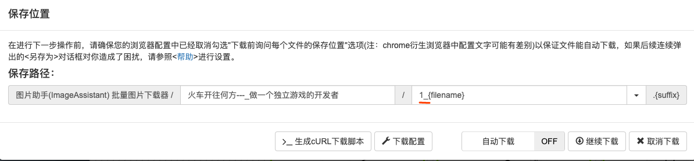

# 使用Markdown摘抄

对于一个网页，首先直接复制然后粘贴到Markdown文件中，基本可以符合摘抄要求。对于网页中的图片，采用Chrome中的Image Assistant插件执行批量下载，下载时要对文件名称前缀上文章ID，方便统一在文件夹中管理。

之后将文件统一移动到assets目录下，并在Markdown中将网页链接改为本地链接即可。

文章摘抄时格式如下：

一级题目：文章名（加超链接）

二级题目：摘抄日期（yyyy.mm.dd）

二级题目：正文

二级题目：感悟

