# [火车开往何方--- 做一个独立游戏的开发者](https://weibo.com/ttarticle/p/show?id=2309404382341140188775)

## 摘抄日期：2019.06.18

## 正文：

[*CottonGame-胖布丁游戏* ](https://weibo.com/u/2968964172) 发布于 2019-06-12 12:50:10 

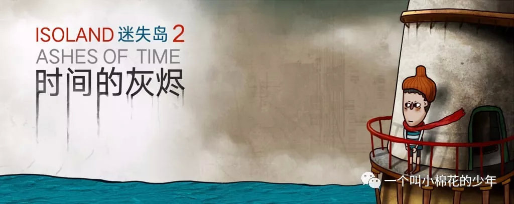

最近我不止一次的听到做游戏的一些朋友给我说他们萌生退意，不想再做游戏了。

想必我不说大家也都知道原因，无非是确实没有轻松挣到钱或者觉得这个行业和自己当初想象的不一样。

而告诉我这些话的人，不过都才20几岁，在经历了一些所谓的意气风发时刻后，发现前路漫漫。

我第一时间就想到了他们当初他们面对媒体面对公众面对投资人等的豪言壮志。

他们说要做MOBA，要做沙盒，要做RogueLike，要做推图，要做IP。

他们会说做独立游戏是他们儿时的梦想、毕生的事业。

我没有想到的是对他们来说“毕生”这个词短到了仅仅2-3年。

他们觉得自己已经不可能成为这些与众不同的人，既不能挣到大钱，也不会做出一款玩家喜欢的知名游戏。

我很难去以一种身份，不管是以一个略年长的人或者以一个开发过所谓知名独立游戏的人，去做这样一个心灵导师。因为我知道，我和他们一样，依然在面对一个无法预知的未来。

我也会不断地思考：作为一个游戏开发者意味着什么？

很奇怪的是，最近我会时常回忆起1997年的那个夏天，那是我大学毕业的最后一年，打包好行李，我将要乘坐绿皮火车，花费3天3夜的时间从吉林回到我的家乡贵阳。在北京转车的时候，由于火车晚点，我被滞留在了火车站，大约接近夜晚12点的时候，我终于拖着疲惫的双腿站到了冷清的站台上，我还记得站台上飘荡的那种呛人的煤烟味，铁轨上涌上来的阵阵怪异的臭味。而年轻的我，在等待着一辆虽然晚点多时但确定无疑可以把我带回家的火车。

但是，当时，对于才结束学生时代的我而言，这辆火车不是带我回家，而是将要把一个才长大的少年带到一个一无所知的未来。

而我清楚的记得，那一刻，对于未来，22岁的我，非常的平静。不慌张，也不害怕。

因为我觉得未来我一定是一个不平凡的人。

那什么叫作不平凡？

我的设计师哥哥，因为工作上的需要，他设计了一套关于不平凡的广告。

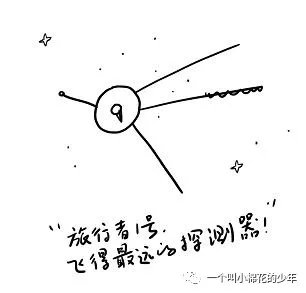

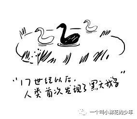

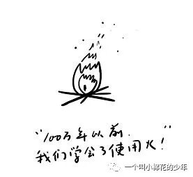

2004年的时候，我决定辞职。我给公司的领导说了这么一堆话：“你知道，有些鸟儿是注定不会被关在牢笼里的，它们的每一片羽毛都闪耀着自由的光辉。”这是电影《肖生克的救赎》的台词。

接着我又说：“ 我不一定是这样的鸟，但是我想试一下。”

这么多年过去了，我试成功了吗？

由于种种原因，我人生变得非常的挣扎、无奈、和悲哀。

我有过一场持续至今天的灾难性的疾病，所以我时常会抱怨人生。我关注了一些身残志坚人的微博，比如桑兰，我对受尽苦难人生的画家总是格外的亲睐，比如弗里达。我会去听盲人歌手周云蓬的演讲、给朋友朗读残疾诗人余秀华的诗歌。我在他们中间找寻一些能让我不要枯萎下去的力量。但是，不知道为什么，我变得更加的自艾自怨。是的，我在挣扎，我记起了《这个杀手不太冷》的台词：

“人生总是这么苦么，还是只有童年苦？” “总是这么苦。”

我逐渐明白了一个道理，绝大多数人穷尽一辈子，也不会是天狼星A或者是旅行者1号。

网络上有一个提问：“你小时候是不是总会觉得你与众不同，总有一天会绽放光芒，但是长大后慢慢发觉，你只不过是人群中最平庸的那一个人。”

是金子你才会发光，是石头的你怎么会发光？

你有没有这样一种亲戚朋友（甚至包括自己的父母），自小开始，他们就会告诉你一些人生哲理，告诉你什么是对什么是错，告诉你梦想不能当饭吃，告诉你不要自以为是，告诉你要夹着尾巴做人。告诉你最后你就会明白他们是对的，都是为你好。

而你的生活轨迹，是不是准确无误地印证了他们劝导的正确性。

相信对于人生而言，你们和我都有一样的种种原因。

所以，

我和你们一样，作为一个游戏开发者，每日每夜思如泉涌，想做出一款好游戏，能挣钱，能好口碑。但同时，时常对自己极度的自信伴随着极度的怀疑。

我记得5年前我开始想做游戏的时候，起因仅仅是因为我觉得我能把我的美术能力通过游戏场景给表达出来。所以听闻有独立游戏这样一种东西后，我深受鼓舞，觉得能找到一些共同探索的伙伴。当时从他们的话语中看到了很多所谓的情怀和梦想。

但是，当我要开始做《南瓜先生大冒险》的时候，有人问我，解谜游戏有市场吗，能挣钱吗？

做《迷失岛》的时候，又有人问我，既然解谜游戏都被验证了不挣钱，你为什么还要再做一个。

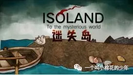

开始做《小三角大英雄》的时候，有人说，你疯了，解谜做得好好的，有点知名度，为什么要换平台过关游戏，这个类型你又不懂，很难做的。

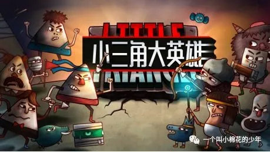

最新的项目叫《怪物之家》，是一个黑白画风的解谜游戏，又有人说，单色风格很难做的，太风格化了，是不是步子迈得太大了一点。

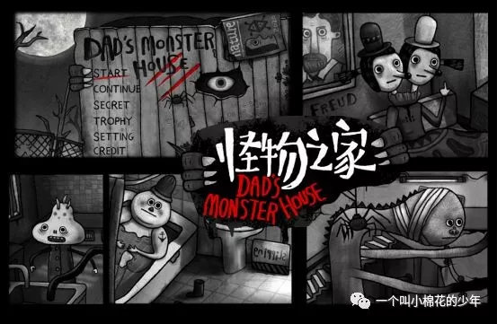

我们年初已经开发好了迷失岛2这款游戏。不是因为迷失岛1挣到钱了，而是因为迷失岛1的玩家希望我们能继续下去。所以，无论如何，我们还会继续做迷失岛3。

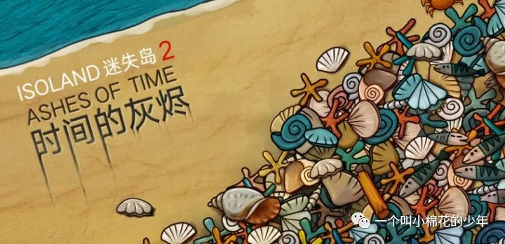

而且我们未来的将要选择开发的游戏类型可能会变得更不一样。某些人看来更不合理，更没有意义。

由于年纪渐长，我最近参加很多重要的同学聚会。见到了很多20多年都没见到过的老同学。

当我们都年少的时候，我觉得他们每一个人都是那么的气宇轩昂，无论成绩好与坏。每个人都像武侠小说中描述的那样，是个人物，长大后一定是不平凡的人。后来很多人读了博士、硕士，当了领导，一些挣了大钱。也有很多高开低走，人生失意。有人儿女满堂，有人孑然一身。

但是当我们坐在一起聊天的时候，无论是谁，我从他们身上都再也感受不到一丝一毫的光彩。

他们都变成了同一种人，没有光彩和魅力的人，平庸的人。

他们的谈话内容充斥着房子、车子、工作加薪、孩子读名校、有钱的亲戚、广泛的人脉。各种家长里短，每个人似乎都看透了这个世界的种种，每个人也都失去了当初的对世界的好奇心。他们都成了一些平凡得不能再平凡的社会人。

小时候我看过一部香港电视剧。其中男主角问一个爱他的女人说，你为什么要喜欢我，我没钱，没名气，没本事。也不帅。女人说：“因为你不平凡。”

我当年觉得也就是电视剧才会这样演，现实生活中一个没有成功过的人怎么能叫不平凡。

前几天，我妈妈的同学来上海玩，一个75岁的老太太。一个人来上海开会，关于logo语言的教学。一个人网络订机票住宿，一个人查找网络地图。和我寒暄的时候，从来不会夸耀自己的儿女（虽然她儿女都是大学教授，非常有本事）。也不会说什么家长里短，只会告诉我一些神经网络、AI等未来的研究方向。在我看来，她的水平并不高，而且这把年纪了，自费到处全国跑，住较差的经济酒店。甚至可能会被一些所谓的研讨会欺骗。每次她谈及她的研究的时候，她总是神采奕奕。

我妈妈私地下问我：“你觉得她搞这些东西有没有意思，能不能挣到钱嘛。”

我说：“完全不能。但是我觉得她是一个不平凡的人。”

还记得那些小时候告诉你梦想不能当饭吃的亲戚吗？这些亲戚朋友现在又都成了什么人呢？他们成为了每天看电视剧和刷新闻的人，每天跳广场舞和打麻将的人。

你知道为什么吗？因为他们老了，老到所有的人都只剩一个所谓梦想，那就是：“安安稳稳地活着，无欲无求才是真”

他们老得失去了对这个世界的爱、勇气和好奇心。

当一个游戏开发者意味着什么？意味着这个行业最挣钱？最体面？最高科技？最COOL?最能把娱乐当成生活？

我觉得仅仅意味着，你是一个创作者。

什么叫创作者，一些对世界充满了好奇心和爱的人。

而哪些人会对这个世界最充满好奇心呢？20年前，火车站台上无知又无畏的我，勇敢的少年。

真的，我一定会和你们一样，有太多的希望，有太多的渴求。

所以，我会失眠、会痛哭、会愤怒、会失望、会咒骂，会咒骂沿着某条铁轨我为什么会走入某个无法知晓的深渊。

这让我筋疲力竭。

你有没有想过这辆火车的终点是什么，在你20岁的时候或者40岁的时候。

这辆火车什么时候会到站，还是一直这样开下去。带你一直探索每一站每一段的未知而又奇妙的世界。

我特别想说的是，20年过去了，我依然想像个少年一样，希望这辆破旧的火车能带我开往一个一无所知的未来。

那是因为，无论如何。我仍旧没有失去对这个世界的好奇心和爱，也有勇气去继续探索未来。

所以我经常说，==热爱游戏的人都是少年==。

年轻是一种品质，而不是数量，一旦有了这种品质，就永远不会失去。

无论如何，少年们，请不要让那些未来打麻将、刷电视剧和跳广场舞的平庸的人看穿你的生活轨迹。

我哥哥设计好了之前关于的不平凡的广告后，觉得他做错了，

天狼星A或者是旅行者1号很伟大，伟大的人固然是不平凡的人。

但是还有很多人和事，不一定伟大，但是也一样可以很不平凡。

所以他又设计了一套新的海报。

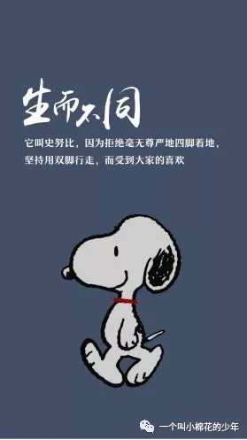

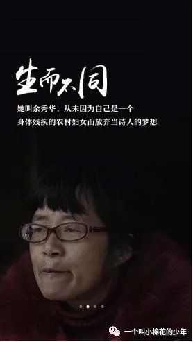

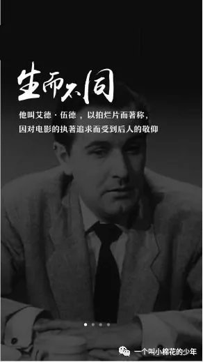

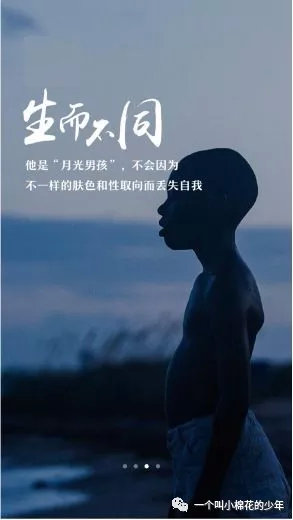

每个人都应该生而不同，带着爱、好奇心和勇气去探索这个世界。

有部电影叫《壁花少年》，结尾有这么几句台词。我很喜欢。

有些人步入17岁，就忘了16岁的自己  我知道终有一天 这些会成为故事 我们的照片会泛黄 我们也会为人父母 但此刻 这些尚未成为过去式 是现在进行式 我就在这里 我凝视着她 她是那样的美丽 我明白了 这一刻 自己不是一个悲伤的故事 你是有生命的 你站起来 看着灿烂的烟火 和所有惊叹的事物 听着那首歌 和最爱的人们在一起兜风

这一刻 我发誓 我们就是永恒

18年前我去参加了艺术博览会，卖我自己的油画作品，我印制了一张名片，上面写了艺术家三个字。当场有很多人问我：你为什么认为自己是个艺术家，有什么机构认证吗。

当年我特别的尴尬和惭愧。因为我无法用世俗的方法来证明自己。一些金钱证书荣誉甚至最基本的一纸专业文凭。

==当下，我依然不能证明我是一个翅膀有光芒可以展翅飞翔的人，但是我很确定我是一个游戏开发者，一个真正的艺术家，一个创作者。==

对于一无所知的未来，我希望自己还能像22岁那年一样，充满了勇气。不慌张，也不害怕。

因为，作为一个创作者而言，我们都应该是一些即使没有铁轨也不曾迷失的永远的少年。

一些注定不平凡的人。

## 感悟：

很强的认同感，在失意时能给自己力量