第一月：

**时间：2019.05.20-2019.06.20**

**目标：能够独立完成基本的问题解决和开发工作，融入团队**

---

# Day 1 - 2: 05.20 - 05.21

入职并配置环境

# Day 3: 05.22

**今天主要的成绩是熟悉了开发环境，领到了任务，并且完成了提交。**

**同时希望仿照[_马里奥制造2_](https://www.youtube.com/watch?v=jPi-u0D8sQ4)，开发一个地图编辑器的拖拽放置功能。**

## 开发环境

开发过程中主要用到的软件包括：Unity、RIder、IntelliJ、Excel、Terminal、Jira、SourceTree

* Unity：预览各类游戏场景和进行试玩
* Rider：编写和调试Unity工程中涉及的C#代码
* IntelliJ：编写和调试Unity工程中涉及的Lua代码
* Excel：查看游戏策划维护的各种表格
* Terminal：运行脚本，用于将excel表格转化为json和lua等游戏中可以被读取的格式
* Jira：在线协作平台，用于领取和完成任务
* SourceTree：拉取和推送代码

## Terminal转化表格

- 首先下载安装item2，替换Mac上的Terminal

- 之后在item2中运行`brew install protobuf`

- 
- 在`/Users/ycirving/Work/wod-client/tools`路径下配置`wod-config-path`和`wod-share-path`为自己的路径，然后运行`./_refresh_wdsync_lua.sh`和`./_refresh_wrpc_lua.sh`来刷新wrpc和wdsync

- 在`/Users/ycirving/Work/wod-shared`目录配置`local.js`，之后运行`./conv.sh all`来更新表格

## IntelliJ与Unity的协作

1. 搜索并安装 _AmmyLua_ 插件，可以让Lua代码高亮显示

   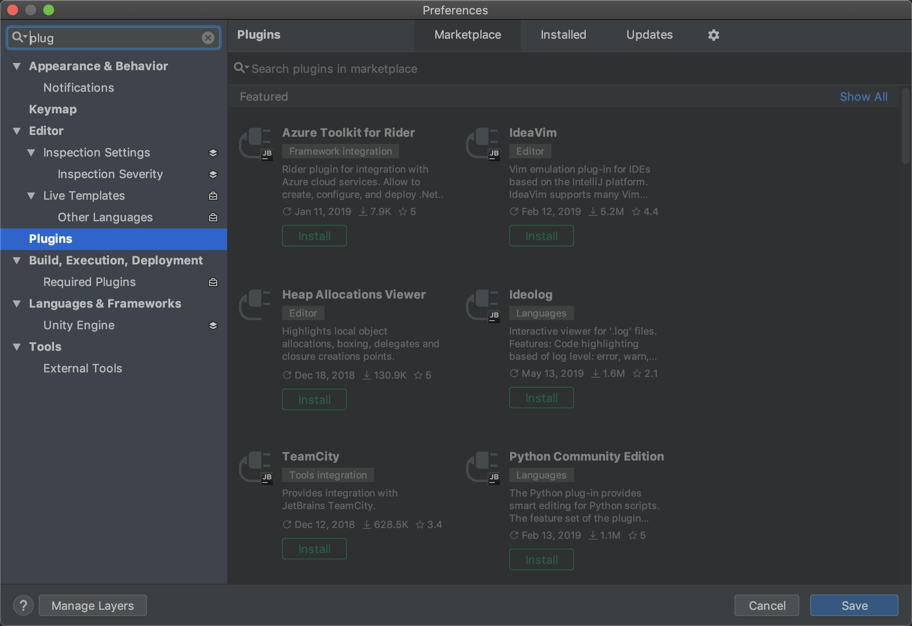

2. 在IntelliJ中选择从源码新建工程，然后根目录选择Unity工程中的Lua目录

   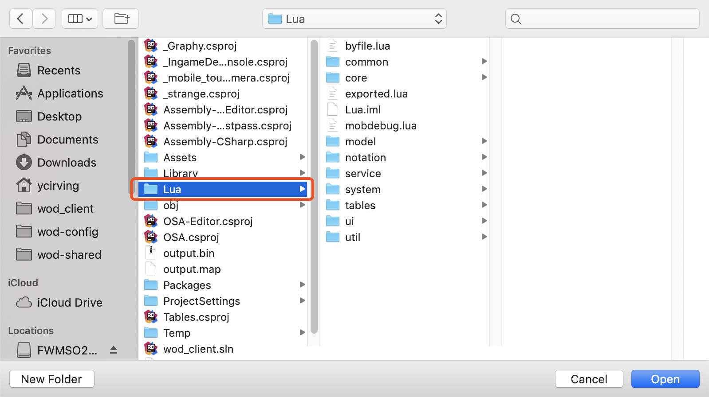

## Rider 与Unity的协作

1. 如果安装了Rider，可以直接在Unity中双击C#文件，即可自动打开Rider

2. 在Rider中，可以通过输出或者加入断点的方式来进行代码调试，输出除了使用标准的`print()`之外，还可以使用定义好的`Debug.Log(Message)`方法来输出Message信息。如果是添加断点，在添加之后，需要开启调试模式，即右上角的绿色Bug，之后在Unity中运行游戏，即可在断点中停止。

   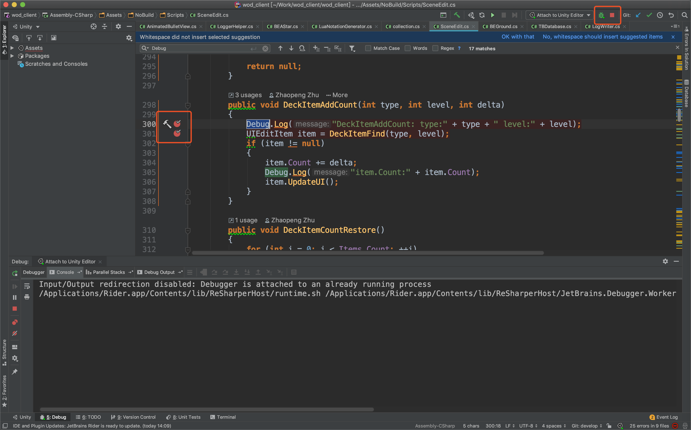

## 提交任务

1. 今天还改了一个Bug，是关于地图中建筑物种类的，建筑物共有21种，种类编号为1到21，而数组从0-20，所以编号作为数组下标时需要进行`-1`操作，而代码漏掉了`-1`，导致删除出错。

2. 修改代码并确认没问题后就可以进行提交了，提交时注意在暂存区只保留自己修改的代码，并且在右侧确认所有修改部分都是正确的，都确认好后，在commit中输入注释，提交即可。

3. 今天在拉取时出现了另一种冲突，即本地文件比远端文件多的情况，在SourceTree中以蓝色形式展现，不同于黄色的相异，这种冲突不能通过重置解决，解决方式为删除本地的文件，选择移除即可。

   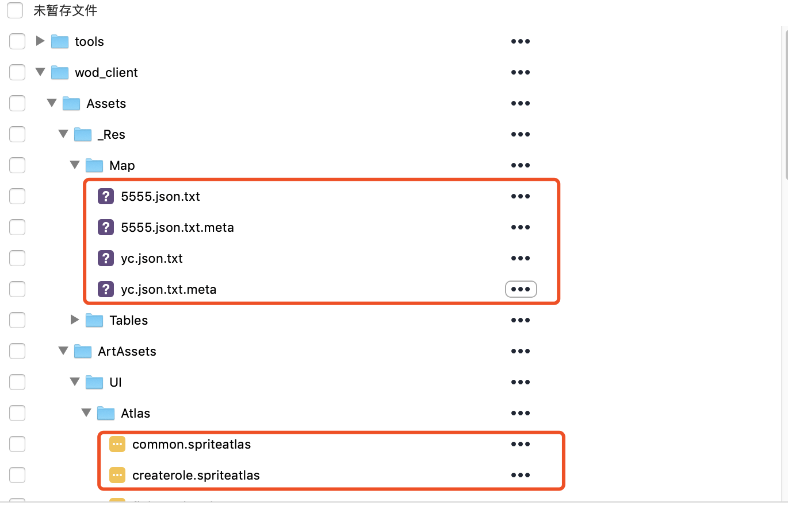


# Day 4 - 6: 05.24, 05.27 - 05.28

## Unity中物体的选取

理解鼠标选取和拾取物体的逻辑

1. 思想为：鼠标点击时，从观察摄像机中发射一条射线，通过判断射线接触到的模型是否为可以被拾取的物体，来确定最终的结果

2. 代码如下：

   ```c#
   private Ray _ray;
   private Vector3 hitPoint;
   public void OnTouchDown(Ray ray)
   {
     _ray = ray;
     RaycastHit hit;
     // hit是击中的物体，判断是否是可以被拾取的物体
     if (Physics.Raycast(ray, out hit) && 
         (hit.collider.gameObject.tag == "ObjectCanBePicked"))
     {
       
       // 记录射线击中的位置
       hitPoint = hit.point;
       // 对选中物体进行操作
       MouseClickedObject = Ground.instance.ObjectsList(hit.collider.gameObject);
     }
     else
     {
       // 没有选中任何物体
       MouseClickedObject = null;
     }
   }
    
   // 将射线可视化
   private void OnDrawGizmos()
   {
     Gizmos.color = Color.red;
     Gizmos.DrawLine(_ray.origin, hitPoint);
   }
   ```
   
3. 设置物体tag：

   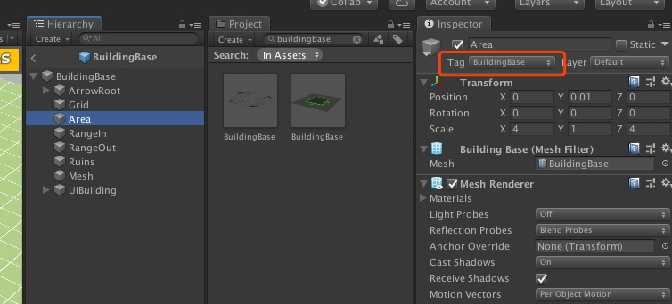

4.拾取物体逻辑图


```flow
st=>start: 点击事件

cond1=>condition: 判断被点击物体是否可被拾取

op1=>operation: 选中地面，清空当前选中物体

cond2=>condition: 判断与当前选中物体是否相同

op2=>operation: 选中新物体，更新当前选中物体

e=>end: 结束框

st->cond1

cond1(yes)->cond2

cond1(no)->op1->e

cond2(yes)->op1->e

cond2(no)->op2->e

```
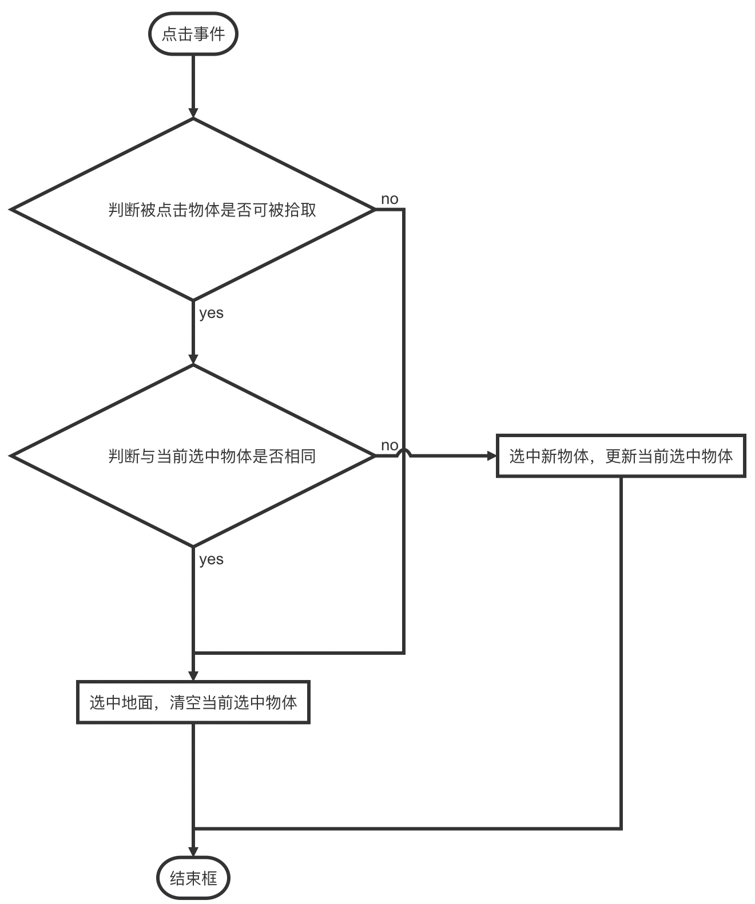

## Rider中一些使用技巧

1. 使用`Ctrl+Shift+F`，可以进行跨文件查找

2. 在菜单栏中的View中，勾选Toolbar，可以显示更多功能，其中有一个十分实用的功能：跳回上次代码的位置，应用在查看某个函数的实现后，回到原始位置。快捷键为`Command+减号`和`Command+Shift+减号`，如果鼠标支持侧键，则可以更方便的在代码间跳转。

3. 调试模式中，有时断点打上后会变成灰色。这种情况不用担心，只是说明程序目前不一定会执行到这里

   
# Day 7: 05.29

## 在Scene中进行对象的绑定

首先我们有一个定义在脚本中的场景类，类中有一些成员变量，比如一个`Text`，叫`textForShow`，我们希望通过这个`Text`来直接控制Unity中某个场景中显示的文本，比如UI中的一个信息`ButtonText`，除了在脚本中动态获得这个`GameObject`以外，我们还可以直接在Unity中进行可视化的绑定。方法如下：

1. 找到这个场景对应的`GameObject`，这时如果它绑定了场景脚本，就能够看到它对应的成员；

2. 之后同样在Hierarchy栏中找到希望绑定的UI；

3. 将UI拖动到成员变量之后即可完成绑定；

4. 绑定后，可以在代码中通过对成员变量的修改，直接控制UI界面。

   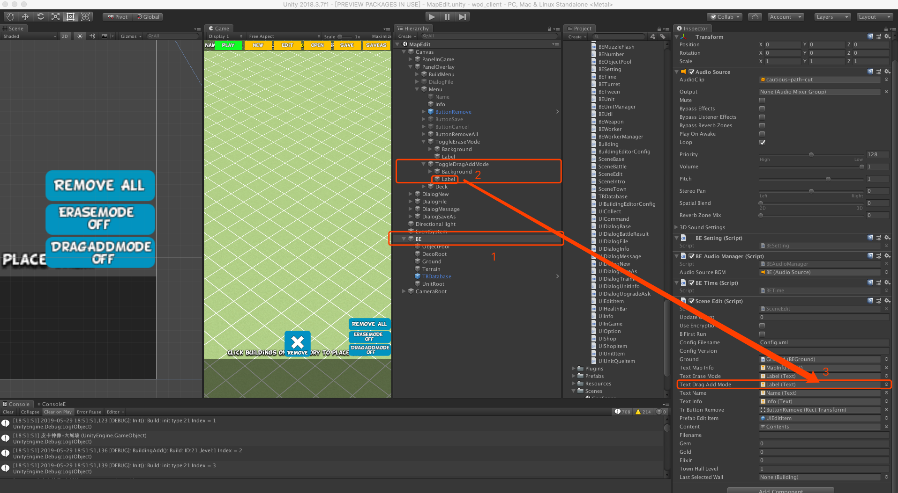


## SourceTree 提交前需要先拉取并解决冲突

每次进行提交前，务必进行拉取操作，否则就会使得代码流进行分流，如下图所示。原因在于，提交前，你的代码并不是最新的，所以你提交之后会从旧版本中新增一个分支。

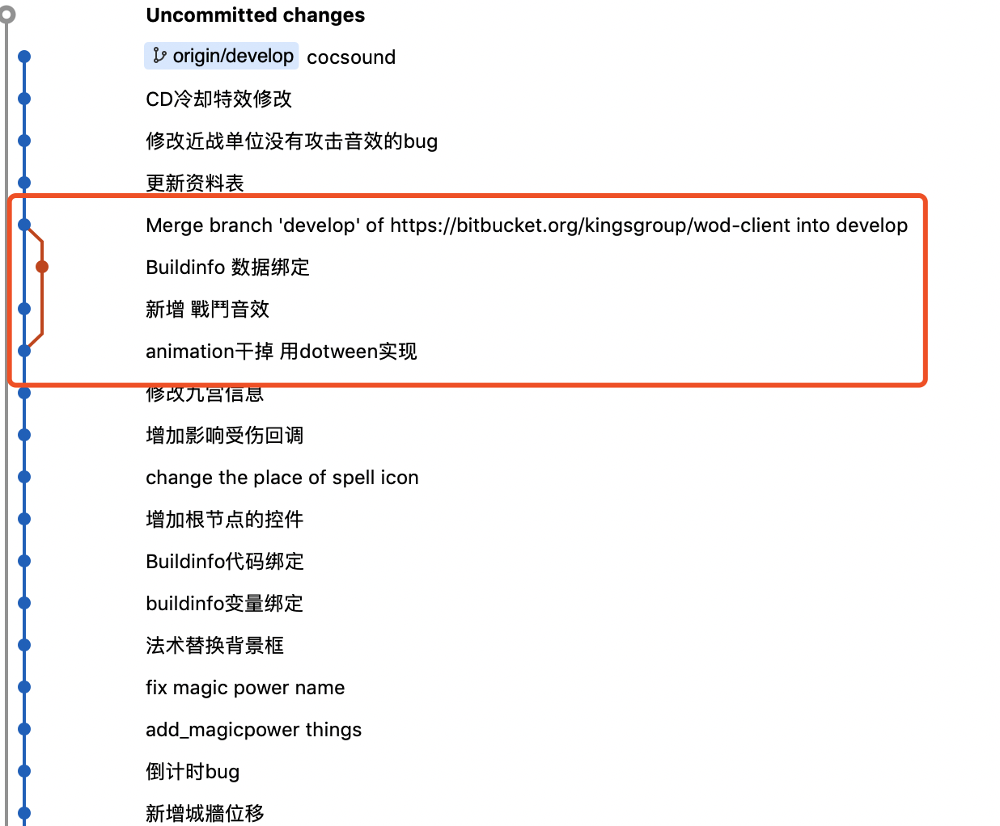


解决方法：选择分叉的点，然后选择"回退"，之后选择软合并即可。


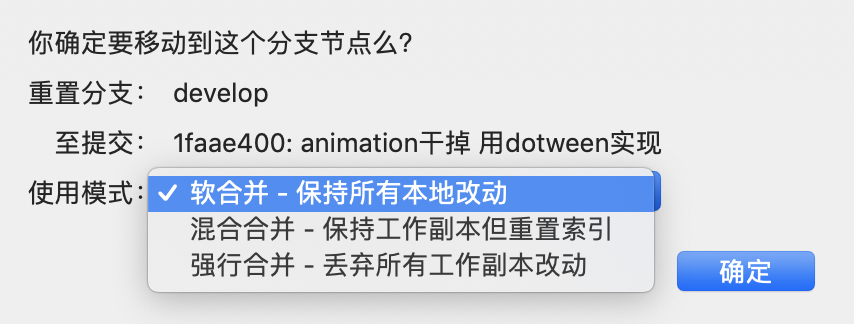

# Day 8-9: 05.30 - 05.31

**今天已经开始接到策划的需求，开始着手实现了，而且不仅局限在 _NoBuild_ 部分的代码，也包括核心的 _Scripts_ 代码**

## Git&SourceTree理解

目前我对git和SourceTree的理解是：git是一套代码版本控制方案，而SourceTree是应用这套方案实现的可视化工具。git中，为了保证每个人的代码都是最新的，需要在提交之前进行一次拉取操作，保证代码先与远端代码一致，之后再提交自己的修改。提交时出错一般是由于代码不是最新版本导致的，这时可以重置到提交以前，再次拉取。而拉取时经常出现的问题就是冲突，原因是我拉取了一个旧版本的代码，并在上面做了一些修改，而这时远端代码突然有了一个新版本，对这个文件同样进行了修改。这样就会导致，如果我直接拉取，则本地的修改就会被覆盖，因此需要先将本地修改的内容重置，再进行拉取即可。

工作中，策划一般负责表格部分，一切对表格的修改，要先跟策划说，让策划提交修改后的表格，而不是自己改好之后提交。程序负责提交所有的代码部分，包括表格导出的代码。

## Rider中一些使用技巧

1. 使用`Ctrl+T`，搜索文件名、函数名等，并直接跳转到文件；
2. 使用`Ctrl+Shift+F`可以跨文件搜索文本；
3. 使用`Ctrl+G`，打开跳转菜单，输入行号可以直接跳转到指定行；
4. 

## 编码经验

1. 数据结构很重要。针对不同的目标，使用不同的数据结构，比如项目中存储不同类型的建筑物，每个建筑物有一个 _索引ID_ ，就比较适合用 _Dictionary_，_ID_ 为 _Key_，而如果用list存储，用下标在list中查找，就会导致后期对ID有一些要求，比如必须跟下标一致等，导致编码繁琐。
2. 多增少改。如果需要改接口，尽量在原有基础上增加一个新的，而不是直接修改旧的接口。因为旧的接口可能被很多地方使用，而新的接口只需要当前使用，当然如果是1中所说的情况，则最好从本质上解决问题。

# Day 10-11: 06.03 - 06.04

## Jira协作平台的使用&提交前保存Unity场景

这两天主要完成了两个工作：

- 地图编辑器建筑物新增位置的bug修改，不会新增在原点。
- 地图编辑器的批量新增和删除功能。

因此也完成了之前Jira中策划提出的一些需求，在提交代码的同时，也需要修改一下Jira中任务的状态，主要就是将状态修改为"验收中"即可。

另外需要注意的一点是，提交前一定要在Unity中进行一次保存操作，主要针对场景文件的保存。

## Unity中对摄像机的固定

当前项目中，一个拖动动作主要涉及两种情况，一种是拖动整个场景，类似于软件中常见的"抓手"功能，需要移动整个相机，另一种就是拖动场景中的某个物体，这时摄像机应该是固定的，改变的是物体与场景的相对位置关系。项目中涉及的区分两种情况的代码：

```c#
// 两项设置为false可以锁定摄像
// 设置为true则可以保持鼠标与相机的相对移动

BECameraRTS.instance.camPanningUse = false;
BECameraRTS.instance.InertiaUse = false;
```


# Day 12-22: 06.05 - 06.20

## Rider中对变量的重命名

如果需要修改一个变量的名称，而且希望同步修改所有引用到的位置，在选中变量之后使用`Command+R+R`可以一次性完成所有修改，该方法也可以通过右键变量，找到`Refactor`中的`Rename`即可。


## C#命名规范

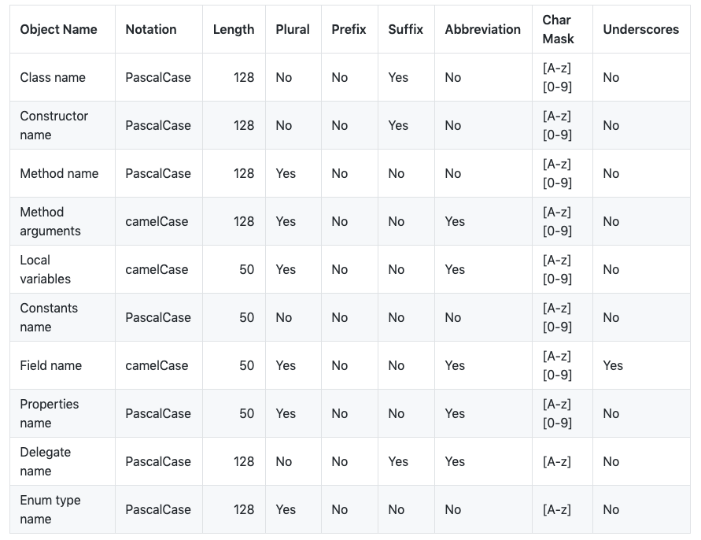

更多规则详见[github]([https://github.com/ktaranov/naming-convention)和[微软官方文档](https://docs.microsoft.com/en-us/dotnet/csharp/programming-guide/inside-a-program/coding-conventions).

## Unity中对Prefab加锁的前端实现

这段时间一直在实现这个需求，感想就是Unity对个性化定制支持很到位，竟然可以手动添加菜单项、右键菜单项等，里面的函数响应也很多。其次就是，原来并不是所有代码都是只在运行时被执行，设置编辑器的代码跟游戏本身已经没有关系了，只要编辑器开着就会被执行。

再来说说这个需求本身，目的是防止多人同时修改同一个prefab文件，导致冲突，因此在修改前需要对该文件上锁，上锁之后才能进行编辑，编辑之后再解锁即可。具体的需求如下：

> xlock
>
> - 每个锁都有名字（字符串，比较时大小写不敏感，存储、显示时有大小写）
>
> - 所有 api 的返回值都用 json 表示
>
> - 可以通过 lock 加锁，参数：lockName、userName
>
>   - 如获取成功，返回 {"result": "ok"}
>
>   - 同一 userName 可重复获取已持有的锁，返回 {"result": "already"}
>
>   - 如果该锁已被他人获取，返回 {"error": "the lock is being hold by xxx"}，xxx 是持有者 userName
>
>   - 其它错误，返回 {"error": "..."}，填充实际错误信息
>
> - 可以通过 unlock 解锁，参数：lockName、userName
>
>   - 如该用户持有该锁，执行解锁，如果成功，返回 {"result": "ok"}
>
>   - 对于同一个锁，不管之前曾重复执行过多少次 lock，一次 unlock 就解锁
>
>   - 如果该锁未被任何用户持有，返回 {"error": "the lock is not being hold by anyone"}
>
>   - 如果该锁正被其他用户持有，返回 {"error": "the lock is being hold by xxx"}，xxx 是持有者 userName
>
>   - 其它错误，返回 {"error": "..."}，填充实际错误信息
>
> - 可以通过 steal 偷锁，参数：lockName、userName
>
>   - 如果该锁正被他人持有，改换持有者，如成功，返回 {"result": "ok"}
>
>   - 如果该锁无人持有，返回 {"error": "the lock is not being hold by anyone"}
>
>   - 同一 userName 可重复偷已持有的锁，返回 {"result": "already"}
>
>   - 其它错误，返回 {"error": "..."}，填充实际错误信息
>
> - 可以通过 lockInfo 查询指定锁的状态
>
>   - 如果未被任何人持有，返回 {"result": "free"}
>
>   - 如果正被某人持有，返回 {"result": "being hold by xxx"}
>
>   - 如发生意外，返回 {"error": "..."}，填充实际错误信息
>
> - 可以通过 list 查询指定用户持有的锁，参数：userName
>
>   - 如果该用户持有锁，返回一个锁名数组：
>   
>   ```
> 	"abc/ddd/file1",
>
> 	"abc/ddd/file2",
>
> 	"abc/ddd/file9"
> ```
>   
> - 如果未持有任何锁，返回 []
>   
> - 如发生意外，返回 {"error": "..."}，填充实际错误信息
>   
> - 可以通过 listAll 查询所有上锁的锁，无参数
>
>   - 如果有上锁的的锁，返回一个数组：
>
> 	```
> {"lockName": "abc/ddd/file1", "userName": "abc"},
> 	
> 	{"lockName": "abc/ddd/file2", "userName": "abc"},
> 	
> 	{"lockName": "abc/ddd/file9", "userName": "ddd"}
> 	```
> 	
> - 如发生意外，返回 {"error": "..."}，填充实际错误信息
>   
> - 可以通过 log 查询（查询以外的）操作日志，参数：n（默认 100）
>
>   - 返回最后 n 条操作日志（按时间正序排列）：
>   
>   
>   ```
>     "2018-12-13 12:10:15 zhangsan locked abc/ddd/file1",
>
>     "2018-12-13 12:10:18 zhangsan unlocked abc/ddd/file1",
>
>     "2018-12-13 15:10:15 lisi stole abc/ddd/file2",
>
>     "2018-12-13 18:10:15 zhansan tried to lock abc/ddd/file2, but failed, because it was being hold by lisi",
>   ...
>   ```
>   
> - 可以采用任意本地存储保存当前锁状态，极端情况下，可通过删除本地文件清除所有锁
>
> - 查询以外的所有操作都要有日志

后端实现的接口：

> - 所有的请求都是post类型
>
> - 所有的响应都是text/plain 内容都是json格式的
>
> 1. 锁文件 
>
> ```
> request:
> 
> http:10.0.34.161:8899/cmd/lock
> 
> body：”args=-UserName ztr -Note xx -GUID ww"
> 
> response :
> 
> {“Code”:1, “Result”:”ok”}
> ```
>
> 
>
> 2. 解锁文件 
>
> ```
> request:
> 
> http:10.0.34.161:8899/cmd/unlock
> 
> body：”args=-UserName ztr  -GUID ww"
> 
> response:
> 
>  {“Code”:1, “Result”:”ok”}
> ```
>
> 
>
> 3. 偷锁
>
> ```
> request:
> 
> http:10.0.34.161:8899/cmd/stealLock
> 
> body：”args=-UserName ztr  -GUID ww"
> 
> response:
> 
>  {“Code”:1, “Result”:”ok”}
> ```
>
> 
>
> 4. 查询锁的拥有者
>
> ```
> request:
> 
> http:10.0.34.161:8899/cmd/findLockOwner
> 
> body：”args=-GUID ww"
> 
> response:
> 
>  {“Code”:1, “Result”:”ok”， “Data”:owner}
> ```
>
> 
>
> 5. 查询某个人的所有锁
>
> ```
> request:
> 
> http:10.0.34.161:8899/cmd/listOwnLock
> 
> body：”args=-UserName ztr”
> 
> response:
> 
>  {“Code”:1, “Result”:”ok”， “Data”:[]string{“lockOwner”:qtr, “lockName”:xxx, “note”:xxxx}}
> ```
>
> 
>
> 6. 查询所有的锁
>
> ```
> request:
> 
> http:10.0.34.161:8899/cmd/listAll
> 
> response:
> 
>  {“Code”:1, “Result”:”ok”， “Data”:[]string{“lockOwner”:qtr, “lockName”:xxx, “note”:xxxx}}
> ```
>
> 
>
> 7. 查询最近n条的操作log
>
> ```
> request:
> 
> http:10.0.34.161:8899/cmd/listOpLog
> 
> body: “args=-Num 10”
> 
> response:
> 
>  {“Code”:1, “Result”:”ok”， “Data”:[]string{}}
> ```
>
> 

这是本人实习期间实现的第一个较为独立的功能，虽然并不是直接作用到游戏中，但是也十分有意义，代码量最终为800行。下面说一下最终的实现细节：

1. 最开始肯定是要实现一个上锁的小demo，需要两个大的部分，一是监听打开prefab事件，二是与服务器通讯。

2. 查了很多资料后，采用[下面的方式](https://forum.unity.com/threads/editor-callback-for-prefab-mode-being-open.566803/)解决第一个问题：

   ```c#
       static XLock()
       {
           PrefabStage.prefabStageOpened += OnPrefabStageOpened;
           EditorApplication.update += Update;
       }
   
       static void OnPrefabStageOpened(PrefabStage prefabStage)
       {      
           if (!XGlobalFlag.xGlobalFlag) return;
           // lock prefab
           var prefabPath = prefabStage.prefabAssetPath;
           var guid = AssetDatabase.AssetPathToGUID(prefabPath);
           try
           {
               LockFile(guid, prefabPath);
           }
           catch (Exception e)
           {
               _goBackToPreviousStage = true;
               // EditorUtility.DisplayDialog("Error", e.ToString(), "OK");
           }
       }
   ```

   其中，定义一个主类`XLock`，在里面加上打开prefab时要调用的函数`OnPrefabStageOpened`，之后在外层实现即可。这里还需要注意的是` _goBackToPreviousStage`这个变量，它控制着是否需要返回上一层界面，即如果传输中发生了异常，则不能打开这个prefab，因此需要设置`_goBackToPreviousStage`为`true`，之后在`XLock`的`Update()`函数中进行界面的更新：

   ```c#
       static void Update()
       {
           if (_goBackToPreviousStage)
           {
               StageUtility.GoBackToPreviousStage();
               _goBackToPreviousStage = false;
           }
   
           if (_request == null)
               return;
     
           if (_request.isDone)
           {
   //                _callback?.Invoke();
   //                _callback = null;
                   _request = null;
           }
       }
   ```

   

3. 基础的HTTP通讯：

   ```c#
       static void PostRequest(string method, string body)
       {
           if (_request != null) return;
   
           var url = _baseUrl + "/" + method;
           _request = new UnityWebRequest(url, "POST");
   
           if (method.Equals("listAll"))
           {
               _request.downloadHandler = new DownloadHandlerBuffer();
               _request.SendWebRequest();
           }
   
           else
           {
               byte[] bodyRaw = Encoding.UTF8.GetBytes(body);
               _request.uploadHandler = new UploadHandlerRaw(bodyRaw);
               _request.downloadHandler = new DownloadHandlerBuffer();
               // _request.SetRequestHeader("Content-Type", "application/json");
               _request.SetRequestHeader("Content-Type", "application/x-www-form-urlencoded");
               _request.SendWebRequest();
           }
   
           while (!_request.isDone)
           {
               Thread.Sleep(1);
           }
       }
   ```

   代码中if的部分是发送一个空请求，else部分是发送一个有内容的请求。首先定义一个`WebRequest`，之后设置`downloadHandler`和`downloadHandler`，准备上传和接收数据，设置RequestHeader，如果是普通字符串，设置为`application/x-www-form-urlencoded`，Json设置为`application/json`，最后为了保证一定会拿到返回值，需要不断检查`request`的`isDone`属性是否为真，否则就需要继续等待。
   
   消息同步这里再多说一句，尝试了很多不同的方法，包括创建回调函数(invoke) 、`yield return _request.SendWebRequest();`和使用`coroutines`，发现还是使用while doen这样比较好用而且简单，但官方并不推荐这么写。
   
   
   
4. 只有，在实际上锁之前，我们还需要得到用户设置的用户名，这里就需要用到弹窗获得用户输入的功能了，由于Unity 2018中没有找到模态(Modal)的输入窗口，所以我们换了个思路，使用模态提示和非模态的输入窗口混合来接收用户输入：

   ```c#
       static void CheckUnityUserName()
       {
           var unityUserName = PlayerPrefs.GetString("UnityUserName");
           if (string.IsNullOrEmpty(unityUserName))
           {
               if (!XSetUserNameWindow.userNameSetDone)
               {
                   EditorUtility.DisplayDialog("Please set your user name first.", "", "OK");
                   XSetUserNameWindow.ShowWindow();
                   throw new Exception("Please set your user name first.");
               }
               unityUserName = XSetUserNameWindow.unityUserName;
               PlayerPrefs.SetString("UnityUserName", unityUserName);
               PlayerPrefs.Save();
           }
       }
       
   
   public class XSetUserNameWindow : EditorWindow
   {
       public static string unityUserName="";
       public static bool userNameSetDone = false;
    
       // [MenuItem("Tools/Test Modal Editor Window")]
   
       public static void Init()
       {
           unityUserName = "";
           userNameSetDone = false;
       }
       public static void ShowWindow()
       {      
           // xSetUserNameWindow.CreateInstance<xSetUserNameWindow>().showModal();
           XSetUserNameWindow.CreateInstance<XSetUserNameWindow>().Show();
           
       }
    
       void OnEnable()
       {
    
       }
    
       void OnDisable()
       {
           //setMainWindowFocus();
       }
    
       void OnGUI()
       {
                   
           GUI.Label(new Rect(30, 10, Screen.width, 20), "Please enter your git username: ");
           GUI.Label(new Rect(30, 40, 100, 20), "User Name");
           unityUserName = GUI.TextField(new Rect(100, 40, 200, 20), unityUserName, 20);
           // unityUserName = GUILayout.TextField("User Name", this.unityUserName, 30);
           if (GUI.Button(new Rect(100, 80, 200, 20), "Save"))
           {
               
               if (string.IsNullOrEmpty(unityUserName))
               {
                   EditorUtility.DisplayDialog("User Name cannot be empty", "", "OK");
               }
               else
               {
                   userNameSetDone = true;
                   EditorUtility.DisplayDialog("User Name Saved", "Set your user name to: " + unityUserName, "OK");
                   this.Close();
               }
           }
       }
       void showModal()
       {
           MethodInfo dynShowModal = this.GetType().GetMethod("ShowModal", BindingFlags.NonPublic | BindingFlags.Instance);
           dynShowModal.Invoke(this, new object[] { });
       }
   }
   ```

   我们将用户名保存在PlayerPrefs中，在上锁前，我们首先会检查用户的用户名是否存在，如果不存在，则弹窗提示，并打开输入窗口接收输入，当用户输入合法的用户名并保存后，设置`userNameSetDone`为`true`，下次运行用户名检查函数时就能读取用户名了。

5. 有了上面两个基本的功能，我们就可以实现基本的上锁和解锁功能了：

   ```c#
       public static void LockFile(string guid, string prefabPath)
       {
   //        PlayerPrefs.DeleteKey("UnityUserName");
   //        PlayerPrefs.Save();
   //        xSetUserNameWindow.init();
           
           // S1: checking unity user name
           try
           {
               CheckUnityUserName();
   
           }
           catch (Exception e)
           {
               throw e;
           }
           
           var unityUserName = PlayerPrefs.GetString("UnityUserName");
           
           // S2: posting http request
           // string json = "{ \"UserName\": \"" + unityUserName + "\", \"GUID\": \"" + guid + "\", \"Note\": \"" + prefabPath +"\"}";
           
           var requestBody = "args= -UserName " + unityUserName + " -Note " + prefabPath + " -GUID " + guid;
           PostRequest("lock", requestBody);
           
           
           Debug.Log("Lock function:");
           Debug.Log("Sent: "+ requestBody);
           Debug.Log("Received: " + _request.downloadHandler.text);
           
           // S3: analysing received json
           XAnalyseJsonBasic jsonAnalysed = JsonUtility.FromJson<XAnalyseJsonBasic>(_request.downloadHandler.text);
   
           _responseCode = jsonAnalysed.code;
           _responseResult = jsonAnalysed.result;
   //        _callback = () =>
   //        {
   //            code = _request.responseCode;
   //            result = _request.downloadHandler.text;
   //        };
   
           // S4: Acting based on analysed json
           if (_responseCode != 1)
           {
               EditorUtility.DisplayDialog("Lock file failed! " + _responseResult, "", "OK");
               throw new Exception("Lock file failed! " + _responseResult);
           }
           else
           {
               // EditorUtility.DisplayDialog("Lock file success!", "", "OK");
           }
       }
   ```

   ```c#
       public static void UnlockFile(string guid, string prefabPath)
       {
           try
           {
               CheckUnityUserName();
   
           }
           catch (Exception e)
           {
               throw e;
           }
           
           var unityUserName = PlayerPrefs.GetString("UnityUserName");
           var prefabNameTemp = prefabPath.Split('/');
           var prefabName = prefabNameTemp[prefabNameTemp.Length - 1];
           
           var requestBody = "args= -UserName " + unityUserName + " -GUID " + guid;
           // string json = "{ \"UserName\": \"" + unityUserName + "\", \"GUID\": \"" + guid + "\", \"Note\": \"" + prefabPath +"\"}";
           
           PostRequest("unlock", requestBody);
   
           XAnalyseJsonBasic jsonAnalysed = JsonUtility.FromJson<XAnalyseJsonBasic>(_request.downloadHandler.text);
   
           _responseCode = jsonAnalysed.code;
           _responseResult = jsonAnalysed.result;
   
           Debug.Log("Unlock function:");
           Debug.Log("Sent: "+ requestBody);
           Debug.Log("Received: " + _request.downloadHandler.text);
           
           if (_responseCode != 1)
           {
               EditorUtility.DisplayDialog("Unlock file failed! " + _responseResult, "", "OK");
               throw new Exception("Unlock file failed! " + _responseResult);
           }
           else
           {
               EditorUtility.DisplayDialog("Unlock the " + prefabName + " success!", "", "OK");
           }
       }
   ```

   其中需要注意的包括对回传数据的解析和对异常的处理。

   由于服务器传回的数据是Json格式，所以在接收和解析数据时我们首先要定义一个类，来表示Json中的各个部分：

   ```c#
   using System.Collections;
   using System.Collections.Generic;
   using UnityEngine;
   
   [System.Serializable]
   
   public class FileLock
   {
       public string lockOwner;
       public string lockName;
       public string note;
   
   }
       
   public class XAnalyseJsonWithLocks
   {
       public int code;
       public string result;
       public FileLock[] data;
   }
   ```

   之后将该类实例化，并使用

   ```c#
   XAnalyseJsonBasic jsonAnalysed = JsonUtility.FromJson<XAnalyseJsonBasic>(_request.downloadHandler.text);
   ```

   来得到解析后的结果。

   异常处理：抛出异常可以打断正在执行的函数，并且可以统一在外层进行输出控制。

6. 最后就是右键菜单的添加：

   ```c#
       [MenuItem("Assets/xLock/Lock", true)]
       static bool ValidateRightMouseLock()
       {
           return Selection.activeGameObject != null && XGlobalFlag.xGlobalFlag;
       }
   
       [MenuItem("Assets/xLock/Lock")]
       static void RightMouseLock()
       {
           var prefabPath = AssetDatabase.GetAssetPath(Selection.activeObject);
           if (!prefabPath.EndsWith(".prefab")) return;
           var guid = AssetDatabase.AssetPathToGUID(prefabPath);
           try
           {
               LockFile(guid, prefabPath);
           }
           catch (Exception e)
           {
               _goBackToPreviousStage = true;
               // EditorUtility.DisplayDialog("Error", e.ToString(), "OK");
           }
           
       }
   ```

   其中，在中括号中加入`'true'`参数的函数负责验证是否要启用该右键菜单，即通过在其中加入验证条件，可以控制该菜单是否被激活。

   没有`'true'`参数的函数控制点击该选项后，具体执行的内容。

7. 最后，光监听prefab打开是不够的，还需要对任何写入操作进行验证，这里主要包括移动、删除、保存三种操作：

   ```c#
   public class XCustomAssetModificationProcessor : UnityEditor.AssetModificationProcessor
   {
       private static AssetMoveResult OnWillMoveAsset(string sourcePath, string destinationPath)
       {
           Debug.Log("Moving assets from Source path: " + sourcePath + "to Destination path: " + destinationPath + ".");
           AssetMoveResult assetMoveResult = AssetMoveResult.DidNotMove;
               
           if (sourcePath.EndsWith(".prefab") && XGlobalFlag.xGlobalFlag)
           {
               var guid = AssetDatabase.AssetPathToGUID(sourcePath);
   //            try
   //            {
   //                xlock.LockFile(Guid, sourcePath);
   //            }
   //            catch (Exception e)f
   //            {
   //                assetMoveResult = AssetMoveResult.FailedMove;
   //                EditorUtility.DisplayDialog("Move failed!", "You cannot lock the prefab: " + sourcePath + ".", "Ok");
   //                return assetMoveResult;
   //            }
   
               try
               {
                   XLock.UnlockFile(guid, sourcePath);
               }
               catch (Exception e)
               {
                   assetMoveResult = AssetMoveResult.FailedMove;
                   EditorUtility.DisplayDialog("Move failed!", "You cannot unlock the prefab: " + sourcePath + ".", "Ok");
                   return assetMoveResult;
               }
   
               try
               {
                   guid = AssetDatabase.AssetPathToGUID(destinationPath);
                   XLock.LockFile(guid, destinationPath);
   
               }
               catch (Exception e)
               {
                   assetMoveResult = AssetMoveResult.FailedMove;
                   EditorUtility.DisplayDialog("Move failed!", "You cannot lock the prefab: " + destinationPath + ".", "Ok");
                   return assetMoveResult;
               }
   
           }
           return assetMoveResult;
       }
   
       private static AssetDeleteResult OnWillDeleteAsset(string prefabPath, RemoveAssetOptions opt)
       {
           Debug.Log("Deleting assets: " + prefabPath + ".");
           AssetDeleteResult assetDeleteResult = AssetDeleteResult.DidNotDelete;
           
           if (prefabPath.EndsWith(".prefab") && XGlobalFlag.xGlobalFlag)
           {
               var guid = AssetDatabase.AssetPathToGUID(prefabPath);
               try
               {
                   XLock.UnlockFile(guid, prefabPath);
               }
               catch (Exception e)
               {
                   assetDeleteResult = AssetDeleteResult.FailedDelete;
                   EditorUtility.DisplayDialog("Deletion failed!", "You cannot unlock the prefab: " + prefabPath + ".", "Ok");
               }
           }
           
           return assetDeleteResult;
       }
   
       private static string[] OnWillSaveAssets(string[] paths)
       {
           Debug.Log("Saving assets...");
           var pathsToSave = new List<string>();
           foreach (string path in paths)
           {
               pathsToSave.Add(path);
               if (path.EndsWith(".prefab") && XGlobalFlag.xGlobalFlag )
               {
                   var guid = AssetDatabase.AssetPathToGUID(path);
                   try
                   {
                       XLock.LockFile(guid, path);
                   }
                   catch (Exception e)
                   {
                       pathsToSave.Remove(path);
                       EditorUtility.DisplayDialog("Deletion failed!", "You cannot lock the prefab: " + path + ".", "Ok");
                   }
               }
           }
           return pathsToSave.ToArray();
       }
   }
   ```

   这里主要是用对函数，定义一个类，继承自`UnityEditor.AssetModificationProcessor`，之后对`OnWillMoveAsset`、`OnWillDeleteAsset`、`OnWillSaveAssets`这三个函数进行实现即可。

总结一下就是，实现这个需求包括两大部分，第一是对用户操作的监听，第二是与服务器端的通信。但第二点只要有模板都很好实现，主要是第一点，如果合理并且全面地防止同时修改prefab情况的发生。

# Day 23-24: 06.21, 06.24

## 点击按钮触发Toggle

这两天回到地图编辑器中，实现了建筑物的复选和整排城墙的一次性选取功能，里面比较重要的一点是，如何点击按钮触发一个toggle：

```c#
Toggle t = GameObject.Find("ToggleMultiChooseMode").GetComponent<Toggle>();
t.isOn = true;
```

而不能直接调用这个toggle的触发函数`OnButtonMultiChooseMode(bool value)`，这样会使得状态错误。而通过改变isOn，可以实现正确的状态跳转。

## Unity中的几个代码修改提示

- 根据条件赋值

```
if(statement) a=b;
else a=c;
```

改成：

```
a = statement? a : b
```

- 反转if表达式

```
if(statement)
{
	...
}
```

改成

```
if (!statement) return;
...
```


## 以后写代码要多加注释

注释遵循的几个规则：

- 注释写在单独的行中，而不是代码后方；
- 注释类似英文句子，句子开头大写，结尾要有句点等标点；
- 注释与`//`之间要有一个空格

# 一月总结

到6月20号实际上已经实习一个月了，但由于最近几天完成的还是开始的工作，所以就一并写在了第一个月里面。一个月里，从最初的一脸懵逼，到后来渐渐熟悉开发环境，再到现在独立解决问题，甚至还有点觉得工作了几年的同事代码能力也就那样（好像有点膨胀了，撤回），心态起伏还是比较大的。然后自己的工作热情也比较高涨，竟然实现了地铁上写代码的成就，果然这种可视化的编程过程比较对我的胃口。一个月前对自己提出的要求也都基本实现了，现在也是一个有微小生产力的程序员啦。

刚到一个月的时候，leader给我看了自己的培养计划，反正到目前为止，第一个月的目标都实现了，自己也会尽力完成后面的工作。

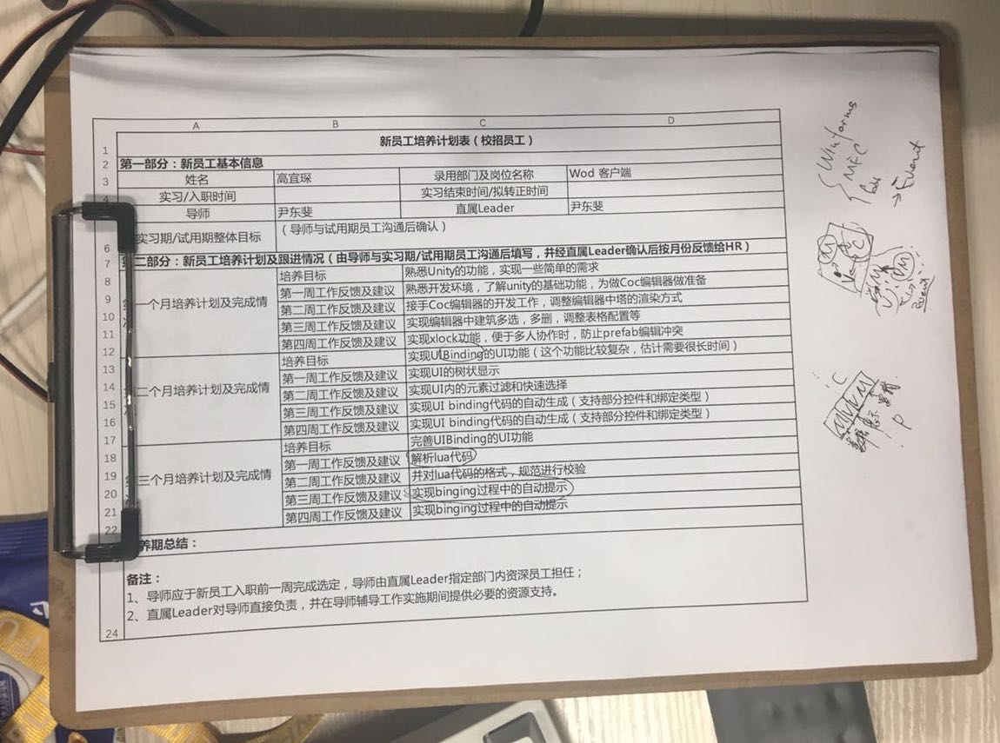

工作难度不是很高，遇到不会的也可以查，再不会就问问leader，基本都可以解决或者找到替代方案。另外感觉leader每天讨论和开会的时间比较多，实际写代码时间并没有很多，但就是出成果，每天都有很多可以展示，所以代码效率还是很重要的，自己写过的代码尽量能够理解并记忆，不断积累就能提高自己的代码效率。而不是实现一个功能需要不断地去搜索和查询。

公司氛围比较好，完成需求的满足感也很高，现在就是觉得没有很系统地学习，导致有些代码不知道实现原理、需求无从下手以及不知道为什么这么写可以实现对应的功能。所以进入7月份，实验室那边工作压力不重了以后，就要静下心来系统地学习一下语法和面向对象的知识，同时准备秋招，fighting！最后放个做的地图编辑器的截图：:smile:

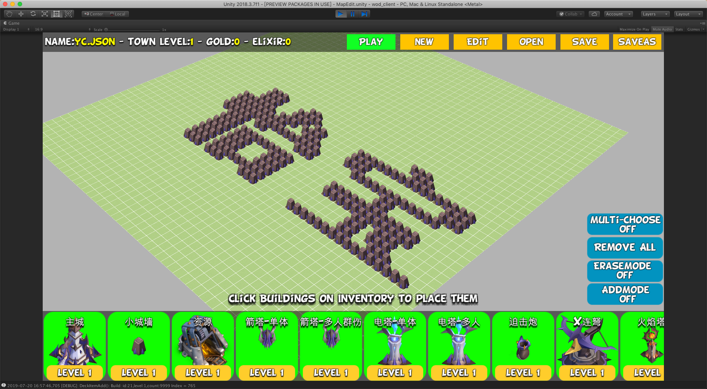