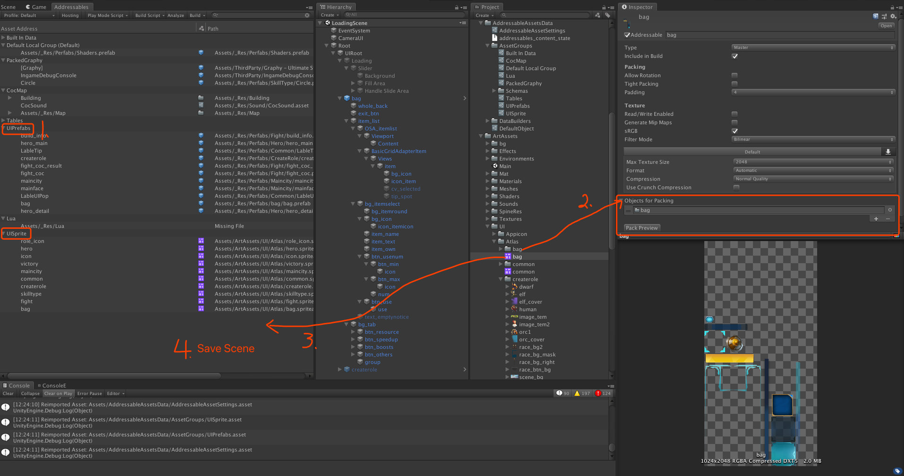
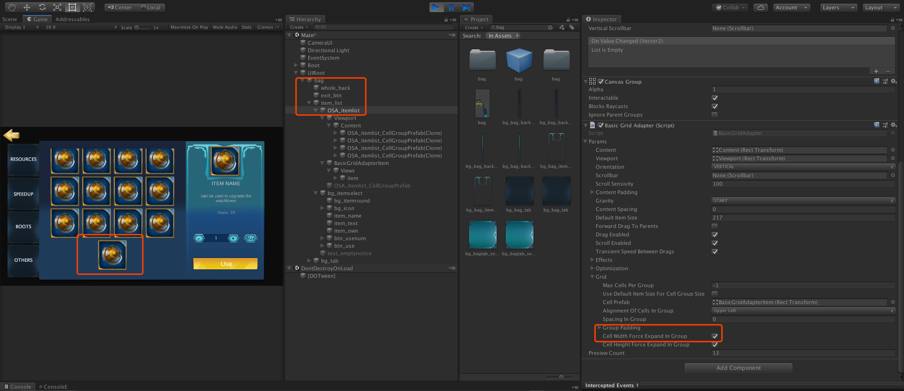
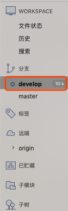
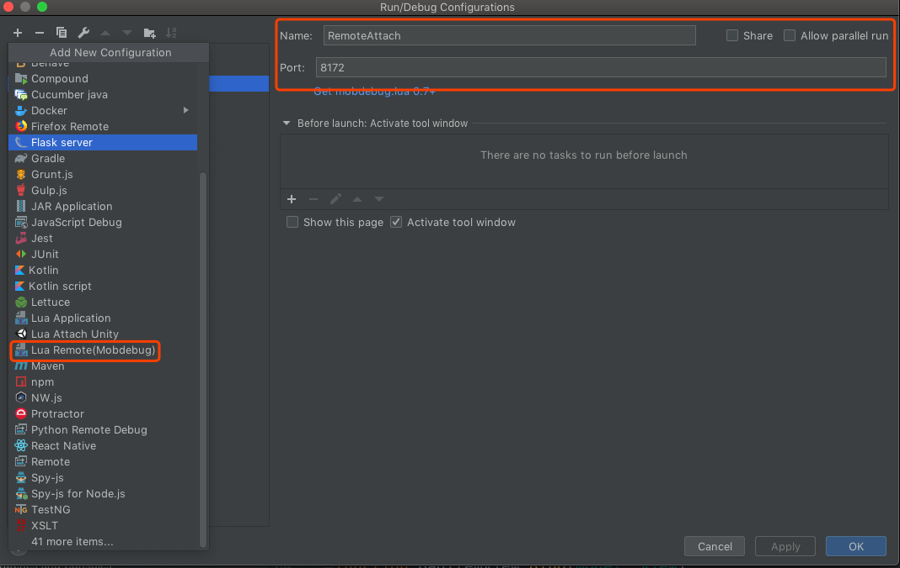
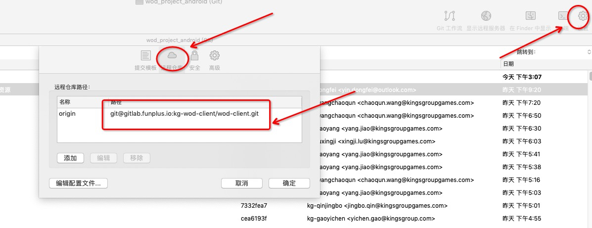
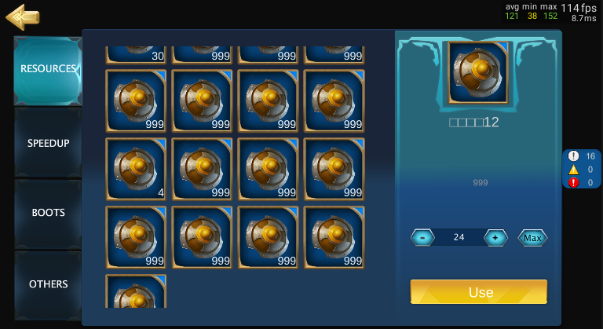

# 第二月：

**时间：2019.06.20-2019.07.20**

**目标：系统学习Unity和面向对象，准备秋招**


# Day 25: 06.27

由于组会需要讲论文以及有点感冒，鸽了两天公司的活。

先记录三个小发现：

- 熟悉C#中的`"\""`，表示只有一个引号的字符串;
- 发送给服务器解析命令行时，可以在有空格的数据比如userName、fileName等，前后加上引号， 这样就可以避免数据被空格打断;
- SourceTree 中仅修改文件名大小写不会算在修改文件里，所以对于一个文件，如果本地仅修改了文件名的大小写，是无法修改远端的。但如果在git config中将”ignorecase“设置为”false“，又会出现多push的情况，即远端会出现修改前和修改后的两个文件，这时需要将本地的文件备份，然后push一次，这样远端会认为本地将文件进行了删除，就会将大小写文件一并删掉。之后再将本地文件恢复，远端会认为新增了文件，而且新增的文件是正确的文件名。所以只需要再push一次即可。

# Day 26: 06.28
今天接到了新的需求，要求使用Unity中的IMGUI的Treeview做prefab的解析和与lua的绑定。基本上和培养要求中说的一致。

这个做一周，希望能把解析做好，之后继续做游戏中的背包系统和大地图城建，涉及wrpc的通信，即客户端与服务器之间的消息传递，听了一下leader的讲解，大致分为两种情况，一是客户端到服务器(C->S)，需要客户端发起请求，然后接受服务器传回的消息，主要通过lua中的回调来实现，大致是：
```
S:FunctionName(arg1, arg2, function (ret)
    // do somethind in invoke function
    end
)
```
其中的`function`是回调函数，可以嵌套；返回值可以多个，也可以是复杂的结构体。

另一种是服务器到客户端(S->C)，是服务器发起的请求，比如在客户端播放一个特效，客户端接收到请求，只需要做对应的响应即可。这种情况需要客户端实现服务器中同名的接口，每个函数有个ID，对应起来即可。这种函数返回值为void。

# Day 27-30: 06.29 - 07.04
这几天没有更新，有几点原因：

1. 需求有点复杂，而且得到的指导不是很够，所以自己探索起来动力不是很充足，而且一周之后需要换需求；
2. 实验室工作进度缓慢，论文也没有中，所以需要做一些实验室的工作；
3. 秋招的压力，需要刷题和刷面经，来准备即将到来的秋招；
4. 爱情方面也略有一些不愉快， 不过已经都解决好啦。

然后总结一下最近学到的东西：

1. SourceTree 时间长需要清理一下，只保留自己修改的文件
2. Unity中，一定要确保屏幕中要显示的内容每次都在OnGUI被刷新，否则就会发生点击后没反应的情况，从而误以为是逻辑问题，实际上是没有被显示出来。
3. Unity中的TreeView中默认的排序功能只能对顶层的节点进行排序，下层的子节点不参与排序。所以如果树的顶层节点只有一个，则排序功能就失效了。

# Day 31-32: 07.05, 07.07
最近主要完成了TreeView的展示功能，包括读取prefab的树形结构，读取其中的条目，按照树形结构显示在window中。但关于TreeView，自己理解的还不够，所以仅记录一些自己认为比较有用的吧。

1. 首先是逻辑部分，官网上封装的层级比较多，每个window包含一个treeview，负责显示树中的内容，每颗tree由不同的element组成，每个element包含深度、名称和id，存储为一个线性结构，按照深度和id恢复到原来的树形结构。
2. 添加节点:
```c#
void SetMvvmTreeElements (GameObject openedPrefab)
{
    _mvvmPrefab
    ScriptableObject.CreateInstance<MvvmPrefab>();
    var gameObjectTreeElements = new List<MvvmGameObject>();
    IDCounter = 0;
            
    var root = new MvvmGameObject("Root", -1, IDCounter);
    gameObjectTreeElements.Add(root);

    // 加入根节点后，排序功能会失效
    root = new MvvmGameObject(_openedPrefab, 0, ++IDCounter);
    gameObjectTreeElements.Add(root);

    foreach (Transform child in _openedPrefab.transform)
    {
            AddChildrenRecursive(root, child, gameObjectTreeElements);
    }
    _mvvmPrefab.treeElements = gameObjectTreeElements;
}

void AddChildrenRecursive(TreeElement parentElement, Transform child, List<MvvmGameObject> gameObjectTreeElements)
{

    var childAdded = new MvvmGameObject(child.gameObject, parentElement.depth + 1, ++IDCounter);
    gameObjectTreeElements.Add(childAdded);

    foreach (Transform grandChild in child.transform)
    {
            AddChildrenRecursive(childAdded, grandChild, gameObjectTreeElements);
    }
}
```
插入节点是一个BFS递归的过程，主要就是新建节点，并且初始化，然后加入到list中即可。

下周开始要实现背包系统和大地图城建了，感觉会更简单一些，同时也要开始正式准备秋招了。

# Day 33: 07.08
今天正式结束了Mvvm的部分，开始做背包系统的绑定，涉及lua和wrpc。记录一下昨天遇到的一个问题：
- 在IntelliJ中打开文件夹后，并不会自动导入文件夹中子文件夹的内容，此时还需要[设置一下根目录](https://www.jetbrains.com/help/idea/content-roots.html)：
打开文件->找到project structure->然后找到Modules->点击add content root，将根目录添加进去即可，然后记得选择"Mark as Sources"。
    

# Day 34: 07.12
1. 今天学习了一下界面绑定时，如何在Unity中更新美术资源：

    - 首先更新表格，刷新wrpc和wdsync
    - Unity中，点击Window->Asset Management->Addressable Assets，打开Addressables窗口，并将其移动到Scene和Game标签里
    - 把美术新增的prefab拖动到UIPrefabs中，并点击简化名称
    - 如果美术新增了贴图，在同目录下新建一个`Sprite Atlas`，与贴图文件夹同名，然后将贴图文件夹拖动到这个Atlas下，点击一下pack preview，最后将atlas拖动到UISprite中，简化名称，保存。
    

2. 如果Unity在Hierarchy中修改了prefab，则需要在Inspector中选择Overrides -> Apply all，这里需要注意，如果修改的是子节点，则不存在Overrides按钮，此时需要回到父节点，然后才能找到Overrides。(也可以直接从Hierarchy中将prefab拖回到Project中)
    


3. 在Console中，点击Collapse，可以将相同的错误折叠，方便观察其他错误。

# Day 35: 07.13
1. 查看Prefab在场景中的显示，可以将其拖动只Hierachy层级下的UIRoot中
2. 修改Unity中grid的元素排列方式，如果需要左对齐，要将选项里的"Cell Width Force Expand In Group"取消掉。

    

3. SourceTree中拉取前要确认当前分支是否正确，即加粗的分支是当前分支

    

4. Intellij IDEA 中调试Lua代码:
    - 首先设置项目的根目录（与Day 33中一致）
    - 在Debug中选择配置，添加远程调试器
    
    - 每次开始调试，只能运行一次Unity，第二次运行Unity之前，需要重新开始调试，否则会卡住

# Day 36: 07.18
1. IntelliJ中，使用Shift+Delete，可以删除一整行。
2. Sourcetree中修改远程仓库路径：
    由于仓库体积不断增大，pull和push速度受到影响，所以项目组将自己的仓库迁移到了本地，迁移后需要配置sourcetree的远程URL：

    

# Dat 37: 07.19
1. 今天终于比较完整地实现了游戏中背包的界面和逻辑，记录一下：

    

- 已实现功能：

    1. 根据服务器端传来的数据，将物品和其对应数量显示在背包中；

    1. 根据物品配置表，将物品按照类别放入不同tab中，显示物品对应的图标和数量；

    1. 根据物品拥有数量，实现使用数量的修改，并且支持手动输入，完成物品切换时，使用数量的改变逻辑；

    1. +、-、MAX按钮的逻辑

    1. 每个tab相互独立，来回切换不会相互影响选中的位置（仅维护一个全局的使用数量，所以切换tab会影响使用数量——参考ROK）

    1. 区分背包页签中有无物品的展示

    1. 物品被选中时有边框提示，界面右侧显示详细信息（名称、数量、描述）。玩家进入背包，默认选中第一个物品。


- 待实现功能

    1. 物品使用（重点需要测试使用完某种物品引起list的变化和选中物体的变化、查看背包时获得新物品的情况）

    1. 物品按照不同的使用方式，选择不同的展示UI

    1. 根据配置表加载物品品质底图和Icon

    1. 正确显示物品名称

    1. userdata为空时，正常显示

    1. 相同物品堆叠的显示

    1. 物品排序

    1. 红点提示

- 注意的细节：
    
    - 了解代码执行的先后顺序和次数是很重要的，比如那个函数会先执行，那个函数是回调，那个函数是每帧都被执行等
    - 修改prefab可以将其拖动到UIRoot中进行编辑
    - prefab修改完记得拖回去应用，但存在改坏的可能，表现为不报错，无提示，但就是进不去场景
    - intelliJ每次打开都需要设置根目录，同时调试功能也比较好用，但每次调试都需要重新启动
    - lua写起来还挺简单的，不需要参数的类型，直接写就行了
    - 代码中隐藏物体时，可在其公共父节点上挂一个gameobject，然后将其active设置为false即可。

- 具体实现：
    - 踩了很多坑，先来说一下大致的思想：基础的mvc架构
        - M中存放数据，以背包为例，M中存放每个tab中有哪些物品，当前选中了哪个列表、哪个物品等。
        - V中主要完成数据跟界面的绑定以及添加事件的监听，比如UI界面上的东西如何在代码中用变量表示，如何根据条件将数据展示给用户，不同的控件绑定哪些数据。
        - C中主要负责对M中的数据进行修改，比如用户点击了某个按钮，具体应该发生什么事情，即C中主要写逻辑。
        - V和C中都可以直接访问M，但V中主要是读取数据，C中主要是读写。
    - 再来说说绑定的原理，我的理解其实就是定义一系列的监听函数，当数据发生变化时，就会调用这个监听函数，然后将数据重新刷到UI上。当然有一些特殊的绑定，比如这次背包接触到的Gridview，可以自动根据list的变化，将list中的元素显示在背包的不同小格子中。最后需要注意的一点是，这里提到的数据变化，会调用监听其父节点的函数，而不是监听该数据本身的函数，奇怪的设计。
    - 具体说说代码：
        
        1. 背包的Model：
        ```lua
        --- BagModel.lua
        ---
        --- Generated by EmmyLua(https://github.com/EmmyLua)
        --- Created by YCIrving.
        --- DateTime: 2019-07-11 18:12
        ---

        ---@class SelectedItem
        local SelectedItem = XT.bindable()
        ---@type BagItemModel
        SelectedItem.CurrentSelectedItem = nil
        ---@type number
        SelectedItem.NumUse = 1


        ---@class SelectedItemList
        local SelectedItemList = XT.bindable()
        ---@type BagItemModel[]
        SelectedItemList.CurrentSelectedItemList = {}
        ---@type boolean
        SelectedItemList.CurrentSelectedItemListEmpty = true


        ---@class BagModel
        local BagModel = XT.bindable()

        ---@type
        BagModel.SelectedItem = SelectedItem()

        ---@type
        BagModel.SelectedItemList = SelectedItemList()

        ---@type BagItemModel[]
        BagModel.ResourcesItemList = {}

        ---@type BagItemModel[]
        BagModel.SpeedupItemList = {}

        ---@type BagItemModel[]
        BagModel.BoostsItemList = {}

        ---@type BagItemModel[]
        BagModel.OthersItemList = {}

        ---@type BagItemModel
        BagModel.ResourcesSelectedItem = nil

        ---@type BagItemModel
        BagModel.SpeedupSelectedItem = nil

        ---@type BagItemModel
        BagModel.BoostsSelectedItem = nil

        ---@type BagItemModel
        BagModel.OthersSelectedItem = nil

        return BagModel

        ```
        注意上面定义了两层，`SelectedItem`和`SelectedItemList`都是为了方便监听其子节点而创建的，这样子节点的改变不会导致整个UI重新被刷新。
        
        2. 背包中每个Item的Model：
        ```lua
        --- BagItemModel.lua
        ---
        --- Generated by EmmyLua(https://github.com/EmmyLua)
        --- Created by YCIrving.
        --- DateTime: 2019-07-13 17:23
        ---

        ---@class BagItemModel
        local BagItemModel = XT.bindable()

        ---@type ObjectConfItem
        BagItemModel.ObjectConfItem = nil

        ---@type number
        BagItemModel.Count = 0

        ---@type boolean
        BagItemModel.Selected = false

        ---@type boolean
        BagItemModel.TipSpot = false

        return BagItemModel
        ```

        3. 背包的View:
        ```Lua
        --- BagView.lua
        ---
        --- Generated by EmmyLua(https://github.com/EmmyLua)
        --- Created by YCIrving.
        --- DateTime: 2019-07-11 18:12
        ---
        require("common.define")
        local CommonFunUtil = require("util.CommonFunUtil")

        ---@class BagView
        local BagView = XT.class()

        -- 都是界面上的控件
        --start
        ---@type UnityEngine.UI.Button
        BagView._btnExit = nil -- exit
        ---@type UnityEngine.UI.Toggle
        BagView._btnResourcesToggle = nil -- resources tabs
        ---@type UnityEngine.UI.Toggle
        BagView._btnSpeedupToggle = nil -- speedup tabs
        ---@type UnityEngine.UI.Toggle
        BagView._btnBoostsToggle = nil -- boosts tabs
        ---@type UnityEngine.UI.Toggle
        BagView._btnOthersToggle = nil -- others tabs
        ---@type Wod.UI.BasicGridAdapter
        BagView._resourcesGridView = nil -- resources gridView
        ---@type Wod.UI.BasicGridAdapter
        BagView._speedupGridView = nil -- speedup gridView
        ---@type Wod.UI.BasicGridAdapter
        BagView._boostsGridView = nil -- boosts gridView
        ---@type Wod.UI.BasicGridAdapter
        BagView._othersGridView = nil -- others gridView
        ---@type UnityEngine.GameObject
        BagView._goResourcesGridView = nil -- resources gameobject
        ---@type UnityEngine.GameObject
        BagView._goSpeedupGridView = nil -- speedup gameobject
        ---@type UnityEngine.GameObject
        BagView._goBoostsGridView = nil -- boosts gameobject
        ---@type UnityEngine.GameObject
        BagView._goOthersGridView = nil -- others gameobject
        ---@type TMPro.TMP_Text
        BagView._lbItemListEmptyNotice = nil
        ---@type UnityEngine.GameObject
        BagView._goItemSelectedInfo = nil -- ItemInfo
        ---@type SpriteLoader
        BagView._itemIcon = nil
        ---@type TMPro.TMP_Text
        BagView._lbItemName = nil
        ---@type TMPro.TMP_Text
        BagView._lbItemText = nil
        ---@type TMPro.TMP_Text
        BagView._lbItemOwn = nil
        ---@type TMPro.TMP_InputField
        BagView._lbNum = nil -- ItemUse
        ---@type UnityEngine.UI.Button
        BagView._btnMinus = nil
        ---@type UnityEngine.UI.Button
        BagView._btnPlus = nil
        ---@type UnityEngine.UI.Button
        BagView._btnMax = nil
        ---@type UnityEngine.UI.Button
        BagView._btnUse = nil
        --end

        --------------------- base function begin --------------------------------------------------------------------------------
        function BagView:Awake()

        end

        function BagView:Start()
            self:Init()
            self:AddListener()
        end

        function BagView:Init()

            if D.BagModel == nil then
                local model = MT.BagModel()
                self.Model = model
                D.BagModel = model
                self:Bind(self, model)
            else
                self:Bind(self, D.BagModel)
                self.Model = D.BagModel
            end

            CT.BagCtrl.InitData()

            -- 回调函数，只有当gridview被创建时才会调用
            self._resourcesGridView.OnStart = function()
                self:BindResourcesItemList()
            end
            self._speedupGridView.OnStart = function()
                self:BindSpeedupItemList()
            end
            self._boostsGridView.OnStart = function()
                self:BindBoostsItemList()
            end
            self._othersGridView.OnStart = function()
                self:BindOthersItemList()
            end

            self:ShowCurrentSelectedItemList()
            self:ShowCurrentSelectedItem()


            self._btnResourcesToggle.isOn = (D.BagModel.SelectedItemList.CurrentSelectedItemList == D.BagModel.ResourcesItemList)
            self._btnSpeedupToggle.isOn = (D.BagModel.SelectedItemList.CurrentSelectedItemList == D.BagModel.SpeedupItemList)
            self._btnBoostsToggle.isOn = (D.BagModel.SelectedItemList.CurrentSelectedItemList == D.BagModel.BoostsItemList)
            self._btnOthersToggle.isOn = (D.BagModel.SelectedItemList.CurrentSelectedItemList == D.BagModel.OthersItemList)

        end

        function BagView:Update()

        end

        function BagView:OnDestroy()
            self:OnClose()
        end

        function BagView:AddListener()

            self._btnExit.onClick:AddListener( CT.BagCtrl.OnBtnExit)
            self._btnMinus.onClick:AddListener( CT.BagCtrl.OnBtnMinus)
            self._btnPlus.onClick:AddListener( CT.BagCtrl.OnBtnPlus)
            self._btnMax.onClick:AddListener( CT.BagCtrl.OnBtnMax)
            self._btnUse.onClick:AddListener( CT.BagCtrl.OnBtnUse)
            self._lbNum.onValueChanged:AddListener (CT.BagCtrl.OnInputNum)

            self._btnResourcesToggle.onValueChanged:AddListener( CT.BagCtrl.OnBtnResourcesTab)
            self._btnSpeedupToggle.onValueChanged:AddListener( CT.BagCtrl.OnBtnSpeedupTab)
            self._btnBoostsToggle.onValueChanged:AddListener( CT.BagCtrl.OnBtnBoostsTab)
            self._btnOthersToggle.onValueChanged:AddListener( CT.BagCtrl.OnBtnOthersTab)

        end

        function BagView:RemoveListener()
            self._btnExit.onClick:RemoveListener( CT.BagCtrl.OnBtnExit)
            self._btnMinus.onClick:RemoveListener( CT.BagCtrl.OnBtnMinus)
            self._btnPlus.onClick:RemoveListener( CT.BagCtrl.OnBtnPlus)
            self._btnMax.onClick:RemoveListener( CT.BagCtrl.OnBtnMax)
            self._btnUse.onClick:RemoveListener( CT.BagCtrl.OnBtnUse)
            self._lbNum.onValueChanged:AddListener (CT.BagCtrl.OnInputNum)

            self._btnResourcesToggle.onValueChanged:RemoveListener( CT.BagCtrl.OnBtnResourcesTab)
            self._btnSpeedupToggle.onValueChanged:RemoveListener( CT.BagCtrl.OnBtnSpeedupTab)
            self._btnBoostsToggle.onValueChanged:RemoveListener( CT.BagCtrl.OnBtnBoostsTab)
            self._btnOthersToggle.onValueChanged:RemoveListener( CT.BagCtrl.OnBtnOthersTab)
        end

        function BagView:OnClose()
            self:RemoveListener()
            self:UnBind()
            self:OnClean()
        end

        function BagView:OnClean()
            D.BagModel = nil
        end

        function BagView:UnBind()
            XT.unbind(self)
            Log("BagView UnBind")
        end


        -- 只有当list中节点发生了删除或增加才会被执行
        --绑定列表
        function BagView:BindResourcesItemList()
            Log("BagView:BindResourcesItemList()")

            XT.bind(self, D.BagModel.ResourcesItemList, function (m, v)
                XT.BindGrid(self, self._resourcesGridView, D.BagModel.ResourcesItemList, VT.BagItemView.Bind)
            end)
        end

        function BagView:BindSpeedupItemList()
            Log("BagView:BindSpeedupItemList()")

            XT.bind(self, D.BagModel.SpeedupItemList, function (m, v)
                XT.BindGrid(self, self._speedupGridView, D.BagModel.SpeedupItemList, VT.BagItemView.Bind)
            end)
        end

        function BagView:BindBoostsItemList()
            Log("BagView:BindBoostsItemList()")

            XT.bind(self, D.BagModel.BoostsItemList, function (m, v)
                XT.BindGrid(self, self._boostsGridView, D.BagModel.BoostsItemList, VT.BagItemView.Bind)
            end)
        end

        function BagView:BindOthersItemList()
            Log("BagView:BindOthersItemList()")

            XT.bind(self, D.BagModel.OthersItemList, function (m, v)
                XT.BindGrid(self, self._othersGridView, D.BagModel.OthersItemList, VT.BagItemView.Bind)
            end)
        end

        function BagView:ShowCurrentSelectedItemList()
            -- 监听两层，包括改变选中ItemList和ItemList本身的变化（新增和删除，要考虑使用完物品的情况）
            -- XT.bind(self, D.BagModel.SelectedItemList, D.BagModel.SelectedItemList.CurrentSelectedItemList, function (m, v)
            XT.bind(self, D.BagModel.SelectedItemList, function (m, v)
                Log("BagView:ShowCurrentSelectedItemList()")
                local CurrentSelectedItemListEmpty = true
                if(D.BagModel.SelectedItemList.CurrentSelectedItemList:Count() ~= 0) then
                    CurrentSelectedItemListEmpty = false
                end
                self._lbItemListEmptyNotice.gameObject:SetActive(CurrentSelectedItemListEmpty)
                self._goItemSelectedInfo:SetActive(not CurrentSelectedItemListEmpty)

                self._goResourcesGridView:SetActive(false)
                self._goSpeedupGridView:SetActive(false)
                self._goBoostsGridView:SetActive(false)
                self._goOthersGridView:SetActive(false)

                if(D.BagModel.SelectedItemList.CurrentSelectedItemList == D.BagModel.ResourcesItemList) then
                    self._goResourcesGridView:SetActive(true)
                elseif ((D.BagModel.SelectedItemList.CurrentSelectedItemList == D.BagModel.SpeedupItemList)) then
                    self._goSpeedupGridView:SetActive(true)
                elseif ((D.BagModel.SelectedItemList.CurrentSelectedItemList == D.BagModel.BoostsItemList)) then
                    self._goBoostsGridView:SetActive(true)
                elseif ((D.BagModel.SelectedItemList.CurrentSelectedItemList == D.BagModel.OthersItemList)) then
                    self._goOthersGridView:SetActive(true)
                else
                    Log("BagView:ShowGridView(): tab chosen error!")
                end
            end)
        end

        function BagView:ShowCurrentSelectedItem()
            -- 监听两层，包括改变选中Item和选中Item数量的变化
            -- XT.bind(self, D.BagModel.SelectedItem, D.BagModel.SelectedItem.CurrentSelectedItem, function(m,v)
            XT.bind(self, D.BagModel.SelectedItem, function(m,v)
                Log("BagView:ShowCurrentSelectedItem()")
                if(D.BagModel.SelectedItem.CurrentSelectedItem ~= nil) then
                    self._lbItemName.text = D.BagModel.SelectedItem.CurrentSelectedItem.ObjectConfItem.Name
                    self._lbItemText.text = D.BagModel.SelectedItem.CurrentSelectedItem.ObjectConfItem.Dec
                    self._lbItemOwn.text = D.BagModel.SelectedItem.CurrentSelectedItem.Count
                    self._lbNum.text = D.BagModel.SelectedItem.NumUse
                    self._btnMinus.interactable = (D.BagModel.SelectedItem.NumUse ~= 1)
                    self._btnPlus.interactable = (D.BagModel.SelectedItem.NumUse ~= D.BagModel.SelectedItem.CurrentSelectedItem.Count)
                end
            end)
        end

        function BagView:Bind(view, model)

            XT.bind(view, model,function (m)
                ---@type BagView
                local v = view
                ---@type BagModel
                local m = model

        --[[        self._resourcesGridView.gameObject:SetActive(false)
                self._speedupGridView.gameObject:SetActive(false)
                self._boostsGridView.gameObject:SetActive(false)
                self._othersGridView.gameObject:SetActive(false)]]

                Log("BagView bind XT.bind")
            end)
            Log("BagView bind")

        end
        --------------------- base function end --------------------------------------------------------------------------------


        return BagView
        ```
        4. 背包的Controller
        ```lua
        --- BagController.lua
        ---
        --- Generated by EmmyLua(https://github.com/EmmyLua)
        --- Created by YCIrving.
        --- DateTime: 2019-07-11 18:12
        ---
        ---
        ---@class BagCtrl
        local BagCtrl = XT.class()
        local BindableList = XT.bindable()

        function BagCtrl.InitData()
            D.BagModel.ResourcesItemList = BindableList()
            D.BagModel.SpeedupItemList = BindableList()
            D.BagModel.BoostsItemList = BindableList()
            D.BagModel.OthersItemList = BindableList()

            if D.PlayerData == nil then
                Warn("D.PlayerData is nil")
                return
            end

            -- 初始化时会被执行一次，之后服务器数据变化时会被执行
            D.PlayerData.Bag:OnChanged(function (bag)
                for k, v in pairs(bag.Items) do
                    local data = MT.BagItemModel()
                    data.Count = v
                    data.ObjectConfItem = T.ObjectConf[k]
                    data.Selected = false
                    data.TipSpot = false

        --[[            -- 临时代码
                    local size = D.BagModel.BoostsItemList:Count()
                    D.BagModel.BoostsItemList[size + 1] = data
                    -- 临时代码]]

                    -- 上线代码(按类型过滤)
                    if(data.ObjectConfItem.DisplayType == 1) then
                        local size = D.BagModel.ResourcesItemList:Count()
                        D.BagModel.ResourcesItemList[size + 1] = data
                    elseif(data.ObjectConfItem.DisplayType == 2) then
                        local size = D.BagModel.SpeedupItemList:Count()
                        D.BagModel.SpeedupItemList[size + 1] = data
                    elseif(data.ObjectConfItem.DisplayType == 3) then
                        local size = D.BagModel.BoostsItemList:Count()
                        D.BagModel.BoostsItemList[size + 1] = data
                    elseif(data.ObjectConfItem.DisplayType == 4) then
                        local size = D.BagModel.OthersItemList:Count()
                        D.BagModel.OthersItemList[size + 1] = data
                    end
                    -- end
                end
                -- 排序(if needed)
                -- table.sort(D.HeroListModel.HeroList.__data, HeroListCtrl.OnSortList)
            end)

            BagCtrl.InitListSelection()

            D.BagModel.SelectedItem.NumUse = 1

        end

        function BagCtrl.OnBtnExit()
            BagCtrl.OnSwitchScene()
        end

        function BagCtrl.OnBtnMinus()
            Log("Button Minus Clicked.")
            D.BagModel.SelectedItem.NumUse = BagCtrl.CheckCurrentNumUse(D.BagModel.SelectedItem.NumUse - 1)
        end

        function BagCtrl.OnBtnPlus()
            Log("Button Plus Clicked.")
            D.BagModel.SelectedItem.NumUse = BagCtrl.CheckCurrentNumUse(D.BagModel.SelectedItem.NumUse + 1)
            -- BagCtrl.CheckCurrentNumUse()
        end

        function BagCtrl.OnBtnUse()
            Log("Button Use Clicked.")
            Log("Use ".. D.BagModel.SelectedItem.NumUse .." ".. D.BagModel.SelectedItem.CurrentSelectedItem.ObjectConfItem.Name .. ".")
            -- 注意：后期还需要实现"每次只能使用一个"的功能
        end

        function BagCtrl.OnInputNum(val)
            D.BagModel.SelectedItem.NumUse = BagCtrl.CheckCurrentNumUse(tonumber(val))
        end

        function BagCtrl.CheckCurrentNumUse(val)
            if(val < 1) then
                val = 1
            end
            if(val > D.BagModel.SelectedItem.CurrentSelectedItem.Count) then
                val =  D.BagModel.SelectedItem.CurrentSelectedItem.Count
            end
            return val
        end

        function BagCtrl.OnBtnMax()
            Log("Button Max Clicked.")
            D.BagModel.SelectedItem.NumUse = D.BagModel.SelectedItem.CurrentSelectedItem.Count
        end

        function BagCtrl.OnSwitchScene()

            CS.UnityEngine.SceneManagement.SceneManager.LoadScene("MainScene")

            XT.UIManager.Instance:Open("mainface",function ()

                XT.UIManager.Instance:OnDestroy("bag")
            end)
        end

        function BagCtrl.InitListSelection()
            if (D.BagModel.ResourcesItemList:Count()>0) then
                D.BagModel.ResourcesSelectedItem = D.BagModel.ResourcesItemList[1]
            end
            if (D.BagModel.SpeedupItemList:Count()>0) then
                D.BagModel.SpeedupSelectedItem = D.BagModel.SpeedupItemList[1]
            end
            if (D.BagModel.BoostsItemList:Count()>0) then
                D.BagModel.BoostsSelectedItem = D.BagModel.BoostsItemList[1]
            end
            if (D.BagModel.OthersItemList:Count()>0) then
                D.BagModel.OthersSelectedItem = D.BagModel.OthersItemList[1]
            end
            BagCtrl.SetCurrentSelection(D.BagModel.ResourcesItemList, D.BagModel.ResourcesSelectedItem)

        end

        function BagCtrl.SetCurrentSelection(TargetItemList, TargetItem)
            -- 将原始selection取消掉
            if(D.BagModel.SelectedItem.CurrentSelectedItem ~= nil) then
                D.BagModel.SelectedItem.CurrentSelectedItem.Selected = false
            end

            -- 赋值新的Item
            D.BagModel.SelectedItem.CurrentSelectedItem = TargetItem
            if(D.BagModel.SelectedItem.CurrentSelectedItem ~= nil) then
                D.BagModel.SelectedItem.CurrentSelectedItem.Selected = true
            end

            -- 赋值新的ItemList
            D.BagModel.SelectedItemList.CurrentSelectedItemList = TargetItemList
        end

        function BagCtrl.OnBtnResourcesTab(val)
            Log("Resources:"..tostring(val))
        --[[    D.BagModel.ChooseResource = val]]
            if(val) then
                BagCtrl.SetCurrentSelection(D.BagModel.ResourcesItemList, D.BagModel.ResourcesSelectedItem)
            end

        end

        function BagCtrl.OnBtnSpeedupTab(val)
            Log("Speedup:"..tostring(val))
        --[[    D.BagModel.ChooseSpeedup = val]]
            if(val) then
                BagCtrl.SetCurrentSelection(D.BagModel.SpeedupItemList, D.BagModel.SpeedupSelectedItem)
            end

        end

        function BagCtrl.OnBtnBoostsTab(val)
            Log("Boosts:"..tostring(val))
        --[[    D.BagModel.ChooseBoots = val]]
            if(val) then
                BagCtrl.SetCurrentSelection(D.BagModel.BoostsItemList, D.BagModel.BoostsSelectedItem)
            end

        end

        function BagCtrl.OnBtnOthersTab(val)
            Log("Others:"..tostring(val))
        --[[    D.BagModel.ChooseOthers = val]]
            if(val) then
                BagCtrl.SetCurrentSelection(D.BagModel.OthersItemList, D.BagModel.OthersSelectedItem)
            end

        end

        return BagCtrl

        ```
        5. 代码其实都不难，总共加起来600行，还有BagItemView和BagItemController就不放了。主要是理解绑定花了比较久的时间，然后缺少一个小的demo理解绑定的基础框架。磕磕绊绊总算写完了，之后review会来更新。

# 二月总结

明天就是7月20日了，入职已经两个月了，总算做了一个游戏发布应该会用到的代码，贡献了自己的一份力量。唯一不足的就是感觉自己的提升很有限，大部分时间都在稀里糊涂地敲代码，正确性上不是很有信心。比较欣慰的小细节是，发现自己的leader原来也有独立游戏的梦想，也很认同独立游戏的品质和可玩性，自己也玩过很多leader玩过的游戏，让自己觉得没有选错工作。

秋招和实习确实挺冲突的，准备秋招基本一个星期没有干活，干活的时候回寝有一点都不想学。总之，这个月时间过得很快，后面还要多抽时间学习啊。

下个月做基础城建，适当放慢一些进度，重点放在秋招上。


