# 第三月：

**时间：2019.07.21-2019.08.30**

**目标：准备秋招**

# Day 38-43: 07.21 - 07.26

最近没怎么更新实习的情况，主要是在调背包的bug，因为需要新增一个使用功能，但是新增后绑定出现了很多问题，花了很长时间才调通。

这里记录一下几个点：
- 在View中绑定的回调函数，不能对Model本身进行修改，即在View中不能直接修改Model，只能读取，否则会造成回调函数被递归调用，导致爆栈，所以需要谨记MVC的设计模式。
- Lua里table传递的是引用，用`tableA=tableB`赋值的话，相当于`tableA`指向了`tableB`的位置，对`tableA`进行修改，同样会引起`tableB`的变化。
- 如果`tableA`绑定了一个viewA，`tableB`绑定了一个viewB，另外假设我们有一个`temp`，首先我们让其指向tableA，然后令`temp=tableB`，为了防止同一个view被绑定到两个table上，绑定机制会进行一个检查，即`tableA`绑定的view与即将`tableB`的是否相同，如果相同就删去`tableA`的view。所以解决这个问题的方式就是一定要将各自的view和各自的grid进行绑定。
    ```Lua
    function BagView:Init()
        -- 初始化时创建不同的view，防止在给currentSelectedItemList赋值时将名字相同的view删掉
        self._resourcesView = {}
        self._speedupView = {}
        self._boostsView = {}
        self._othersView = {}
        ...

    -- 绑定时选择各自的view进行绑定
    function BagView:BindResourcesItemList()
        Log("BagView:BindResourcesItemList()")

        XT.bind(self._resourcesView, D.BagModel.ResourcesItemList, function (m, v)
            Log("Bind Resources Item List")
            XT.BindGrid(self, self._resourcesGridView, D.BagModel.ResourcesItemList, VT.BagItemView.Bind)
        end)
    end

    function BagView:BindSpeedupItemList()
        Log("BagView:BindSpeedupItemList()")

        XT.bind(self._speedupView, D.BagModel.SpeedupItemList, function (m, v)
            XT.BindGrid(self, self._speedupGridView, D.BagModel.SpeedupItemList, VT.BagItemView.Bind)
        end)
    end

    function BagView:BindBoostsItemList()
        Log("BagView:BindBoostsItemList()")

        XT.bind(self._boostsView, D.BagModel.BoostsItemList, function (m, v)
            XT.BindGrid(self, self._boostsGridView, D.BagModel.BoostsItemList, VT.BagItemView.Bind)
        end)
    end

    function BagView:BindOthersItemList()
        Log("BagView:BindOthersItemList()")

        XT.bind(self._othersView, D.BagModel.OthersItemList, function (m, v)
            XT.BindGrid(self, self._othersGridView, D.BagModel.OthersItemList, VT.BagItemView.Bind)
        end)
    end
    ```

- 上面的问题修复好以后，又发现了新的问题，就是不能对列表进行排序，因为排序后列表中元素的顺序被打乱了，但没有重新绑定，这时就会出现grid中cell的错乱，这时只要强制让grid和view重新绑定一次即可。
```lua
-- 定义(bindable.lua)
NotifyChanged = function(self)
    local __m_bind = self.__m_bind
    if(__m_bind ~= nil) then
        for _, func in pairs(self.__m_bind) do
            func(self, nil)
        end
    end
end

...

-- 排序(BagView.lua)
table.sort(D.BagModel.ResourcesItemList.__data, BagCtrl.OnSortItemList)
table.sort(D.BagModel.SpeedupItemList.__data, BagCtrl.OnSortItemList)
table.sort(D.BagModel.BoostsItemList.__data, BagCtrl.OnSortItemList)
table.sort(D.BagModel.OthersItemList.__data, BagCtrl.OnSortItemList)

-- 设置选择项（非初始化调用时执行）
if(D.BagModel.NotInit) then
    D.BagModel.ResourcesItemList:NotifyChanged()
    D.BagModel.SpeedupItemList:NotifyChanged()
    D.BagModel.BoostsItemList:NotifyChanged()
    D.BagModel.OthersItemList:NotifyChanged()
    BagCtrl.RestoreCurrentSelection()
end

...

-- ui/BingGrid.lua
local bind = require("core.bind")
local unbind = require("core.unbind")

local function BindGrid(view, grid, list, binder)

    grid.UpdateViewItem = function(index, v)
        local m =  list[index]
        -- 修正绑定的引用，防止多个view被绑定到同一个数据上
        if (v.CellIndex ~= index) or (v.CellModel ~= m) then
            unbind(v)
        end
        v.CellIndex = index
        v.CellModel = m
        binder(m, v)
    end

    if list.__m_bind ~= nil then
        bind(view, list, function (l)
            grid:Refresh(#list.__data, false, true)
        end)
    else
        grid:Refresh(#list, false, true)
    end
end

return BindGrid
```

# Day 44-45: 07.27, 07.29
- IntelliJ中按下alt键然后框选代码可以同时选中多行，然后同时编辑（按住鼠标中键拖动也可以，但记得是框选）

# Day 46: 08.05
- 对数字显示在屏幕上的转化的实现
    - 对于特别大的数字，如果直接显示在屏幕上会导致空间不够，所以需要一些压缩操作。
    - 操作要求：1)按照不同大小压缩，比如小于1K不压缩，大于等于1K但小于1M时，压缩为后缀为K的数字，大于等于1M时，压缩为后缀为M的数字。2)压缩后不能四舍五入，而要永远舍去多余的小数点。
    - 对于第一个需求，可以采用分位点判断的形式，即首先判断是否需要压缩，如果是，则从大到小依次遍历分位点，如果满足压缩要求则进行压缩
    - 对于第二个需求，可以采用先乘再除的形式，比如要将34567压缩为34.5K，直接除以1000的答案是34.567K，之后再保留一位小数位34.6K，不满足要求。所以我们定义power为$10^{decimal}$，decimal为保留的小数点位数，然后我们将压缩后的结果乘以power，再取floor，之后再除以power即可，比如上面得例子中我们的计算过程为
        ```
        power = 10^1 // 因为保留一位小数，所以是10的1次方
        34567/1000 = 34.567
        34.567*power = 345.67 // 先乘power
        floor(345.67) = 345 // 之后下取整，即floor
        345/power = 34.5 // 最后除以power
        // 输出34.5K
        ```
    - 源代码如下:
        ```Lua
        -- 把数字转换为显示在界面上的字符串
        -- num: 待转换的数字
        -- quantileList: 数字分位点列表, 通常为10^3、10^4、10^6等，不同语言可能不同
        -- suffixList: 后缀列表，对应每个分位点的后缀，比如"K"、"万"、"M"等，不足第一个分位点将没有后缀
        -- decimals: 需要保留的小数点位数
        function CommonFunUtil.NumberToStrForShowing(num, quantileList, suffixList, decimals)
            if (num==nil) then return "" end

            if(num<quantileList[1]) then return tostring(num) end

            local quantileListLen = 0
            for id, val in pairs( quantileList ) do
                quantileListLen = quantileListLen + 1
            end

            local suffixListLen = 0
            for id, val in pairs( suffixList ) do
                suffixListLen = suffixListLen + 1
            end

            assert(quantileListLen == suffixListLen, "The lengths of quantileList and suffixList must be equal!")

            local power = 10^decimals
            local fmt = "%."..decimals.."f"

            for i=quantileListLen,1,-1 do
                if((num/quantileList[i])>=1) then
                    return string.format(fmt.."%s", math.floor(num/quantileList[i]*power)/power,suffixList[i])
                end
            end
        end        
        ```

# Day 47-52: 08.06 - 08.10

最近实现了一个按钮长按的功能，现在记录一下：

- 首先在UI的脚本中增加一个LongPressButton：
    ```c#
    using UnityEngine;
    using UnityEngine.Events;
    using UnityEngine.EventSystems;
    using UnityEngine.UI;

    namespace Wod.UI.Ext
    {
        public class LongPressButton : Button
        {
            private bool _pressing = false;

            //[SerializeField]
            public float PressTimeThreshold;
            private float _pressTime;
            public UnityEvent onLongPressed;

            public override void OnPointerDown(PointerEventData eventData)
            {
                _pressing = true;
                _pressTime = 0;
            }

            public override void OnPointerUp(PointerEventData eventData)
            {
                _pressing = false;
            }

            private void Update()
            {
                if (_pressing)
                {
                    _pressTime += Time.deltaTime;
                    if(_pressTime > PressTimeThreshold)
                        onLongPressed.Invoke();
                }
            }
        }
    }
    ```
    可以看到它继承自Button，所以同样有OnClick()事件。之后，比较重要的是它有一个状态表示是否按下，还有一个状态表示按压时间，如果按压时间超过阈值，就会触发长按回调。

- 为了将其设置为一个通用的插件，还需要在Editor的脚本中增加其对应的Editor，以控制其在Inspector中的显示

    ```c#
    using UnityEditor;
    using UnityEditor.Experimental.UIElements;
    using UnityEditor.UI;
    using UnityEngine;

    namespace Wod.UI.Ext
    {
        [CustomEditor(typeof(LongPressButton))]
        public class LongPressButtonEditor : ButtonEditor
        {
            public override void OnInspectorGUI()
            {
                base.OnInspectorGUI();
                
                LongPressButton myLongPressButton = (LongPressButton)target;
                myLongPressButton.PressTimeThreshold = EditorGUILayout.FloatField("按压时间阈值（秒）", myLongPressButton.PressTimeThreshold);
            }
        }
    }
    ```
    这样就可以在Inspector中看到如下界面，可以将按压时间作为一个值来单独设置：

    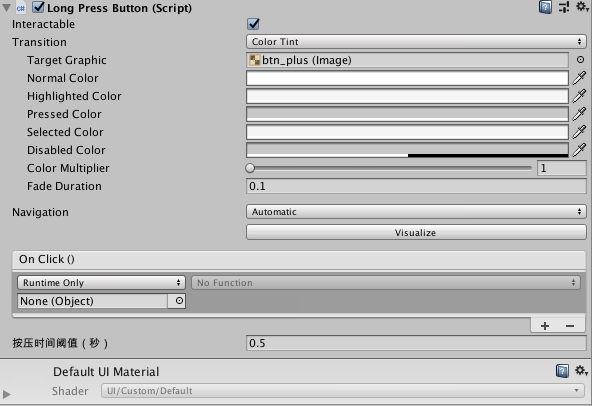

- 之后我们给需要长按的按钮挂上Long Press Button的脚本，并在Lua中声明为：
    ```Lua
    ---@type Wod.UI.Ext.LongPressButton
    ```
    注意，此时需要重新将C#代码进行一次生成，导出最后的Lua代码，方法为在Unity中的XLua中，先选择Clear Generated Code，然后选择Generate Code即可。

- 最后我们在Lua中，给按钮加上监听器，监听其`onLongPressed`事件，`self._btnPlus.onLongPressed:AddListener(CT.BagCtrl.OnLongPressBtnPlus)`，这样就能支持像正常`onClick`事件一样写函数了。

# Day 53: 08.11

记录一个修改prefab时的坑：

- 在对Prefab中挂在的Lua Behaviour进行控件绑定时，需要将prefab拖动到UIRoot下进行，如果直接打开Prefab，然后绑定，在重新运行时会失效。

再记录一个显示方面的坑：

- 有时需要显示一个界面或者tips，如果在game中发现没有成功显示，此时首先打开scene界面，看scene中是否存在该物体，如果没找到，则回到Hierarchy中，看能否找到对应的物体。因为有时game中没有不代表没有被初始化，也有可能是位置错误或层级错误，导致没有显示在屏幕上。

# Day 54-58: 08.12 - 08.16
好久没更新了，最近实现了背包2.0的全部功能，遗留的都是目前无法实现的功能，也算给三个月的实习一个比较好的交代了吧，这里记录一下成果吧~

- Jira
    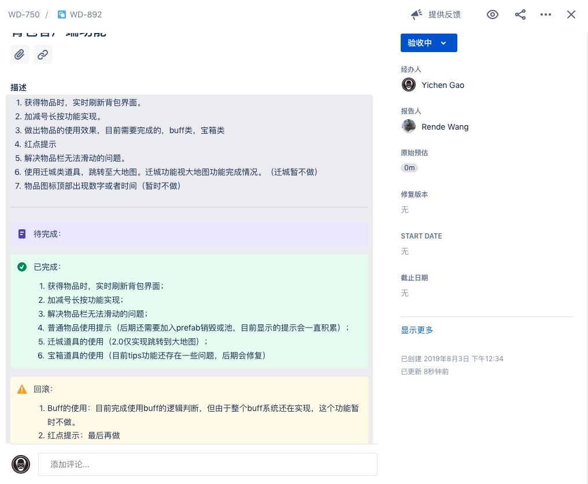

- Map Editor

    
    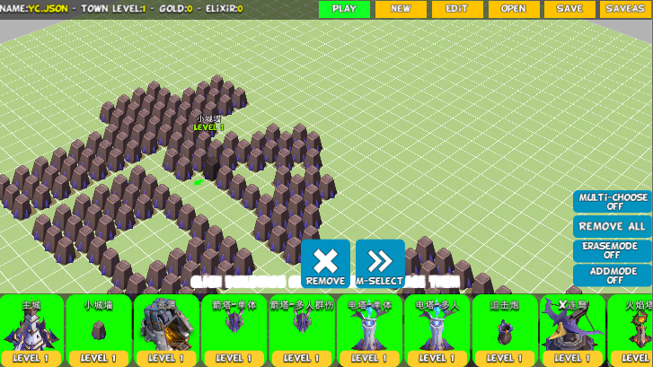
    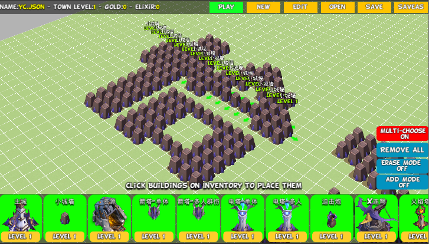

    - 多选功能：同时选中多个物体，并支持同时拖动和放置
    - 一键选取功能：点击后可以选择横纵方向上最长的相同的类别的建筑
    - 清除功能：开启后按下鼠标，可以快速删除鼠标经过位置的建筑
    - 添加功能：开启后，选择一种建筑，按下鼠标，可以快速在鼠标经过的位置快速添加建筑

- XLock

    
    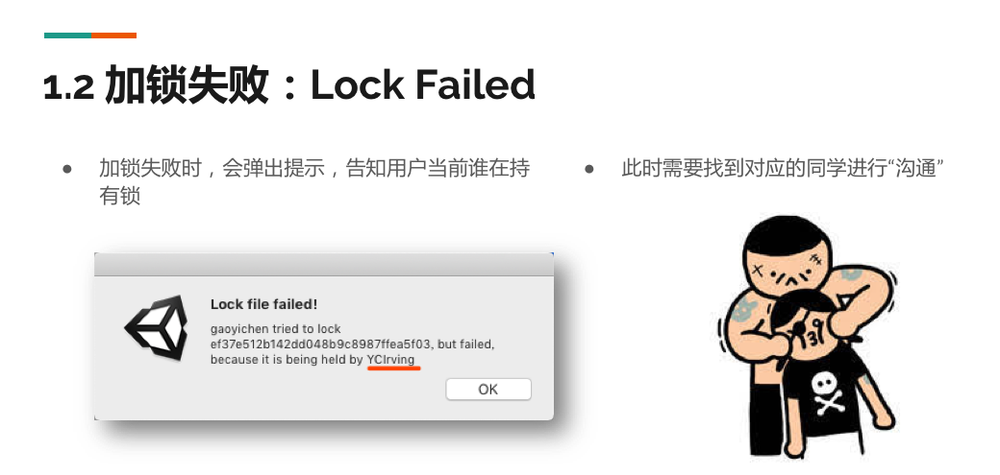

    - 使用手册：[XLock.pptx](assets/wod-XLock的使用.pptx)
    - 加锁
    - 解锁
    - 偷锁
    - 查询

- Prefab解析器

    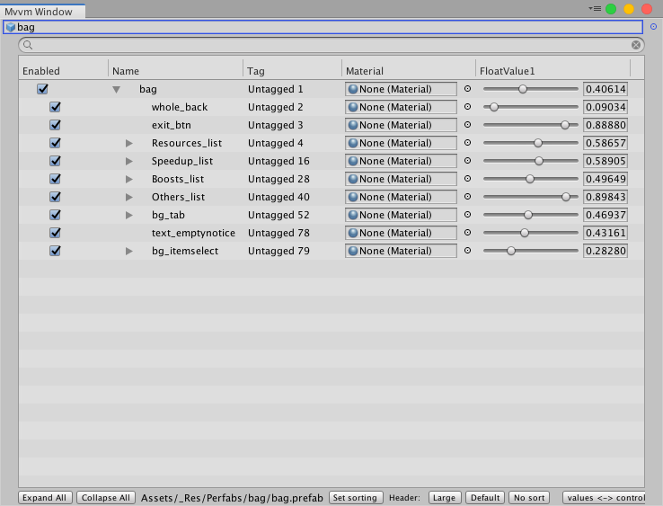

    - IMGUI
    - 支持拖动
    - 能够对Prefab中的树形结构进行解析

- 背包

    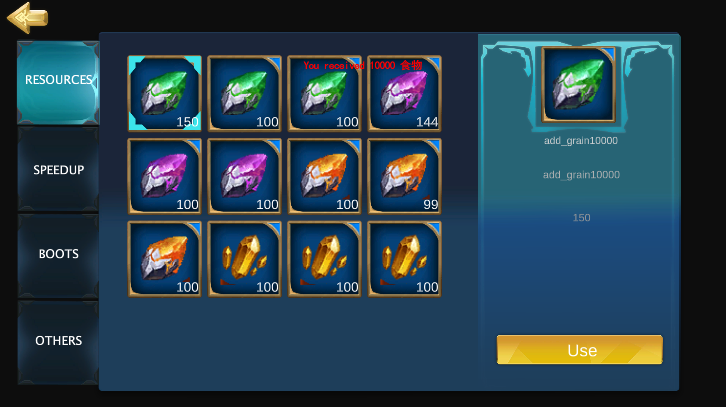
    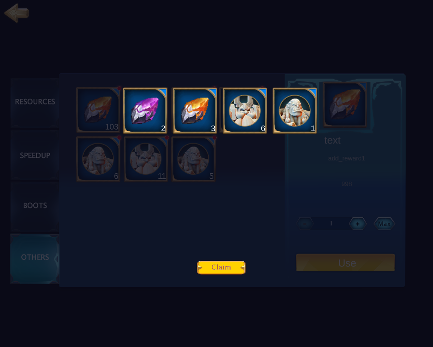
    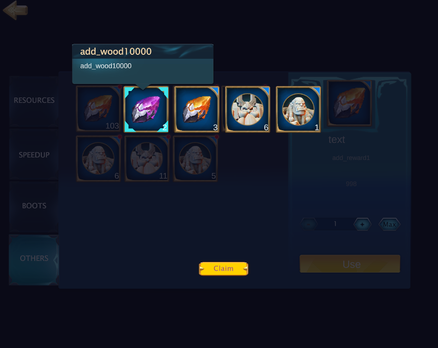

    - 一个自然的背包功能，将玩家的物品分类显示在不同的页签中，并支持记忆功能，即四个页签相互独立
    - 支持服务器同步，可以使用物品，并且物品的变化可以实时反映在背包中
    - 使用后显示动画
    - 实现开宝箱功能，并实现点击后的提示功能
    - 实现按钮长按功能

# Day59-60: 08.17 - 08.18
- 今天又踩了一个坑，是关于射线穿透的：

    - 首先，在背包中开宝箱得到的物品列表中，点击物品有一个tips显示，现在需要实现如下三个功能：
        - 点击其他物品能直接在新的位置显示新的tips；
        - 点击界面上的领取按钮，不论是否有tips，都能直接将界面关闭；
        - 点击界面上其余的空白界面，能够将tips关闭。

    - 实现的思路如下：
        - 打开tips时，其附带一个透明的全屏背景，可以接受鼠标点击事件
        - 当鼠标再次点击时，获得一系列点击事件，第一个事件一定是透明背景，用来将tips关掉
        - 之后遍历所有的事件，我们这里选择向下穿透一层，选择第一个不等于全屏背景的事件进行执行
        - 这样就能实现点击新的物品或者按钮，能够按照需求的逻辑走

    - 控制射线穿透的代码如下：

        ```c#
        // TipsPointerUpDownListener.cs
        using System.Collections.Generic;
        using ModelShark;
        using UnityEngine;
        using UnityEngine.EventSystems;
        using Wod.ThirdParty.Util;
        using Wod.UI.ModelShark;
        using XLua;

        namespace Wod.UI.Ext
        {
            public class TipsPointerUpDownListener : MonoBehaviour, IPointerDownHandler, IPointerUpHandler, IPointerClickHandler, IRecyclable
            {
                public LuaFunction onup,ondown;
                public void OnPointerDown(PointerEventData eventData)
                {
                    if (ondown != null)
                        ondown.Call(eventData);
                    
                    TooltipManager.Instance.HideAll();
                    PassEvent(eventData,ExecuteEvents.pointerDownHandler);
                }

                public void OnPointerUp(PointerEventData eventData)
                {
                    if (onup != null)
                        onup.Call(eventData);
                    
                    PassEvent(eventData,ExecuteEvents.pointerUpHandler);
                    
                }
                void OnDestroy()
                {
                    Recycle();
                }
                public void Recycle()
                {
                    if (onup != null)
                        onup.Dispose();
                    
                    if (ondown != null)
                        ondown.Dispose();
                    
                    this.enabled = false;
                }
            
                //把事件透下去
                public void  PassEvent<T>(PointerEventData data,ExecuteEvents.EventFunction<T> function)
                    where T : IEventSystemHandler
                {
                    List<RaycastResult> results = new List<RaycastResult>();
                    EventSystem.current.RaycastAll(data, results);
                    GameObject current = data.pointerCurrentRaycast.gameObject ;
                    for(int i =0; i< results.Count;i++)
                    {
                        if(current!= results[i].gameObject)
                        {
                            ExecuteEvents.Execute(results[i].gameObject, data,function);
                            break;
                            //RaycastAll后ugui会自己排序，如果你只想响应透下去的最近的一个响应，这里ExecuteEvents.Execute后直接break就行。
                        }
                    }
                }

                public void OnPointerClick(PointerEventData eventData)
                {
                    PassEvent(eventData,ExecuteEvents.submitHandler);
                    PassEvent(eventData,ExecuteEvents.pointerClickHandler);
                }
            }
        }    
        ```
        可以看到，PassEvent里面有一个循环，遍历所有事件，当发现与背景点击事件不同时，就执行，然后break

    - 后来实际运行过程中发现，事件并不会穿透，检查了很久的代码也没发现问题，后来才发现是图标的图片或者文字将事件拦截了下来，也就是说射线穿透了一层，但是距离实际要响应物体之间还有其他物体拦住了射线，这个将射线拦截的属性是“Raycast Target”，打开时，他就是一个可以响应射线的物体，我们只要将无需响应的物体，比如装饰图片这样的物体的这个属性关闭即可。

    - 设置完之后，发现button的响应还是不对，这里记录一下，button中如果需要响应射线，则其中一定要挂一个图片，并将其Raycast Target打开，然后如果是button的背景图片可以直接挂在父节点上，并将其button中Target Graph属性设置为自己即可，如下图所示：

        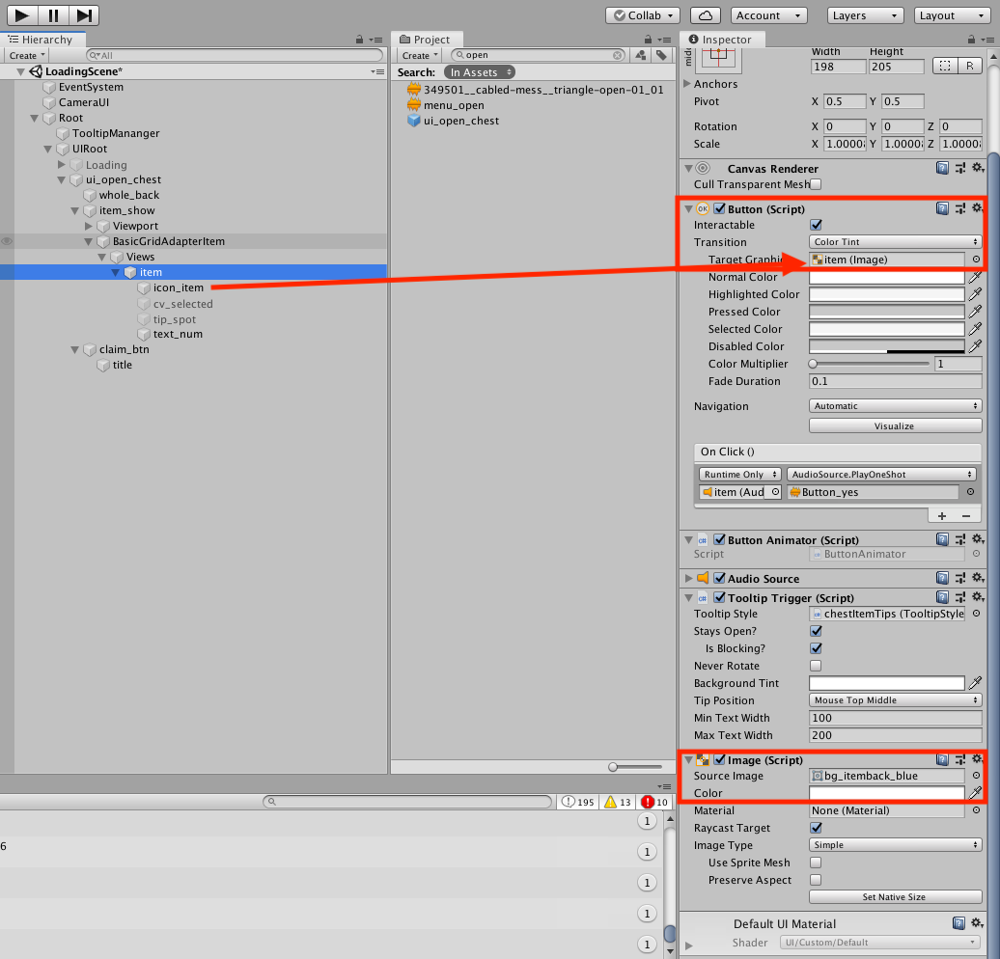

- 另外，今天换了新的版本控制软件，tower，需要破解，基本功能一样，只不过拉取时要先save stash一下，拉取完成后再apply stash。配合beyond compare一起使用效果更佳:
    ```
    TOWER (GIT)
    (Requires Tower 2.0.5 or newer)
    Launch Beyond Compare, go to the Beyond Compare menu and run Install Command Line Tools.
    Open Tower's preferences dialog on the Git Config Tab.
    Set the Diff Tool drop-down to Beyond Compare.
    Set the Merge tool drop-down to Beyond Compare
    ```

    [中文文档](https://www.git-tower.com/learn/git/ebook/cn/command-line/introduction)

    使用中发现一个问题，就是拉取时会报错，显示无效的用户名或密码：

    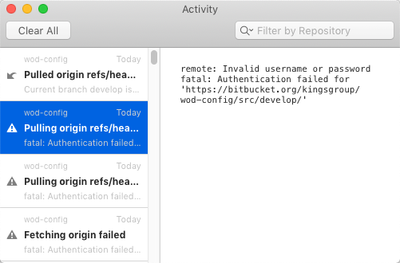

    这时主要是账户没有注册到Tower中导致的，所以需要在账户中添加自己的bitbucket账号，输入用户名即可：

    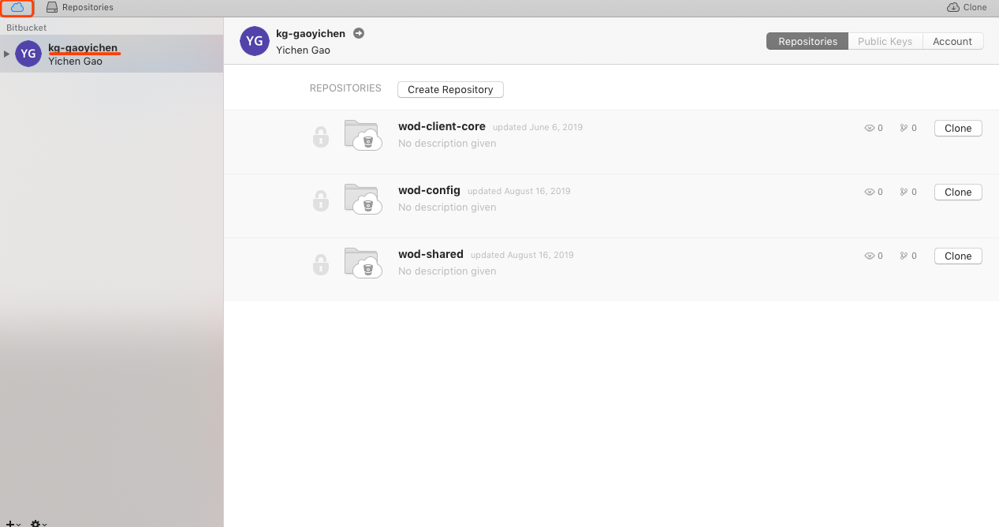

- 今天leader还讲了项目的结构和mvvm结构，这里也记录一下

    - 结构：

    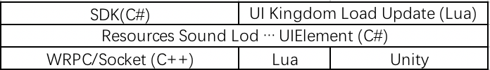

    - Mvvm:

    

    程序基于状态而不是事件，所以C不会通知V去做什么事情，比如讲一个button设置为enable，相反，C会直接修改M中的数据，数据的变动会直接反应到V上，来实现对V的控制。
    
    M需要将对应的数据绑定到V上，所有V中可以改变的信息都需要在M中出现，比如上面提到的，button的状态。

- 最后学习了一下如何在git中更改文件的大小写，一般情况下，直接在资源管理器中修改会出问题，就是git不能检测到文件被重命名，这时在终端中执行下面两行即可：

    ```
    git mv casesensitive tmp
    git mv tmp CaseSensitive
    ```
    现将里面的文件改成其他的文件名，之后再改回来即可。

# Day61: 08.19

今天跟Hr提了离职，三个月的实习也算正式结束啦~

# Day62: 08.26

今天是周一，Hr跑过来确认了离职（我明明说了的），然后就把我移出钉钉了，特别快，没有任何征兆地我就不能看钉钉的任何信息了。好在我们还有个微信群，作为群主的我这里也来个截图纪念这三个月吧~

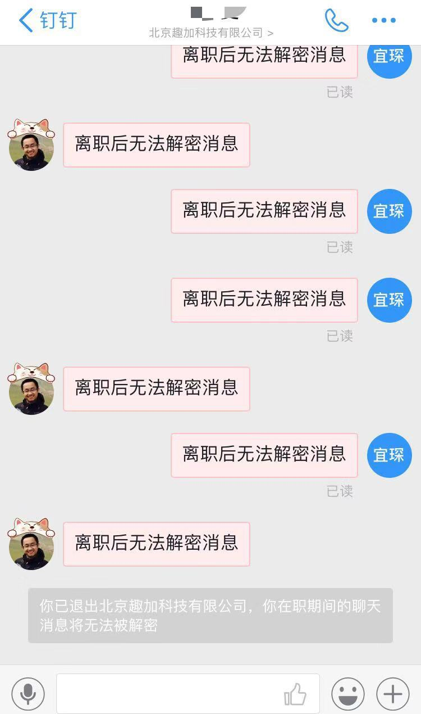


