# 游戏评测
在这里简单记录自己的游戏经历，不想搞得太正式，不然维护起来太费劲，就当一个简单的随笔好了。每款游戏也会从亮点、不足、评分三个方面来评价。

关于游戏图片，手游去taptap上搜即可，其他去游民星空，点进去大图就能找到无水印的图了。

整个评论模板
```


亮点：
- 
- 

不足：
- 
- 

评分：5分

时间：2020.xx.xx

```

200216更新：之前自己想把市面上所有的爆款游戏都抽空来体验一下，然后记录下来自己的感受。但现在我认为没有这个必要，我希望在自己喜欢的游戏或者精品游戏上花更多时间。在我看来，游戏本来就是艺术品，每个人有自己的好恶，自己觉得玩着没意思或者游戏本身就粗制滥造，那就不要硬着头皮再去玩了，这么多游戏不可能玩得过来。所以后面的评测在游戏数量上可能会增加地慢一些，但每一篇评测的质量会更加精良，评测的游戏也会更加符合我自己的口味，宁缺毋滥吧。另外，之前自己的完美主义又犯了，想着这里能够收录自己玩过的所有游戏，为我的莽撞自罚一杯。这里只记录现阶段玩的游戏，不会专门去怀旧。

## 端游

### 动作

#### 只狼：影逝二度
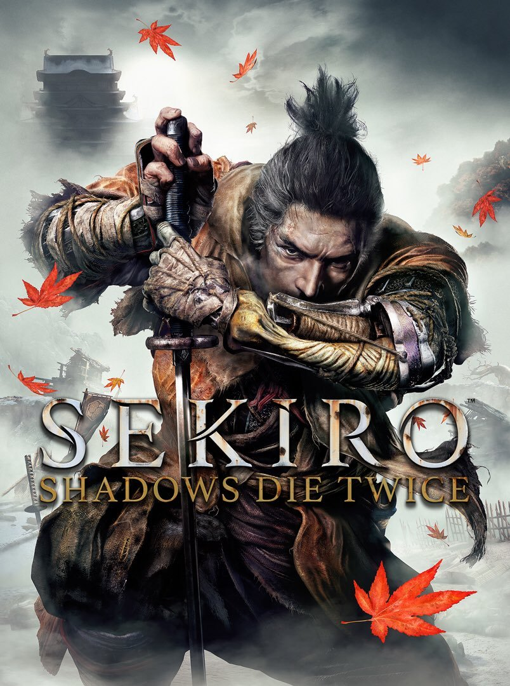

亮点：
- 自己接触的第一个“魂”系列游戏。战斗系统上，之前玩过的游戏对贪刀和无脑攻击的惩罚都不算高，以鬼泣为例，上去一顿莽顶多分数会少一些，但不会影响正常过关。只狼却很不一样，第一个精英怪让你了解弹反的重要性，第一个boss赤鬼则专治贪刀的坏习惯。还有屑一郎之前的“居合哥”，开始我对他的居合斩一筹莫展，动作太快根本没办法弹反，后来在不断死去活来的过程中，我发现他在出招前，手部有一个握刀的前摇，以这个为信号就能让我有足够的时间连按两下防御，从而最终击杀他。这一切设计都在传达一个信号，那就是“精确”，一个忍者必须对自己和对手的招式有充分的认识，才能做到百战不殆。更加精妙的是，这跟真正的格斗也是相通的，你必须仔细观察和记忆自己和对手的每个动作，思考对方的破绽，使得战斗保持在自己的节奏之下，有来有回，逐步击杀对手，而不是常见的上去一顿放技能加一顿猛捶。我认为这种战斗体验带来的沉浸感比视觉上的更加震撼和扣人心弦，因为战斗时我会不自觉地屏住呼吸，我知道我的每一步操作都至关重要，每一个失误都可能导致殒命，这一切让我失败时顿足捶胸，成功时欢呼雀跃。这也是“魂”系列游戏的核心所在吧，你会发现你不断战胜的不仅仅是一个个boss，还有你自己，你面对敌人时越来越镇定，闪转腾挪、进攻防守越来越气定神闲，当你回过头来看时，你会发现自己走了很远。说句题外话，这是我不喜欢MMO的一个原因，完全就是看特效、看动画，没有走位、没有压迫、没有操作，完全是数值的加减乘除，毫无乐趣可言。
- 情节设计上，在给足自由度的前提下，将故事讲得逻辑自洽富有深度，人物饱满有个性，主线支线让玩家从只言片语中了解正在发生的一切，很喜欢这种剧情展开的方式。
- 细节上，这是我认为最能体现开发者诚意的地方。首先是名字，这里的每一个道具都具有浓浓的日本文化气息，一个普通的加buff药品，还会有“哼将糖”、“哈将糖”的区分，还会为每个物品配有一段简介，真的很用心了。比起传统的武侠游戏，不是小药瓶、大药瓶，就是木剑、布衣和草鞋，超出了不止一点半点。其次是剧情细节，npc不会一直站在一个地方。即使你没有推任何主线或支线，跟npc的对话也会随着时间流逝而改变。这让游戏更加真实，也更有代入感。之后是文化输出，从知乎上一个回答看到，一些建筑、姓氏和事件都能找到历史原型，连忍杀的手势都有礼仪在里面。最后就是游戏机制，据说游戏是一天内发生的事情，从早上、到黄昏再到夜晚，还有网上说的敌人和主角共用一套设计体系，也就是说主角和敌人在本质上的完全平等的，只是技能和buff不同而已，这也更像是现实中的格斗。最后就是碎片化的叙事，让玩家一点点去发现事情的真相的设计也很对我的胃口。
- 最后要来说说宫崎英高的恶意了，不得不说如果不剧透玩下来还是很刺激的，突如其来的大蛇，突然复活的狮子猿，着实让玩家吓得不轻。还有走着走着遇到一个黑乎乎的大坑，想着用钩锁够到对面却刚好差一点点，落到boss坑里打不过又跑不了，跟水生的凛不说话她还是会追过来打我，落到雾隐贵人的寺庙，很紧张的一顿猛打，才发现这个boss就是出来白给的……这些情节要说能说一天，虽然感觉各种被戏耍，但是通过之后却回味无穷，可以说之前我的心智一直是被游戏宠爱着的，受伤了游戏告诉我可以不动回血，死亡了也可以满血复活接着重来，没有任何损失，关卡和boss就是一个比一个难，直到最后大结局。但是突然有一天只狼说，我不宠你，你要在我的恶意中变得成熟，因为游戏中到处充满了跟以往不同的设计。所以我会感谢这个让我逃离了思维定式的游戏，让我即使失败了也能一次又一次继续战斗的游戏。
- 只狼让我认识到了世界上很多事都不是一蹴而就，有的你认为简单的事，想做好却需要不断地练习，有的你认为很复杂的事，找准节奏也能完成地有模有样。只有不断地练习和实战，才能得到提升，玩游戏如此，做事情亦如此。感谢只狼，毫不夸张的说，之前任何游戏都没有教会我如此多的东西，只狼做到了。

不足：
- 太容易沉浸算吗哈哈哈，一玩起来时间就失控了
- 是个音游，每天不听到弹刀的声音就浑身难受
- 有的怪物真的完全戳中我的怕点

评分：5分，TGA年度最佳还没有让我失望过

时间：2019.01.06

### 解密

#### 疑案追声
   
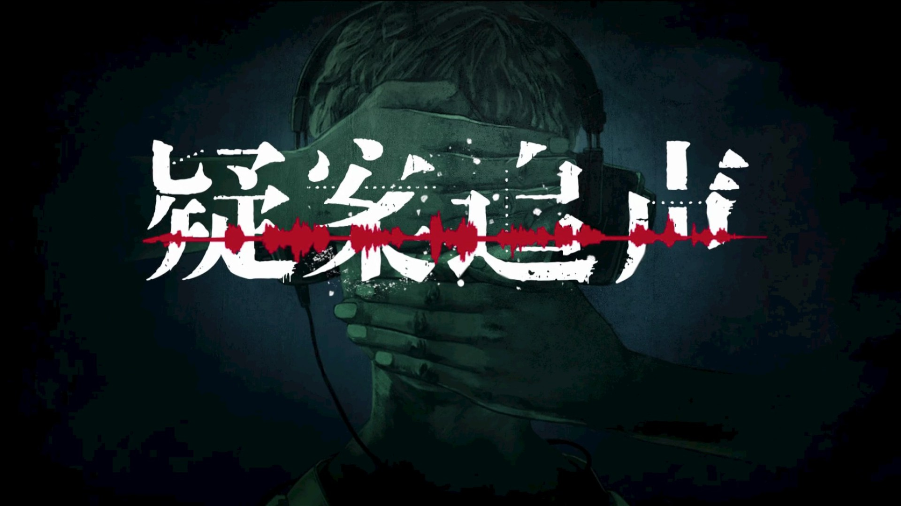

亮点：
- 新颖的玩法让我看了几分钟直播后就毫不犹豫地入手了，这也是这款游戏拿到4分的主要原因，仿佛是一场中文的听力考试。
- 剧本和关卡设计地很不错，难度由简到难。
- 最后一关设计很棒，第一个DLC好复杂，中元节DLC很感人。

不足：
- 虽然大部分是声音的游戏，但是不得不说声优的配音并不出彩甚至很出戏，尤其中元节DLC，一些语气和台词仿佛能让玩家感到他们在录音室里照着稿子念。
- 3D音效有利有弊，我觉得仅仅改变音量大小即可，环绕确实让人感觉很难受。
- 第一个DLC，台词中有太多粗口，让玩家有些不适。
- 每一关最后解密有点敷衍，希望能够详细还原一下真实的剧情。

评分：4分

时间：2019.10.07


## 手游

### 动作

#### 崩坏3


亮点：
- 画面很棒，界面精美，战斗时使用原版动漫人物，而不是简化后的Q版，真的已经算是动漫少女类和3D动作游戏的标杆了。
- 吃金币和回血时的语音不错
- 升级时提示玩家“不要小气，多升一点”太萌了
- 新角色的CG视频也太炫了
- 游戏中还链接了官网的各种周边，比如漫画和玩家们自己制作的动画、视频等
- 操作也分长按和短按，还加入了闪避，更向硬核格斗迈出了一步

不足：
- 对二次元真心不感兴趣

评分：4分，绝对很可以的游戏了

时间：2020.02.21


### 格斗

#### Flappy Fighter


亮点：
- 来自个人开发者的一款结合flappy bird和街头霸王元素的2D格斗游戏，不得不说核心的战斗部分做得很出色，上手特别爽快，虽然只有五个动作键（包含了跳跃攻击和超杀键），但是在此基础上衍生出的连招特别丰富
- 是打发时间的好方式，一局一分钟，随时随地玩一局，对我这种格斗游戏爱好者来说很开心了

不足：
- 每周一个人物还能忍，但是后面IOS整个四个月不更新，推特上说IOS下架了，此时只能用一个人物的弊端就出现了，很容易玩腻
- 所有皮肤仅仅是配色不一样

评分：4分，能把格斗游戏抽象到这个体积而且手感和连招保留地如此完美确实很不容易

时间：2020.02.21

### 横版过关

#### 三国战记-风云再起

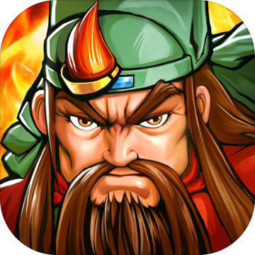

亮点：
- 画面比街机提升了一个层次，但只有画面

不足：
- 毫无打击感可言，这个对于动作类游戏简直是致命的，手感做成这样，不知道为什么taptap能打到7.9分
- 关卡做成章节式很打乱游戏的流畅性，每关不到两分钟就能通关，玩家刚进入状态游戏就结束了
- 特效很僵硬，关卡结束时的子弹时间放大了特效的缺陷，实属画蛇添足，摇杆不跟手，基本没有什么复杂的连招，不能前前跑动，这些小细节也很让人不爽。
- 第一关女boss孙姬的声优太出戏，难道是项目组的美术或者hr？有个小兵的配音是方言，还有首充时送诸葛亮，配音是“亮亮帮你打天下”，瞬间怒删游戏。要走情怀和怀旧路线就不要整这些恶搞的东西，何况情怀都没做好。另外只有第一关的对话有声音，后面对话都是字了。
- 可以参考现在老玩家玩的三国战记的版本，比如纯boss闯关，增多小兵这些。这才是目标人群，将这些游戏移植到手机上就成功一半了。

评分：1分，像个半成品或者demo

日期：2019.09.20

#### 街机三国


亮点：
- 不愧是继承了页游的ip，整个游戏玩下来就是一个字，爽。各种伤害一直冒，打击感还行，任务也是领取机制，跟dnf比较像，只是技能受限，任务也比较简单。

不足：
- 除了爽没有任何亮点，很快就不想玩了，反正就是一顿技能上去乱按，还加了“弹刀”模式，在boss技能前摇时按指定按键就能触发，不仅可以打断boss技能还能造成伤害还有眩晕效果，简直不要太无脑。完全没有走位和技巧可言，上去一顿乱按就完事儿了。

评分：1.5分，比上面的三国战记多的0.5分是手感分和画面分。

日期：2019.09.20

#### 崩坏2


亮点：
- 我觉得没啥亮点

不足：
- 游戏像玩flash，动漫宅男真是谜一样的群体，大概充值时主角的一个娇嗔就能让很多宅男来个648吧；
- 第一关boss上来就一个bug，莫名其妙就结束了。游戏开局的引导也有bug，这都不测一测就上线了吗？
- 横板过关游戏的精髓一个都没有，动作僵硬尤其是挥动武器，打击感惨不忍睹，没有加速跑，没有跳跃，没有人物速度的变化，没有连击，简直一点操作都没有，纯粹开个好武器乱按
- 一会儿日语一会儿英语，给我整懵了
- boss怪还能不能再敷衍一点，模型变大就行了吗？
- 玩过经典横版过关的玩家对这款游戏零容忍，我觉得这款游戏归为休闲可能更合适，因为真的是一款十分不合格的横板过关，号称“跟DNF很像”，笑了。
- “死肥宅真恶心”，果然给个“老婆”就充钱呗。

评分：0.5分，这0.5是看在崩坏3的面子上给的

时间：2019.10.17


#### 影之刃2


亮点：
- 打击感说得过去，浮空和连招也还可以
- 角色的原画和动画风格自己还算比较喜欢，大概就是整个身体的关节数很少，每个部分在一定角度范围内摆动，有点人偶的感觉

不足：
- 声优还行，但台词垃圾，什么“下面给你吃”都出来了
- 女性角色不是大胸就是露大腿，满满的页游气息
- 策划是不是以为角色念点电影台词就高端了，“你所维护的秩序都是个笑话”这种没有世界观铺垫说出来真的尬
- 操作上一顿乱点就可以，操作空间很有限
- 打击时候的音效，特别是角色发招时的声音，真的鬼畜，不过好处就是女角色受击的喘息声有点厉害

评分：2分，没啥意思，习惯了街机里面爽快的操作，对这种页游级别的操作表示完全不想玩下去。

时间：2019.11.13

#### 苍翼之刃


亮点：
- 横版过关的动作类游戏在手游中算是小众品类，这款游戏能坚持运营两年已经十分难能可贵了
- 真正的技能靠手搓，独创了点击、上划、下划、横划和蓄力的输入方式，在手游上起到了还算不错的效果，但我还是觉得点击的输入方式会好一些。

不足：
- 人物动作还是有些僵硬，UI设计也很有年代感，难逃页游的质感，但考虑到游戏是很早之前的游戏，所以这些缺点还算合理

评分：3分。

日期：2019.12.14

#### 超杀默示录


亮点：
- 过场动画的街机风还挺怀旧的，其他跟街机一点关系都没有
- 人物动作很帅，但帧数太低

不足：
- 页游品质，难逃各种技能一放就无敌的设定
- 剧情有Bug，我升级了武器总让我从之前已经过了的一关开始玩
- 魔改三国，没有一点尊重史实的意思

评分：1分。冲着宣传广告里的八神庵下载了游戏，结果很失望

日期：2020.02.21

#### 猎人


亮点：
- 除了打击感差一些以外，游戏整体都很出色，没有了页游的质感，更加接近DNF端游
- 连招爽快，技能炫酷
- 大量动画和CG，更加符合动漫玩家的口味
- 60帧的画面更加顺畅和柔和，画面左下角有帧数显示，很专业的样子

不足：
- 没看过动漫的玩家可能不太会入坑


评分：3.5分，如果自己喜欢的话能到4分

日期：2020.02.21

#### 火影忍者


亮点：
- 原作还原的很好，虽然没有动画，但配音和剧情已经很丰富了，IP很大，只可惜自己不看火影
- 打击感不错，战斗的核心部分完成度也很高
- 主页采用人物固定但视角可以调节的模式，相比于类似于DNF的场景选择，这样更快捷和简洁，而且更加富有创意。场景的背景还会根据时间来调节，冬天无法使用夏天的背景，这个也很有意思。
- 战斗中切换场景时，加载是真的快，不影响战斗的连贯性
- 从直播平台的火爆程度可以看出，除了IP的加成以外，本作在PVP上也有较高的水准，可谓目前我看到最接近DNF的作品了。

不足：
- 总是闪退
- 可用版面太少，敌人一般从右侧出现，而左侧空间很大，右侧很小，也就导致敌人经常会被打出版面，影响战斗的连贯性和节奏
- 没有跳跃和冲刺

评分：4分，魔方工作室的作品质量都很高啊，从王牌战士到火影忍者，自己都很喜欢

日期：2020.02.21


### 体育

#### 街篮


亮点：
- 巨人网络研发的篮球3对3手游，应该是我第一款在手机上玩到的类似fs的游戏。

不足：
- 人物动作僵硬
- 移动缓慢
- 帧数低
- 锯齿高
- 总体游戏体验一般

评分：2分，不及格。

日期：2019.09.20


#### 街头篮球

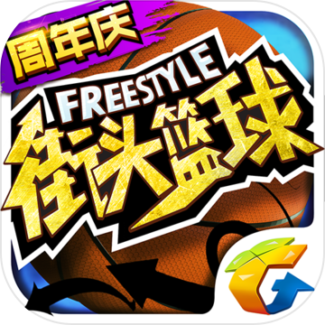

亮点：
- 这款游戏号称原版fs，我觉得充其量只能算从音乐上移植了fs吧
- 加了投篮条，还算不错的设计吧，习惯fs的玩家可能需要一定时间来适应按键时间。

不足：
- 时不时会有“nice pass”和“gorgeous pass”的鬼畜
- 帧数低
- 动作僵硬
- 锯齿高

评分：3分，勉强及格吧。

日期：2019.09.20


#### 潮人篮球


亮点：
- 游戏时间最长的篮球手游了，无论从流畅度、判定、细节等方面，都完爆前两款
- 内容上增加了人物技能，因此在每局后期增加了很多变数，思路上街霸5也有同样的设定。

不足：
- 网络有时响应不好，按键时经常被无视。
- 游戏策划差，所有这样的游戏基本都是看能力值，遇到能力值高的真的一点还手余地都没有，这是所有fs篮球游戏的通病，一定程度上弱化了操作的重要性。另外游戏内部各种能力值设计复杂，技能分等级、皮肤加属性、还有天赋系统、特训系统、新出来的一个教练系统，简直要把零氪或微氪玩家往绝路上逼，吃相难看，我反正是头一次见一款篮球游戏能有这么多系统。
- 游戏运营差，跟《这！就是灌篮》合作出了张宁这些现实球员，我就觉得肯定要黄，本来游戏里人物的风格都是偏二次元的，突然搞出几个现实世界中的人物，让人觉得很违和。
- 现在又在跟灌篮高手打擦边球，出了能力值爆棚的樱木花道、大猩猩和三井，基本碰到就被打爆，好好一款游戏非要这么着急挣钱，逼走了一大票玩家，现在好友列表几乎都是灰的，着实很无奈。
- 另外，七夕节也出了个卖肉活动，从萝莉、御姐各个方面向宅男进攻，我是不会买账的，很反感策划运营这种擦边球的小心思

评分：4分，充值104元，虽然这种游戏玩家黏性太低，短期内挣不到钱基本就GG，但这款吃相有点太难看了。

时间：2019.09.25


#### 灌篮高手


亮点：
- 看得出来游戏还是很注重怀旧玩家的体验，知道大家来玩很大一部分原因是情怀，所以也尊重原著，包括游戏片头视频就是动画片头、声音也基本都是从动画中直接提的、小人的形象也与动画中一致……这些细节就足够让玩家感受到开发者的诚意，而不是觉得这是个借IP圈钱的游戏
- 登录游戏后不是直接给一个主界面，而是有一些过渡，这个设计很棒
- 界面设计中规中矩
- 投篮动作很舒服
- 排位等待的动画细节也不错，等待超过5秒，樱木转球的速度会加快
- 游戏中的盖帽应该是下了大功夫的，真的会根据两个人的位置和投篮方式来决定盖帽的方式，而不是一般游戏那样，盖帽成功就是进攻方直接被弹开。我有一次还看到了双手盖帽，真心细节
- 技能方面基本上还原了原著，随着角色成长，技能也会变多变炫，可见游戏在技能上是下了大功夫的
- 全场3V3这个模式太赞了，完全超出了同类型游戏的限制，全场断球、快攻、配合的快感前所未有
- 流川枫和仙道各种换手上篮是真的帅，细节很到位


不足：
- 游戏中有的声音会爆音，听着很难受，而且没有解说
- 在游戏内购货币上放了个小篮球的标志，而这个标志也会被用在消息提醒上，所以有点误导玩家
- 平衡性上还需要改进，有的角色防守难度太大，樱木和流川枫的小技能感觉不是前场基本防不住，而且流川枫小技能的命中率为100%，不被帽就一定会进
- 过人什么的有点水，仙道的过人完全就是bug
- 部分动作跟雷火的潮人篮球完全一致，比如内藤铁也的双手灌篮，真的是像素级复刻了
- 实战容易看不到自己的人，人物占比有点小，而且很Q，所以动作不会特别舒展
- 目前觉得像个半成品，优化空间很大
- 跟其他游戏一样，培养球员真的太费了，又是天赋、又是球员属性、又是皮肤，能力不够又打不过
- 篮板判定很迷，经常出现中锋卡位半天最后还抢不过溜进来的后卫。对我这个内线玩家很不友好
- 游戏中的队友互动做得不好，进球后的过场动画无法打字，剩下的交流时间几乎没有

评分：4分，充值了18元，把赤木升到了S，跟同学玩了一天，挺欢乐的，全场跑着很舒服，算是篮球游戏中做得很出彩的一款了

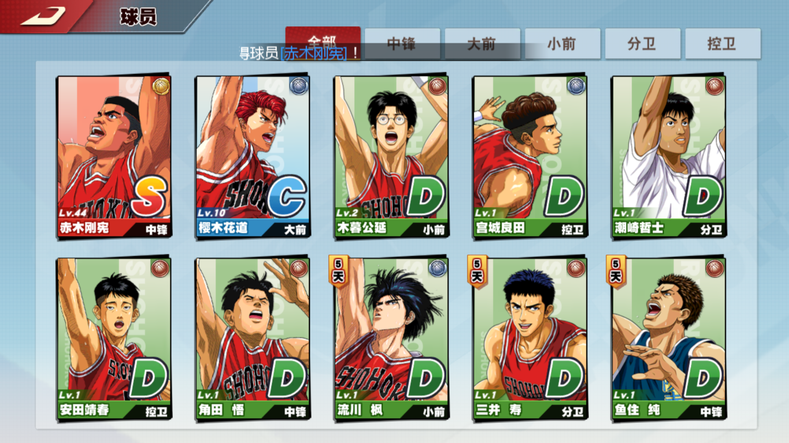

日期：2019.12.13

### 卡牌

#### 月圆之夜


亮点：

- 上次玩卡牌游戏可能已经是小学时候了，当时游戏王玩的不亦乐乎，之后不玩可能是因为这样的游戏比较烧脑吧。参加完巨人网络校招之后，接触了这款月圆之夜，一下子就沉迷了，有着无法抗拒的魔力。
- 游戏的玩法设计很简单，就是两个人互相攻击，取消了游戏王和炉石传说中召唤兽的概念，伤害计算也很简洁
- 简单的玩法下，每种角色的风格还能保持多样性，比如战士就是平A和叠护甲叠装备，法师就是加魔法值和使用咒术牌，游侠使用行动力，还有使用祈祷牌和反制牌的角色。总而言之，不同角色玩法依然很多变。
- 画面、配音和音乐都不错，采用新颖的翻牌式关卡设计也很出彩
- 不同boss的特点很符合其名称和原画设计
- 爽起来是真的爽，不论是打持久还是打爆发，都很有意思
- 主要上瘾的地方是游戏中玩家有很快速的成长过程，另外前期小怪也比较容易无脑击杀，开始一个新存档的门槛低了很多。
- 最后记录一个我自己认为很爽的玩法，使用战士，加到3点行动力，装备两把狂战斧，然后旋风斧最好也整一张，用于打爆发，最后进攻号角必备。回合开始，先出进攻号角，然后疯狂使用各种攻击牌就完事儿了，无脑还很爽。
- 19-10-14更新：小红帽日记这个模式也很有意思，有点互动电影的感觉，加分项！

不足：

- 游戏通关之后不能继承之前的牌组继续游戏，必须从头开始，导致玩家有一种失去感
- 一个噩梦难度还要分成好多等级，重复而且难度逐渐上升的挑战很容易让玩家放弃
- 没有pvp，也不能自己组合卡组去完成更难的挑战，不过设计初衷也是单机游戏，pvp这个没有也没关系

评分：
5分满分，taptap上也有9.2的高分，荣获了“2017年度最佳本土独立游戏”的头衔，实至名归。

时间：2019.09.25


#### 长安幻世绘


亮点：
- 画风跟阴阳师很像，但制作还算比较精致
- 回合制的玩法至少我玩的时候没有感觉出特别多新奇的东西

不足：
- 游戏自己把自己归到了卡牌类，虽然我觉得跟卡牌没啥关系
- 对于这种灵妖和二次元的东西没啥兴趣

评分：2分，没有玩过阴阳师，不好作比较，但自己没啥玩下去的动力

日期：2019.12.13

### 战术竞技

#### 和平精英

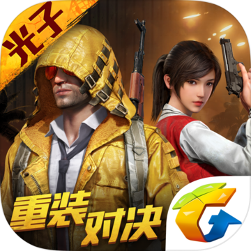

亮点：
- 从众多吃鸡手游中最终存活，靠的真的是实打实的品质。
- 首先，无论从画面还是地图还是玩法，都做到了高度还原端游，让玩家很自然地迁移过来
- 其次在不同类型的手机上都能够正常运行，可见其优化程度之高
- 为了适配手机操作维度低，做了很多简化，比如自动拾取、自动上弹、自动装备等
- 由于国内特殊的环境，不得不加一些额外的功能，但遭人诟病的挥手退场已经被取消了，可见光子也在不断在过审和还原端游体验之间做着各种尝试
- 游戏中也不断增加新的游戏模式，缓解了玩法单一和队友长时间ob的缺陷
- 游戏中的新地图不用下载，这个是战胜全军出击的一个重要因素，玩家在玩的时候，不会专门等半小时来下载地图，下载游戏时就让玩家腾出足够的空间，保证玩家游戏时体验最大化是比较正确的。
- 好吧，现在需要下载了，游戏地图越来越多这也无可厚非
- 游戏里的小活动很用心，比如今年新年的团圆饭、元宵节的元宵礼盒、情人节的热气球等等，这都是实实在在放在游戏中的东西，而不是普通的“累计登录”、“扭蛋转盘”这种的活动，可见光子还是很用心地在丰富玩家体验。
- 各种个性化的设置是我见过所有手游里最复杂的，复杂的设置下是开发者极力尊重玩家游戏体验的结果，很有诚意。

不足：
- 4v4的模式让我以为乱入了cf，战术竞技和fps虽然相似，但是融合太多的元素在一个游戏里反而容易丧失游戏的特性，如果最后变成了一款普通fps结合吃鸡模式的游戏就属于本末倒置了。
- 花里胡哨的装备和素质广场中，故意区分玩家氪金程度的热力榜，让零氪玩家多少有点被冒犯的感觉，凭什么他们就能站那么高。现在已经可以关闭了。

评分：5分，作为吃鸡游戏的代表，和平精英在品质已经甩开其他游戏一大截了，虽然很多人对其中的设计颇有微词，但从玩家的角度看，有一款这样的游戏，已经是吃鸡移植的里程碑式作品了。

时间：2019.09.25


#### 量子特攻

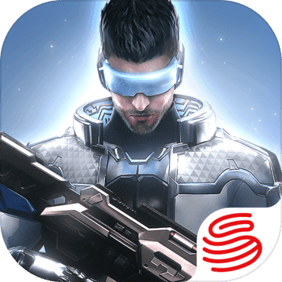

亮点：
- 载具很炫酷
- 载具上的音乐很放松，梦回GTA
- 滑板飞着很爽
- 取消了趴下的操作，减少了伏地魔，但也不能算优点吧，只是迎合了某些玩家
- 很多细节还处理地不好，包括枪口顶墙、人物移动等

不足：
- 低配版堡垒之夜
- 跟“荒野行动”一样的硬伤——动作僵硬，游戏手感是基本一致的，目测借鉴了大量荒野行动的代码
- 还是“荒野行动”的硬伤——魔改，一股浓浓日式风格，这是特工啊，要的是科技感和炫酷感，搞一堆和服马尾什么鬼：

  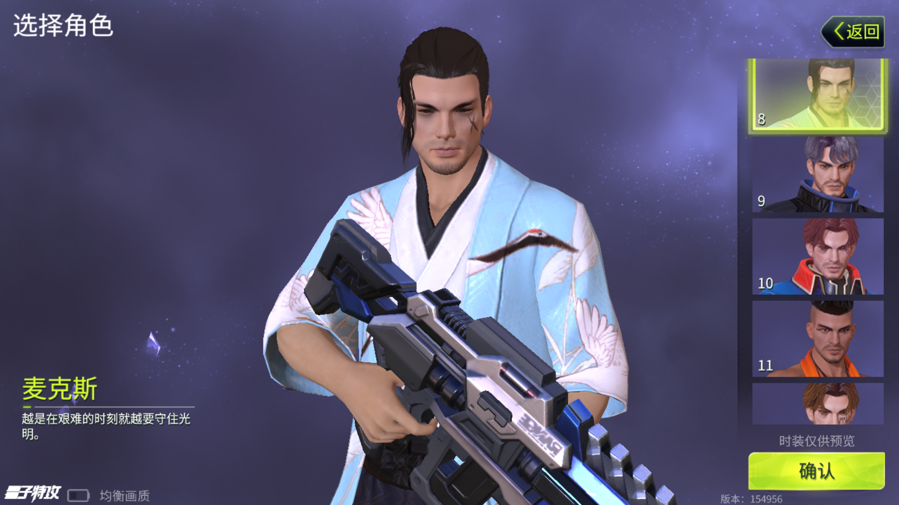
  
  看着就很违和。

- 摩托很难开
- 枪也很魔改
- 爬墙的设定也太蠢了
- 枪械手感一般
- 战术翻滚太强大了，一下子能飞老远

评分：2分

时间：2019.10.14


### FPS

#### 王牌英雄


亮点：
- 画风偏动漫风格，掩盖了一部分画面的缺陷，使得画面看上去比写实风格高端不少
- 画面足够炫，人物技能和爆炸等一些特效也足够真实
- 解锁了全部模式才来打分，英雄很多，但低端局无脑用加特林真的很carry
- 游戏里面的细节打磨得超级棒：一些界面转场使用视频来衔接真的太赞了，立刻显得很高端；背景音乐在进入匹配模式后会加滤镜变成很空旷的效果（这个无敌了，第一次看到这么细节的处理，匹配每次也就不到十秒钟吧）；把声优的名字写在英雄下面；角色的台词也很棒；
- 射击手感也不错，不同的枪械有不同的弹跳，辅助瞄准真的强，按着打就完事儿了，主要也是因为这里面人物的位移比较大，不好瞄准吧。
- 另外右手按住射击按键后，再进行移动可以在射击的同时移动视角，实现了操作维度动作维度的匹配，搭配辅助瞄准，体验很不错。

不足：
- 主界面在更新时，视频会一直循环播放，更新久时会让人有点厌倦
- 完成任务点击领取按钮时做得不顺畅，体验不好
- 似乎没找到快捷交流的按钮，无法在战斗中给队友鼓励，只能通过发信号来说明战术
- 游戏各个模式基本趋同，就是传统的fps模式和守望先锋的一些占点模式
- 同样人物行走时会有点滑行的感觉
- 平衡性上，除了加特林以外，其他英雄还没怎么用过，但上手或者本身就比较弱，不知道怎么用好


评分：5分，终于迎来了自己第一款fps游戏，虽然模仿了守望先锋，但丝毫不影响它在手机上超出同类fps一大截的水准。

时间：2019.11.02

### 赛车

#### 狂野飙车8：极速凌云


亮点：
- Gameloft的游戏质量上绝对过关。作为一款经典的赛车游戏，狂野飙车玩起来真的很爽，漂移、特技、氮气加速应有尽有，还有翻车的子弹时间以及精美的赛道和各种比赛模式等等，这些都决定了这款游戏的下限不会低
- 看了看视频，发现游戏里各种操作上的小技巧和细节特别丰富，绝对是一款值得不断研究和提高的好赛车游戏。另外就是好车与坏车差距很大
- 画质过硬，各种光影效果、碰撞效果，特别是路面的积水反光做得太好了
- 摩托车玩着很爽，赛道也针对摩托车做了修改，很良心
- 自己在最早起的智能手机上就玩过，确实是口碑不错的IP了，但玩法上创新不太多

不足：
- 赛道对新手不太友好，近道太多而且各个分支差距很大，游戏时总是不知道什么时候就掉到了最后一名，这个真的很恼火
- 多人游戏很卡
- 取消漂移需要点一下刹车或者直接氮气，我觉得按着刹车漂移，放开停止会更好
- 接触到好车需要的时间比较久

评分：4分，

时间：2020.02.21

#### 马里奥赛车：巡回赛 ---待完善


亮点：
- 赛道设计很棒，十分符合休闲游戏的定位

不足：
- 道具种类不够丰富
- 多人游戏有时会掉线，而且与好友建房后只能房内自己游玩，无法再与其他人一起，而且多人游戏还在测试中，有待完善
- 锁国区
- 漂移功能很鸡肋

评分：3分，不如NDS上体验好

时间：2020.02.28


### 非对称竞技

#### 猫和老鼠：欢乐互动


亮点：
- 画面声音比较怀旧

不足：
- 操作僵硬，平台跳跃做得一般，连松鼠大战都比不过
- 配音有点出戏，本来猫和老鼠就不说话
- 玩法上就是2D版的第五人格，只不过更适合小孩子，去掉了恐怖元素
- 当猫真的太难了
- 画风一般，建议好好看看原著

评分：2分，不是我喜欢的类型

时间：2019.09.25

### 平台跳跃
#### 魂斗罗：归来

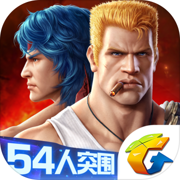

亮点：
- 支持多人合作是唯一的亮点

不足：
- 冲魂斗罗IP来的，发现就继承了2D平台跳跃的玩法，其他完全跟魂斗罗无关
- 子弹可以调节方向的设定很不喜欢
- 为了让玩家氪金想出了很多玩法
- 画面动作都比较僵硬，角色各种乱入，赤裸裸变成了平台上的DNF
- 关卡依然被切分得很碎，玩得很不爽

评分：1分

时间：2019.10.02

#### 超级马里奥：酷跑 ---待完善


亮点：
- 
- 

不足：
- 
- 

评分：5分

时间：2020.xx.xx

#### 忍者必须死3

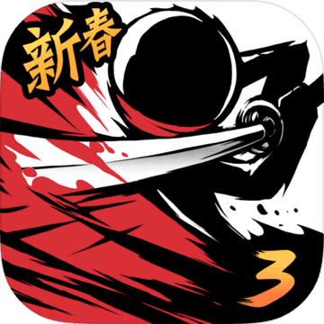

亮点：
- 画面和UI界面都很精美，剧情也很良心
- 剧情需要的操作和玩家实际操作结合地很好
- 跑酷游戏做得很爽，玩起来各种道具和技能
- 很锻炼反应能力
- boss战的设计很不错

不足：
- 大部分关卡在一根绳子上，不是自己喜欢的类型

评分：3.5分，作为一款跑酷游戏来说已经很不错了

时间：2020.02.21

### 休闲
#### 球球大作战


亮点：
- 将大鱼吃小鱼的思想玩出了很多花样
- 看了游戏视频觉得还是有一些操作和配合在里面的

不足：
- 变大之后移动太缓慢是我最不习惯的
- 玩法上没什么意思

评分：2分，不是我喜欢的类型

时间：2019.10.02

#### 我不是塔防3D
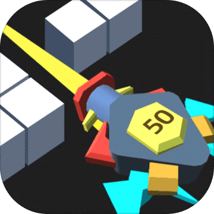

亮点：
- 没有亮点

不足：
- 砖块落到面前全部碎掉这个设计简直无语，剥夺了玩家的成就感，我打不打最后都不会死。一点都不解压，更别提爽快了
- 至少从视觉上没看出来炮台升级有啥区别
- 以为将之前爆款的小游戏养鲲和打砖块结合起来就能创造一种新玩法也是想瞎了心，无聊至极
- 提个改进，如果真想结合，每个炮的弹道让玩家手动控制，所有炮台轮完一次后，砖块向下掉落一格

评分：0分，要不是看在广告做得满天飞，让这个游戏冲上了app store前二十，我真不会花时间玩这个。

时间：2019.10.18

#### 家国梦

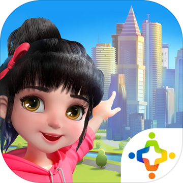

亮点：
- 作为国庆献礼的手游，精美程度绝对没得挑，从插画到动画细节到各种政策细节都打磨地很到位，玩家在收割金币、升级建筑时会有很爽的体验。
- 预告片做得很好，有种《文明》的既视感。
- 完全免费，无内置购物。

不足：
- 玩法单一，缺乏创新，几乎只有一个场景，我的体验是一直在建房子，类似于最初的QQ农场吧，对这类型的游戏一向不感冒。
- 每次收完金币，很快就会新产生出来，强迫症表示体验很不好。
- 火车拉的资源每次都要手动移动，很费劲。
- 全靠玩家肝，但是肝也得不到很好的回报，房子什么升级外观没有变化，只有升星才可以。
- 总体感觉是一个过家家的游戏。

评分：2分

时间：2019.10.07

#### 弓箭传说

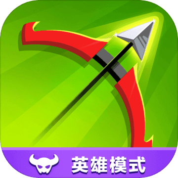

亮点：
- 最近的爆款游戏，可以说借鉴了大量之前豹场“弓箭手大作战”的玩法，由PVP改成了PVE，放弃了吃鸡模式，转变到了普通的关卡模式，结果来看出奇的好，最起码广告经费充足，虎扑、抖音上都能看到它，是一款成功的休闲游戏。
- 游戏乐趣主要就是一个字：爽，让我想起了之前的射击游戏“消灭病毒”（by Kunpo），当然爽的前提是节奏的变化和角色能力的成长，游戏做得都很细致，包括学习技能buff、天赋、装备、开箱等系统，只是自己的技能buff不会累积，每次进游戏都是零开始，但这也不算缺点，只是一种设计。
- 操作简单容易上手，是一款十分合格的休闲游戏。

不足：
- 休闲游戏就不求玩法上有多丰富了，广告里宣传的模式目前都没有，虚假广告真可怕
- 其余的缺点对我来说都是鸡蛋里挑骨头，广告也没有那么多，毕竟是营收之本，不强求通关的话完全可以不看

评分：4分，休闲游戏的成功案例

时间：2019.10.14

#### 风之旅人


亮点：
- 画面太美了，禅意十足（我有个疑问，禅意是不是就是看不懂的一堆符文乱七八糟的）
  
  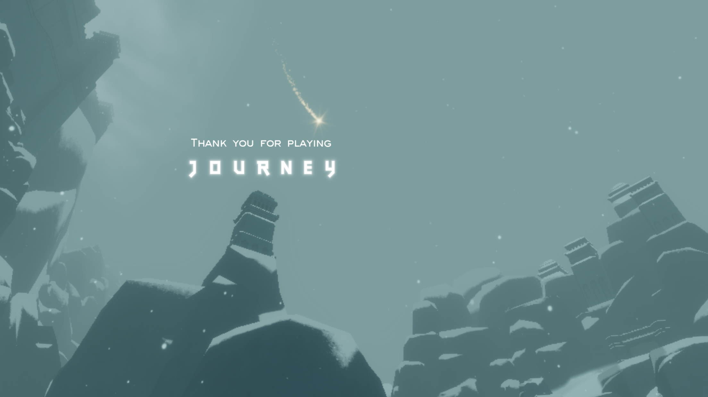

- 选择关卡的设计很不错，角色站在平台上，飞到自己要前往的关卡，保证了游戏的连贯性

不足：
- 很早就听说这款游戏制作很精良，直到最后上架App Store后果断买来玩一下，结果手机上玩游戏效果大打折扣：
  - 画面：分辨率低，很多锯齿
  - 声音：卡顿明显，有时直接会把声音卡没
  - 屏幕比较小，精美场景的冲击力变弱
  
- 由于是在手机上玩，发现除了画面美以外也没有多出彩，看了知乎才发现自己被坑惨了
  - 游戏里很少会遇到人，偶尔遇到几个我还以为是教学的电脑
  - 并没有组队通关的情形产生，少了很多温情
- 最后总结一点就是，千万不要买移动端的版本

评分：3分，就我目前玩到的内容来看，只有3分，以后如果玩到主机版本再回来更新

时间：2019.10.14

#### 激斗火柴人
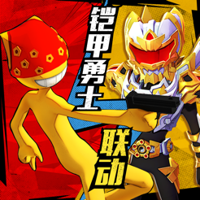

亮点：
- 玩法新颖，也很魔性
- 地图设计很棒，还有创意工坊模式
- 上手了之后还是有一些乐趣的，尤其是双人模式

不足：
- 广告不能忍，每次一局结束强迫看5秒广告真的受不了，这个设计蠢到家了
- 战斗开始会掉帧，游戏操作偏休闲
- 双人没什么配合空间，还要担心误伤队友
- 不明白为什么有的玩家打得这么准，我需要瞄准好久

评分：2分，3分的游戏，广告减1分

时间：2019.12.05

#### 迪士尼梦幻王国


亮点：
- 画面很温馨，IP很香，把迪士尼的各种大大小小的人物都融合了进来

不足：
- 继承了SLG的又肝又氪原则，真心不喜欢这种风格的游戏，换成啥IP都一样

评分：2分

时间：2019.12.05


#### 我功夫特牛
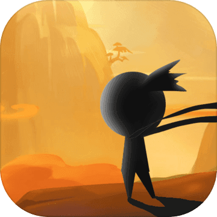

亮点：
- 作为小游戏，广告不是很多，没有特别强迫玩家浏览广告
- 推广的广告还算比较良心，放了真实的游戏画面，宣传的玩法和实际也基本一致

不足：
- 操作也不能说完全没有，但是给玩家操作的空间很小，只有两个按键，当两边都有敌人时完全躲不开
- 玩法上我自己玩了前几关，觉得很无聊，看了看网上的视频，发现也就是多了一些武器和技能。靠着不断冒伤害以及打击感，爽快还是有的，但还是没有弓箭传说做得好
- 字节跳动的小游戏

评分：1分，并不解压，而且很无聊

时间：2019.12.13

#### 双生视界


亮点：
- 一开始我以为是个fps射击游戏，后来我发现是个2.5D射击游戏，再后来我发现是个养成游戏，现在我觉得是个十八禁游戏（游戏真的写了十八岁以下不能注册）
- 少女角色的胸部可以抖动，原画也充满了擦边球和暗示，这样的游戏过审应该挺不容易的，不过宅男就吃这一套，连我一个不怎么喜欢二次元的人都有点上瘾
- 界面UI真的超级超级精致和华丽，打磨地相当好，每个按钮，每个界面，每个交互都诚意满满，开宝箱和抽卡等也不是简单的点个按钮就可以，而是充满了交互（开门之类的），体验很棒，特别是抽到稀有卡时，还有巨幅写真和一些剧情交互。
- 主界面加入了摸头增加好感度的设定，虽然应该不新奇，但我还是第一次见到，挺不错的
- 剧情很良心，不是那种随便说几句话就开打的形式，人物有自己的动作和表情，玩家不会轻易跳过，而且剧情中还有一些伏笔，可以看出剧情很饱满，而且是真心设计过的。信箱里还有神秘代码，都是很赞的设计。
- 游戏主体是个不错的创新，这种2.5D的射击游戏目前不是很多，本作还加入了同时操作三个人以及三个人同时移动，但各自又有自己的攻击方式，这部分的逻辑应该比较复杂，体验也相对不错。里面人物还有各种技能，也比较华丽。
- 朋友圈和微信这个功能很赞，代入感很强
- 3D咖啡店的功能也不错，类似模拟经营游戏
- 除了咖啡店，还有自己的“后宫”模式，可以将自己的角色放在卧室或者瑜伽室进行飞镖或者瑜伽练习，加上可自由移动的摄像机，跟小黄油越来越像了。
- 宅男我觉得真顶不住，直男也快顶不住了

不足：
- 游戏中头发在跳跃时会一起抖动，但抖动有bug
- 游戏整体也发现一个bug，我开始用游客账号登录，然后第二次玩提示我用B站账号登录，我登录了之后并没有继承游客账号的内容，还需要从头过一次剧情
- 游戏难度不是很难，同时操作三个人，有的子弹就没办法完美躲避
- 换衣服时会卡顿，不过动画做得还是很不错的

评分：4分，游戏本身制作很精良，但核心的战斗部分太容易无聊了

时间：2019.12.20


### 策略

#### 万国觉醒


亮点：
- Funplus实习时模仿的项目，画面精美，行军、缩放等细节处理到位，收集材料很爽快，不同文化、武将融合地都比较优秀。
- 自由城建的设计比较好，可以玩出农场的感觉。
- 数值设计很好，普通玩家到后期会慢慢发现升级变得越来越困难，产生充值行为。

不足：
- 对这种复杂系统，我自己上手比较慢
- 零氪玩家表示最后会退化成为农场游戏，不肝不氪就没有团战和国战体验，没有核心玩法的乐趣之后很容易流失

评分：2分，因为并不是自己喜欢的类型

时间：2019.10.14

#### 率土之滨
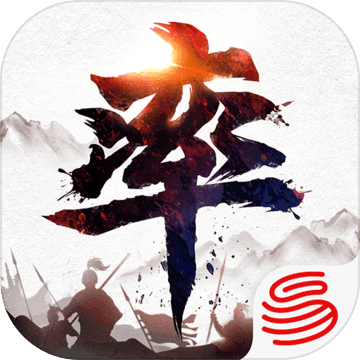

亮点：
- 游戏画风相对比较写实，而且尊重历史，日式风没有那么浓，男性英雄没有花里胡哨的铠甲，女性英雄衣着也相对不是很暴露，在画风上拥有比较不错的辨识度
- 游戏里有个大数据分析，虽然我不知道怎么用，但对大佬玩家来说是一个比较贴心的设计，可以进一步提升自己的游戏策略水准。
- 横竖屏切换和3D开关的设计不错
- 与万国觉醒相比，加入了抽卡设计（万国觉醒是碎片召唤机制），画面上和体验上更有优势。
- 游戏里玩家们在公屏上成语接龙也太欢乐了：

  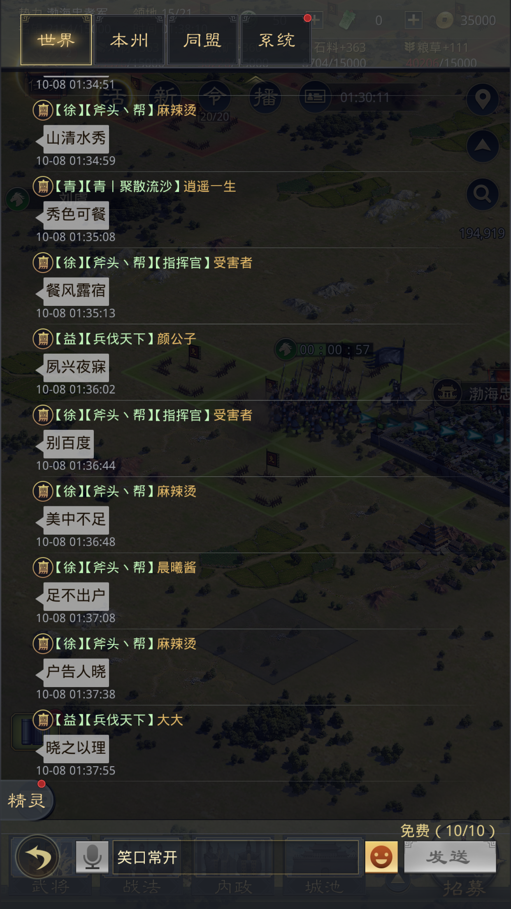

不足：
- 乐趣同样应该是抽卡和团战，同样不适合我
- 如果不去实习，不接触万国觉醒是肯定不会玩这款游戏的，而且它跟万国觉醒相比也有明显的缺点：
  - 首先是自己的城池就是一个模型，无法进入，也不能看到里面建筑物的样子，更不支持自由城建。能看到的仅仅是自己建筑物的等级，对我而言少了不少乐趣。
  - 其次军队行军也直接在地图上点对点进行，因此会出现军队直接在城池上行军的现象，看着不和谐。
  - 地图不支持缩放
  - 战斗鸡肋，战斗时玩家不能介入，相当于在战斗开始前结果就已经确定了，少了玩家的策略部分
  - 游戏动画点着不爽
  - 小红点也很鸡肋，看着很像我实习时使用的，临时用来凑数的红点
- 游戏内置的“率土风云”应该是每周选出一些经典战役分享给玩家的一个节目，已经于今年二月份停更了，不知道是不是玩家留存少的一个信号。

评分：2分

时间：2019.10.14

#### 魔法门之英雄无敌：战争纪元


亮点：
- 画面做得很精致，特效、动画和原画都很不错

不足：
- 情怀游戏，战棋类的玩法自己接触也比较少。
- 策略上主要是排兵布阵，但看视频也没有体现出特别多重要性，主要是战力的比拼，及时放个技能就行了。
- 完全是强迫症在逼着自己玩，一局对战基本不超过一分钟，不刷满三星就别扭，大部分时间都是升级、进阶、升星和刷战力，确实很没意思。

评分：1.5分，游戏性上只有1分，另外0.5给画风，有种莫名的安全感，很怀旧。

时间：2019.10.23

#### 权力的游戏 凛冬将至


亮点：
- 没啥亮点，记得任务完成得很爽快

不足：
- 跟万国觉醒没法比，就是一个换皮游戏，经典的SLG玩法
- 画面自带高糊滤镜

评分：1分

时间：2019.11.04

#### 游戏开发物语


亮点：
- 没啥亮点，像素风让人有点怀旧吧，玩家中口碑不错，但受众不大

不足：
- 不太喜欢这样风格的游戏，虽说是模拟经营，但本质上还是策略游戏，所以对这类游戏普遍不太感冒

评分：1分

时间：2019.12.14

#### 三国志·战略版
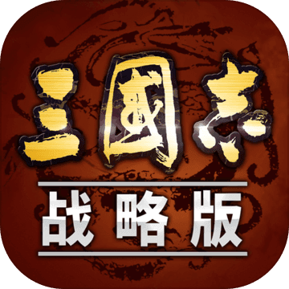

亮点：
- 来自阿里互娱开发的爆款游戏，但还是SLG的模式
- 原画很棒
- 据说游戏融入了真实地形，也是游戏广告里宣传的重点，应该算是个亮点吧。

不足：
- 依然觉得没啥意思

评分：2分，游戏1分，看在是爆款而且是目前为数不多直播平台上比较活跃的SLG手游，加1分

时间：2019.12.14


### 音乐

#### 跳舞的线


亮点：
- 充满回忆和感动的一款游戏，音乐优美，关卡精良，很对我的胃口，即使现在也能对其中一些老关卡的旋律记忆犹新。看到目前为止游戏是三周年，那算下来自己也算是元老玩家了，记得还是大学同学灿总推荐了我这款游戏，十分感谢
- 自己有强烈的收集欲，早起关卡除了大教堂和园林好像都完美通关，寒冬remix、秋天的山路等等，失败了不知多少次，通过了都会手心冒汗，很少有音游能带来这种体验。通关的成就感真的特别大

  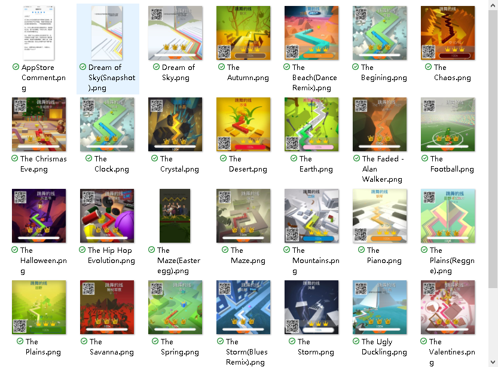

- 是自己最早希望能够模仿的游戏，因为确实有很多感动和回忆
- 特别喜欢这款游戏，也充值过一波，买了最贵的舞线，另外还给开发者写过评论，他们也积极回复并做出了改变
- 关卡中还会有各种彩蛋，设计真的很良心
- 后期出了引导线，一些关卡比如大教堂会简单很多，不然真的会挡住一大部分玩家

不足：
- 游戏时会特别关注路线，而忽略了关卡中的一些景色
- 后期出了特别多广告和花里胡哨的活动，进游戏选关卡也会特别卡，不知道为什么这个游戏畅玩1小时（无线体力加去广告）就需要12块钱，估计是瞅准了玩家群体小，所以逼着小部分玩家氪金。看了下现在还出了按月续订，也是贵的离谱，很奇怪好好的游戏为什么非要这样逼走玩家，精简系统，做成一次性付费或者类似DLC的模式不香吗。后期我是打算云通关了
- 还有一个很严重的问题是，游戏特别依赖设备，即有线耳机，外放的话听不清鼓点很容易乱节奏，而蓝牙耳机的延迟对这个游戏也是致命的，所以只有有线耳机可以玩，因此也是自己慢慢放下的一个原因

评分：4.5分，创意十足、设计精美的音乐游戏，但活动和广告扣0.5分，可以改为一次性付费或者解锁关卡的设定。


日期：2020.02.21

更新：2020.02.21，听了听三周年的音乐，又下了回来，因为确实很感动。

#### 滚动的天空2


亮点：
- 画面太美了，跑酷的形式玩着也很爽，制作很精良，甚至有点脱离休闲的范围，朝着宏大制作迈进了。

不足：
- 广告太多，到处充斥着充值和看广告的按钮，音游很重要的连续性和试错性被切得稀碎
- 操作不是很精确，实时滑动（为了区别神庙逃亡式的滑动）的操作注定会将音游卡点的乐趣降低不少

评分：3分，与跳舞的线相比，音游的乐趣少了很多

时间：2019.10.14

### 解谜
#### 迷失岛


亮点：
- 画风很喜欢，难度也很合适，不看攻略基本能完成90%的谜题吧
- 一二周目的关卡有差异的设计比较亮眼
- 有两个谜题的线索在主菜单的“关于”里，也是个不错的设计，果然解密类游戏里每一个像素都要留意。
- 最后的彩蛋很喜欢，寄出一封信之后会得到一封回信，信里是迷失岛2的预告
- 靠着攻略完成了全成就，装信的那个宝箱游戏一开始就见到了，但直到最后才解开，也算一种设计上的呼应吧
- 有南瓜先生的彩蛋

不足：
- 玩完之后不知道都干了什么，剧情方面比较薄弱，好多事件都没有理清


评分：3.5分，给4分觉得有点高，3分又不止

时间：2019.10.14

#### 南瓜先生大冒险


亮点：
- 谜题设计跟迷失岛差不多，大部分能够独立完成
- 通过玩小游戏来得到提示是个比较不错的设计，如果能多几个小游戏就好了
- 通过玩解谜游戏发现，解谜的过程跟日常解决问题比如写代码十分类似，开始可能顺风顺水也可能遇到困难，但总会慢慢找到突破口或某天突然恍然大悟，所以日常做事也不能遇到困难就退缩或放弃，而要知道困难本来就是普遍存在的，遇到困难是正常现象，而且解决困难有时也不会是一朝一夕就能够完成的，而要坚持不懈，即便这次没有进展，也要相信困难最终一定会被解决。

不足：
- 与迷失岛相比，流程设计成了关卡模式，难度会小一些，但自由度会降低一些
- 有些关卡结局没存档就必须要重头打，不能选择关卡
- 有的谜题比较牵强，尤其是最后那个电压表
- 隐藏关卡的设计不错


评分：3.5分，跟迷失岛一样水准

时间：2019.10.20

#### 密室：往逝

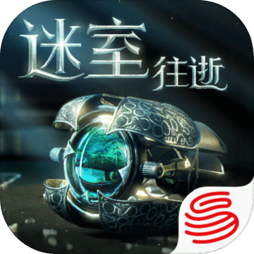

亮点：
- 虽然印了网易的标，但研发并不是网易，而是国外的一个叫Fireproof的团队，taptap上评分高达9.1分，可见这款游戏在玩家中口碑还是相当不错的。
- 光影和画面做得很不错。

不足：
- 试玩关卡更像是在玩一个玩具，解谜就是怎么摆弄的问题，希望后面的关卡能加入更多剧情和NPC吧，并没有玩下去的冲动


评分：3分

时间：2020.02.21

#### 别喂猴子

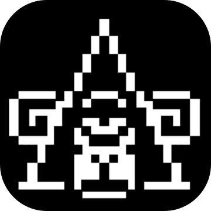

亮点：
- 独特的游戏模式，是我之前完全没有接触过的。之前接触过看门狗的偷窥支线，觉得很有意思，但那个仅仅是观看动画。这个还需要玩家来提取信息和互动。
- 略微黑色幽默的剧情里面有很多细节，也符合碎片化叙事的设定
- 音效很不错，嘈杂的环境音能给人安全感
- 摸清游戏套路之后还是很有意思的，在观察和维持体力之间找到平衡

不足：
- 游戏在引导方面做得不好，前几次玩根本找不到门路，后期也要维持体力和观察之间的平衡，我自己是很难撑过前三周。我觉得这个游戏更适合于视频通关
- 目前我还没发现游戏有比较高的可玩性，剧情和对话总是重复，有时会感觉在浪费时间
- 通关之后需要重新开始，有很多笼子不能互动
- ios上的成就系统没实现，考虑后期在stream上入一个
- 视频直接切换很晃眼
- 多周目简直是噩梦，本来希望解锁更多剧情，但很多线索需要重复等待和获取
- 16天以后无法继续，导致很多还在调查的剧情草草收尾


评分：3.5分，这种解密的创意真的很不错，但是想解锁多个结局就必须要多周目，而多周目会有很多重复和等待，不利于后面继续游戏，所以游戏机制上再完善一点就更好了。

时间：2020.02.20

#### Tick Tock: A Tale for Two


亮点：
- 创意真的很不错，两个设备同时游戏而且不需要联网或者交互，把我认知的双人游戏开拓了一个层面
- 整个游戏不是很难，但很考验翻译和汉化的水准，特别是电话那里
- 谜题难度适中，考虑到两人只用语言交流，这个难度其实刚刚好，特别是电视机和电话关卡

不足：
- 游戏只有三章不是很过瘾，最后剧情结束地有点突兀
- 游戏里的道具系统很鸡肋，受到无法直接通信的限制，道具其实很难发挥作用，但如果两个人可以通过输入密码来共享道具，就可以解决更复杂的谜题

评分：4分，由于疫情不得不跟女票异地，还是她找到了这款游戏，一起度过的时光很欢乐。

时间：2020.xx.xx

### 多人竞技

#### 龙族幻想


亮点：
- 看着手机里这个占内存的巨无霸，终于下定决心来玩一下，坚持了两小时不到，（可能看了半小时剧情，寻了半小时路，胡乱放了半小时技能）实在玩不下去了
- 最重要的亮点就是，自己之前没怎么接触过MMO游戏，被游戏内各种微系统惊艳到了：拍照系统、与NPC类似微信的聊天系统、摩托车驾驶和飙车系统、打篮球系统、服装染色、社团招募好像还能做海报，看了看视频还有养成系统包括弹吉他和成为明星，拍卖系统，不走主线光玩这些也还挺有意思吧，开放世界还是做得有点样子的。
- 剧情视频里加弹幕的设计很创新，可能比较符合宅男的设定吧，但有时让我感觉自己在跟一群肥宅在玩，动不动就老婆就拔刀的，还有各种中二台词。创意值得讨论，但内容我看了不喜欢。
- 互动电影和解密也不错，但分支的选择好像对剧情发展影响不大，就会加一些属性
- NPC说的话会显示在公屏上，挺有意思的，感觉突破了一个次元
- 画面在我看来一般，但对于手机而言可能已经很不错了吧，毫无疑问是加分项。可是那些弹幕里说看电影的，你是刚开始看吗？
- 跳跃时不影响自动寻路这个设定很喜欢

不足：
- 聊天放在左下角很不习惯，强迫症表示左下角必须全是摇杆
- 声优出戏，没啥感情，台词也很尬
- 原著粉怎么看我不知道，我觉得前面剧情太拖沓了，很墨迹
- 战斗系统太垃圾，完全是那个技能CD好了放哪个，没有走位和战术，据说PVP也是全靠属性决定胜负。主角没有受击动作，打击感也很一般。闪避和跳跃按键太小了，再次说明了走位在策划眼里作用不大。可能MMO就是这样的？
- 没记错的话昵称只支持6位，笑了
- 怪物都是闪现，一下子出现在眼前的
- 剧情很蠢，主角一开始就强到吊打各种怪兽。而且后面学校被来的那个人清场时的剧情突然没有台词了
- 画风难受，角色都穿着各种奇怪的衣服，跟网易一个吊样子
- 鬼泣的钩子系统属实笑尿了，点几下就完事儿呗
- 大佬能充110万，我是真的服
- 以后做游戏让我远离宅男和各种“老婆”可以吗，求你了

评分：3分，刚刚及格吧，之前没怎么玩过MMO，不好比较。画面和游戏内细节到位了，但从玩家评论以及我自己的喜欢程度只能这个分数。

时间：2019.10.22

#### 完美世界

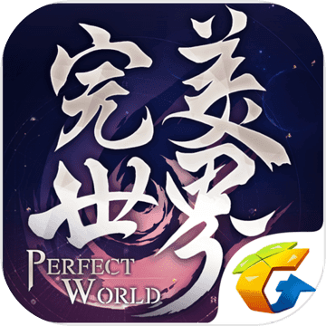

亮点：
- 特效画面啥的还凑乎
- 打击感比龙族幻想强一些
- 游戏前期能够看到其他玩家
- 坐骑（qi2）这个词读对了，还是可以的。

不足：
- 配音不合理，我选了妖族，npc是一只大老虎，结果配音是个清秀的男生，一点都不搭
- 如果啥都不点，我怀疑游戏自动就能帮你一个接一个帮你完成任务，没有任何操作性可言，这种游戏就是氪金加挂机，打着情怀收割一波韭菜，没意思。

评分：2分，玩了十分钟就不行了，想睡觉，我真的不适合玩MMO

时间：2019.11.04

#### 倩女幽魂


亮点：
- 画质很好，开场CG很惊艳，但说到底就是个视频嘛。另外游戏里的各种场景渲染地也不错。
- 有的场景里有烟花，是个不错的创意。
- 意境十分古色古香，让我想起了之前玩仙剑的感觉，很有安全感，确实有一种想要玩下去的冲动。
- 我发现玩家充值的冲动来自于看到别的玩家炫酷的装备和坐骑，经常走着走着就能看到一个骑着鸟飞得很高的玩家，让我不服气，也想买一个试试。

不足：
- 引导的声优什么鬼，温柔一点不可以吗。
- 为什么我的角色会拿着个盾牌走来走去，看着很别扭。
- 打斗就不提了，真的一般，简单的特效和伤害堆叠，没有打击感和操作。另外就是打斗太久，本身就这么几个小特效，半天还杀不死对面，只能来回放技能，很无聊。
- 有个任务是让蒲松龄把石灯点亮，找了半天也没找到按钮怎么点，结果网上一查是用手点一下屏幕上石灯。这就好比一开始我都是用手柄玩游戏，结果突然有一关让我用鼠标操作，体验不好。
- 28级时任务有点断，会发现之前无脑点突然不好使了，但也不知道要干嘛。
- 还有个小插曲，进入游戏后会有玩家以帮主的名义私信你加你微信，然后说倩女幽魂怎么怎么不好，现在帮会换了一款游戏，让你去下载并截图发给他。这种推广方式第一次见，直接到游戏里抢玩家，也是服气。

评分：3.5分，看在龙族幻想都拿到3分的水平上，这款游戏确实比之前的两款更能吸引我，但MMO我是真的没兴趣。

时间：2019.11.05

#### 我的起源


亮点：
- 没发现啥亮点

不足：
- 人物没表情，全程一张脸
- 画面粗糙，要用方块像素就都用，为什么只有地形是方块
- 为什么第一个宠物是个高糊的恐龙
- 抄袭塞尔达真的懒得吐槽，只抄地图、音效，玩法，但还是恶心的MMO，不断做任务，打击感几乎没有，打boss全程无脑点，太无聊了
- 我觉得这是个换皮游戏，因为跟完美世界一样差劲

评分：1分，至少在我发现它的可玩点之前它就把我劝退了。

时间：2019.11.27

#### 龙珠最强之战


亮点：
- 打击感不错
- IP很香
- 开箱时的交互还有点意思

不足：
- 战斗系统垃圾，就是点点点，最让我不理解的一点是，我点一下普攻，是第一段动作，过3秒再点时，因为已经过去了一段时间，所以正常的游戏应该还是第一段，但这个游戏竟然会到第二段，ACT玩家觉得不太能接受这么长时间动作不复位
- 直播都是怎么叠装备，怎么提升战力，到了真正对战时就完全是点点点，基本没啥操作，搞不懂这种游戏乐趣到底在哪儿

评分：2分，IP加一分

时间：2019.12.14

### 沙盒
#### 乐高无限
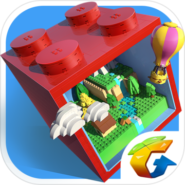

亮点：
- 玩家是真的自由，不仅能够自己创建地图，还能够自己定义规则，可以在这个世界中真正实现自己的玩法，从游戏制作上我觉得难度不小。
- MC玩家可能会比较喜欢吧

不足：
- 不得不承认，我玩手游可能就是图方便快捷，随时可以开一局的原因，所以这么肝的游戏，加上手机操作不方便，建造一个地图可能真的很费时费力，在手机上整确实很需要耐心，而且最终体验也很难特别好，玩的人少了，自己成就感也不高，所以不太看好之后的走势，但的确是个大胆而且成功的尝试。
- 我不是MC玩家，所以玩了一局找宝石，玩了一局运输船，觉得还不如去专门玩同类型的游戏，所以我是没get到游戏的乐趣在哪里。

评分：3分，自由度是实现难度上给3分，游戏丰富性和可玩性我自己不喜欢，包括MC我也提不起兴趣，所以不加分。

时间：2019.11.13

## 主机及其他