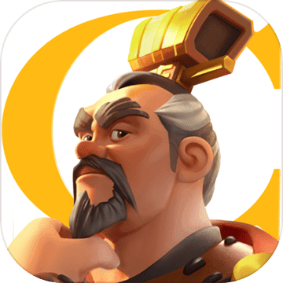

# 游戏评测
简单记录自己的游戏经历，不想搞得太正式，不然维护起来太费劲，就当简单一个随笔好了。每款游戏也简单地从亮点、不足、评分三个方面来评价。

关于游戏图片，手游去taptap上搜即可，其他去游民星空，点进去大图就能找到无水印的图了。

整个评论模板
```


亮点：
- 
- 

不足：
- 
- 

评分：5分

时间：2019.xx.xx

```

## 端游

### 解密

#### 疑案追声
   


亮点：
- 新颖的玩法让我看了几分钟直播后就毫不犹豫地入手了，这也是这款游戏拿到4分的主要原因，仿佛在做中文的听力考试。
- 剧本和关卡设计地很不错，难度由简到难。
- 最后一关设计很棒，第一个DLC好复杂，中元节DLC很感人。

不足：
- 虽然大部分是声音的游戏，但是不得不说声优的配音并不出彩甚至很出戏，尤其中元节DLC，一些语气和台词仿佛能让玩家感到他们在录音室里照着稿子念。
- 3D音效有利有弊，我觉得仅仅改变音量大小即可，环绕确实让人感觉很难受。
- 第一个DLC，台词中有太多粗口，让玩家有些不适。
- 每一关最后解密有点敷衍，希望能够详细还原一下真实的剧情。

评分：4分

时间：2019.10.07


## 手游

### 动作

#### 崩坏3--待完善


亮点：
- 画面真的很棒
- 吃金币和回血时的语音不错
- 升级时提示玩家“不要小气，多升一点”太萌了
- 

不足：
- 。。。
- 

评分：5分

时间：2019.xx.xx

### 横版过关

#### 三国战记-风云再起


亮点：
- 画面比街机提升了一个层次，但只有画面

不足：
- 毫无打击感可言，这个对于动作类游戏简直是致命的，手感做成这样，不知道为什么taptap能打到7.9分
- 关卡做成章节式很打乱游戏的流畅性，没关不到两分钟就要退出去点一下，也就是说玩家刚进入状态就结束了
- 特效很僵硬，关卡结束时的子弹时间放大了特效的缺陷，实属画蛇添足，摇杆不跟手，基本没有什么复杂的连招，不能前前跑动，这些小细节也很让人不爽。
- 第一关女boss孙姬的声优太出戏，是项目组的美术还是hr。有个小兵的配音是方言，还有首充时送诸葛亮，配音是“亮亮帮你打天下”，瞬间怒删游戏。要走情怀和怀旧路线就不要整这些恶搞的东西，何况情怀都没做好。另外只有第一关的对话有声音，后面对话都是字了。
- 可以参考现在老玩家玩的三国战记的版本，比如纯boss闯关，增多小兵这些。这才是目标人群，将这些游戏移植到手机上就成功一半了。

评分：只能给1分，像个半成品或者demo

日期：2019.09.20

#### 街机三国


亮点：
- 不愧是继承了页游的ip，整个游戏玩下来就是一个字，爽。各种伤害一直冒，打击感还行，任务也是领取机制，跟dnf比较像，只是技能受限，任务也比较简单。

不足：
- 除了爽没有任何亮点，很快就不想玩了，反正就是一顿技能上去乱按，还加了“弹刀”模式，在boss技能前摇时按指定按键就能触发，不仅可以打断boss技能还能造成伤害还有眩晕效果，简直不要太无脑。完全没有走位和技巧可言，上去一顿乱按就完事儿了。

评分：1.5分，比上面的三国战记多的0.5分是手感分和画面分。

日期：2019.09.20

#### 崩坏2


亮点：
- 我觉得没啥亮点

不足：
- 游戏像玩flash，动漫宅男真是谜一样的群体，大概没有充值时的一个“哼”字就能让很多宅男来个648吧；
- 第一关boss上来就一个bug，莫名其妙就结束了。游戏开局的引导也有bug，这都不测一测就上线了吗？
- 横板过关游戏的精髓一个都没有，动作僵硬尤其是挥动武器，打击感惨不忍睹，没有加速跑，没有跳跃，没有人物速度的变化，没有连击，简直一点操作都没有，纯粹开个好武器乱按
- 一会儿日语一会儿英语，给我整蒙了
- boss怪还能不能再敷衍一点，模型变大就行了吗？
- 玩过经典横版过关的玩家对这款游戏零容忍，我觉得这款游戏归为休闲可能更合适，因为真的是一款十分不合格的横板过关，号称“跟DNF很像”，笑了。
- “死肥宅真恶心”，果然给个“老婆”就充钱呗。

评分：0.5分，这0.5是看在崩坏3的面子上给的

时间：2019.10.17

### 体育

#### 街篮


亮点：
- 巨人网络研发的篮球3对3手游，应该是我第一款在手机上玩到的类似fs的游戏。

不足：
- 人物动作僵硬
- 移动缓慢
- 帧数低
- 锯齿高
- 总体游戏体验一般

评分：打分只能给2分，不及格。

日期：2019.09.20


#### 街头篮球


亮点：
- 这款游戏算是从音乐上移植了fs
- 加了投篮条，还算不错的设计吧，习惯fs的玩家可能需要一定时间来适应按键时间。

不足：
- 时不时会有“nice pass”和“gorgeous pass”的鬼畜
- 帧数低
- 动作僵硬
- 锯齿高。

评分：3分，勉强及格吧。

日期：2019.09.20


#### 潮人篮球


亮点：
- 游戏时间最长的篮球手游了，无论从流畅度、判定、细节等方面，都完爆前两款
- 内容上增加了人物技能，因此在每局后期增加了很多变数，思路上街霸5也有同样的设定。

不足：
- 网络有时响应不好，按键时经常被无视。
- 游戏策划差，所有这样的游戏基本都是看能力值，遇到能力值高的真的一点还手余地都没有，这是所有篮球手游的通病，一定程度上弱化了操作的重要性。另外游戏内部各种能力值设计复杂，技能分等级、皮肤加属性、还有天赋系统、特训系统、新出来的一个教练系统，简直要把零氪或微氪玩家往绝路上逼，吃相难看，我反正是头一次见一款篮球游戏能有这么多系统。
- 游戏运营差，跟《这！就是灌篮》合作出了张宁这些现实球员，我就觉得肯定要黄，本来游戏里人物的风格都是偏二次元的，突然搞出几个现实世界中的人物，让人觉得很违和。
- 现在又在跟灌篮高手打擦边球，出了能力值爆棚的樱木花道、大猩猩和三井，基本碰到就被打爆，太难了，好好一款游戏非要这么着急挣钱，逼走了一大票玩家，现在好友列表几乎都是灰的，着实很无奈。
- 另外，七夕节也出了个卖肉活动，从萝莉、御姐各个方面向宅男进攻，我是不会买账的，一想到运营的小心思我就挺恶心的说实话

评分：4分，这种游戏玩家黏性太低，短期内挣不到钱基本就GG，但吃相也别太难看。

时间：2019.09.25

### 卡牌

#### 月圆之夜


亮点：

- 上次玩卡牌游戏可能已经是小学时候了，当时游戏王玩的不亦乐乎，之后不玩可能是因为这样的游戏比较烧脑吧。参加完巨人网络校招之后，接触了这款月圆之夜，一下子就沉迷了，有着无法抗拒的魔力。
- 游戏的玩法设计很简单，就是两个人互相攻击，取消了游戏王和炉石传说中召唤兽的概念，伤害计算也很简洁
- 简单的玩法下，每种角色的风格还能保持多样性，比如战士就是平A和叠护甲叠装备，法师就是加魔法值和使用咒术牌，游侠使用行动力，还有使用祈祷牌和反制牌的角色。总而言之，不同角色玩法依然很多变。
- 画面、配音和音乐都不错，采用新颖的翻牌式关卡设计也很出彩
- 不同boss的特点很符合其名称和原画设计
- 爽起来是真的爽，不论是打持久还是打爆发，都很有意思
- 主要上瘾的地方是游戏中玩家有很快速的成长过程，另外前期小怪也比较容易无脑击杀，开始一个新存档的门槛低了很多。
- 最后记录一个我自己认为很爽的玩法，使用战士，加到3点行动力，装备两把狂战斧，然后旋风斧最好也整一张，用于打爆发，最后进攻号角必备。回合开始，先出进攻号角，然后疯狂使用各种攻击牌就完事儿了，无脑还很爽。
- 19-10-14更新：小红帽日记这个模式也很有意思，有点互动电影的感觉，加分项！

不足：

- 游戏通关之后不能在继续使用牌组进行挑战，每次游戏必须从头开始，导致玩家有一种失去感
- 一个噩梦难度还要分成好多等级，重复而且难度逐渐上升的挑战很容易让玩家放弃
- 没有pvp，也不能自己组合卡组去完成更难的挑战，不过设计初衷也是单机游戏，pvp这个没有也没关系

评分：
5分满分，taptap上也有9.2的高分，荣获了“2017年度最佳本土独立游戏”的头衔，实至名归。

时间：2019.09.25

### 战术竞技

#### 和平精英


亮点：
- 从众多吃鸡手游中最终存活，靠的真的是实打实的品质。
- 首先，无论从画面还是地图还是玩法，都做到了高度还原端游，让玩家很自然地迁移过来
- 其次在不同类型的手机上都能够正常运行，可见其优化程度之高
- 为了适配手机操作维度低，做了很多简化，比如自动拾取、自动上弹、自动装备等
- 由于国内特殊的环境，不得不加一些额外的功能，但遭人诟病的挥手退场已经被取消了
- 游戏中也不断增加新的游戏模式，缓解了玩法单一和队友长时间ob的缺陷
- 游戏中的新地图不用下载，这个是战胜全军出击的一个重要因素，玩家在玩的时候，不会专门等半小时来下载地图，下载游戏时就让玩家腾出足够的空间，保证玩家游戏时体验最大化是比较正确的。

不足：
- 4v4的模式让我以为乱入了cf，战术竞技和fps虽然相似，但是融合太多的元素在一个游戏里反而容易丧失游戏的特性，如果最后变成了一款普通fps结合吃鸡模式的游戏就属于本末倒置了。
- 花里胡哨的装备和素质广场中，故意区分玩家氪金程度的热力榜，让零氪玩家多少有点被冒犯的感觉，凭什么他们就能站那么高。

评分：5分，作为吃鸡游戏的代表，和平精英在品质已经甩开其他游戏一大截了，虽然很多人对其中的设计颇有微词，但从玩家的角度看，有一款这样的游戏，已经是吃鸡移植的里程碑式作品了。

时间：2019.09.25


#### 量子特攻


亮点：
- 低配版堡垒之夜
- 载具很炫酷
- 载具上的音乐很放松，梦回GTA
- 滑板飞着很爽
- 取消了趴下的操作，减少了伏地魔，但也不能算优点吧，只是迎合了某些玩家
- 很多细节还处理地不好，包括枪口顶墙、人物移动等

不足：
- 低配版堡垒之夜
- 跟“荒野行动”一样的硬伤——动作僵硬，游戏手感是基本一致的，目测借鉴了大量荒野行动的代码
- 还是“荒野行动”的硬伤——魔改，一股浓浓日式风格，这是特工啊，要的是科技感和炫酷感，搞一堆和服马尾什么鬼：

  
  
  看着就很违和。

- 摩托很难开
- 枪也很魔改
- 爬墙的设定也太蠢了
- 枪械手感一般
- 战术翻滚太强大了，一下子能飞老远

评分：2分

时间：2019.10.14


### FPS

#### 王牌英雄


亮点：
- 画风偏动漫风格，掩盖了一部分画面的缺陷，使得画面看上去比写实风格高端不少
- 画面足够炫，人物技能和爆炸等一些特效也足够真实
- 解锁了全部模式才来打分，英雄很多，但低端局无脑用加特林真的很carry
- 游戏里面的细节打磨得超级棒：一些界面转场使用视频来衔接真的太赞了，立刻显得很高端；背景音乐在进入匹配模式后会加滤镜变成大厅模式（这个无敌了，第一次看到这么细节的处理，匹配每次也就不到十秒钟吧）；把声优的名字写在英雄下面；角色的台词也很棒；
- 射击手感也不错，不同的枪械有不同的弹跳，辅助瞄准真的强，按着打就完事儿了，主要也是因为这里面人物的位移比较大，不好瞄准吧。

不足：
- 主界面在更新时，视频会一直循环播放，更新久时会让人有点厌倦
- 完成任务点击领取按钮时做得不顺畅，体验不好
- 似乎没找到快捷交流的按钮，无法在战斗中给队友鼓励，只能通过发信号来说明战术
- 游戏各个模式基本趋同，就是传统的fps模式和守望先锋的一些占点模式
- 同样人物行走时会有点滑行的感觉
- 平衡性上，除了加特林以外，其他英雄还没怎么用过，但上手或者本身就比较弱，不知道怎么用好


评分：5分，终于迎来了自己第一款fps游戏，虽然模仿了守望先锋，但丝毫不影响它在手机上超出同类fps一大截的水准。

时间：2019.xx.xx

### 非对称竞技

#### 猫和老鼠：欢乐互动


亮点：
- 画面声音比较怀旧

不足：
- 操作僵硬，平台跳跃做得一般，连松鼠大战都比不过
- 配音有点出戏，本来猫和老鼠就不说话
- 玩法上就是2D版的第五人格，只不过更适合小孩子，去掉了恐怖元素
- 当猫真的太难了
- 画风一般，建议好好看看原著

评分：2分，不是我喜欢的类型

时间：2019.09.25

### 平台跳跃
#### 魂斗罗：归来


亮点：
- 支持多人合作是唯一的亮点

不足：
- 冲魂斗罗IP来的，发现就继承了2D平台跳跃的玩法，其他完全跟魂斗罗无关
- 子弹可以调节方向的设定很不喜欢
- 为了让玩家氪金想出了很多玩法
- 画面动作都比较僵硬，角色各种乱入，赤裸裸变成了平台上的DNF
- 关卡依然被切分得很碎，玩得很不爽

评分：1分

时间：2019.10.02

### 休闲
#### 球球大作战


亮点：
- 将大鱼吃小鱼的思想玩出了很多花样
- 看了游戏视频觉得还是有一些操作和配合在里面的

不足：
- 变大之后移动太缓慢是我最不习惯的
- 玩法上没什么意思

评分：2分，不是我喜欢的类型

时间：2019.10.02

#### 我不是塔防3D


亮点：
- 没有亮点

不足：
- 砖块落到面前全部碎掉这个设计简直无语，剥夺了玩家的成就感，我打不打最后都不会死。一点都不解压，更别提爽快了
- 至少从视觉上没看出来炮台升级有啥区别
- 以为将之前爆款的小游戏养鲲和打砖块结合起来就能创造一种新玩法也是想瞎了心，无聊至极
- 提个改进，如果真想结合，每个炮的弹道让玩家手动控制，所有炮台轮完一次后，砖块向下掉落一格

评分：0分，要不是看在广告做得满天飞，让这个游戏冲上了app store前二十，我真不会花时间玩这个。

时间：2019.10.18

#### 家国梦


亮点：
- 作为国庆献礼的手游，精美程度绝对没得挑，从插画到动画细节到各种政策细节都打磨地很到位，玩家在收割金币、升级建筑时会有很爽的体验。
- 预告片做得很好，有种《文明》的既视感。
- 完全免费，无内置购物。

不足：
- 玩法单一，缺乏创新，几乎只有一个场景，我的体验是一直在建房子，类似于最初的QQ农场吧，对这类型的游戏一向不感冒。
- 每次收完金币，很快就会新产生出来，强迫症表示体验很不好。
- 火车拉的资源每次都要手动移动，很费劲。
- 全靠玩家肝，但是肝也得不到很好的回报，房子什么升级外观没有变化，只有升星才可以。
- 总体感觉是一个过家家的游戏。

评分：2分

时间：2019.10.07

#### 弓箭传说


亮点：
- 最近的爆款游戏，可以说借鉴了大量之前豹场“弓箭手大作战”的玩法，由PVP改成了PVE，放弃了吃鸡模式，转变到了普通的关卡模式，结果来看出奇的好，最起码广告经费充足，虎扑、抖音上都能看到它，是一款成功的休闲游戏。
- 游戏乐趣主要就是一个字：爽，让我想起了之前的射击游戏“消灭病毒”（by Kunpo），当然爽的前提是节奏的变化和角色能力的成长，游戏做得都很细致，包括学习技能buff、天赋、装备、开箱等系统，只是自己的技能buff不会累积，每次进游戏都是零开始，但这也不算缺点，只是一种设计。
- 操作简单容易上手，是一款十分合格的休闲游戏。

不足：
- 休闲游戏就不求玩法上有多丰富了，广告里宣传的模式目前都没有，虚假广告真可怕
- 其余的缺点对我来说都是鸡蛋里挑骨头，广告也没有那么多，毕竟是营收之本，不强求通关的话完全可以不看

评分：4分，休闲游戏的成功案例

时间：2019.10.14

#### 风之旅人


亮点：
- 画面太美了，禅意十足（我有个疑问，禅意是不是就是看不懂的一堆符文乱七八糟的）
  
  

- 选择关卡的设计很不错，角色站在平台上，飞到自己要前往的关卡，保证了游戏的连贯性

不足：
- 很早就听说这款游戏制作很精良，直到最后上架App Store后果断买来玩一下，结果手机上玩游戏效果大打折扣：
  - 画面：分辨率低，很多锯齿
  - 声音：卡顿明显，有时直接会把声音卡没
  - 屏幕比较小，精美场景的冲击力变弱
  
- 由于是在手机上玩，发现除了画面美以外也没有多出彩，看了知乎才发现自己被坑惨了
  - 游戏里很少会遇到人，偶尔遇到几个我还以为是教学的电脑
  - 并没有组队通关的情形产生，少了很多温情
- 最后总结一点就是，千万不要买移动端的版本

评分：3分，就我目前玩到的内容来看，只有3分，以后如果玩到主机版本再回来更新

时间：2019.10.14

### 策略

#### 万国觉醒


亮点：
- Funplus实习时模仿的项目，画面精美，行军、缩放等细节处理到位，收集材料很爽快，不同文化、武将融合地都比较优秀。
- 自由城建的设计比较好，可以玩出农场的感觉。
- 数值设计很好，普通玩家到后期会慢慢发现升级变得越来越困难，产生充值行为。

不足：
- 对这种复杂系统，我自己上手比较慢
- 零氪玩家表示最后会退化成为农场游戏，不肝不氪就没有团战和国战体验，没有核心玩法的乐趣之后很容易流失

评分：2分，因为并不是自己喜欢的类型

时间：2019.10.14

#### 率土之滨


亮点：
- 游戏画风相对比较写实，而且尊重历史，日式风没有那么浓，男性英雄没有花里胡哨的铠甲，女性英雄衣着也相对不是很暴露，在画风上拥有比较不错的辨识度
- 游戏里有个大数据分析，虽然我不知道怎么用，但对大佬玩家来说是一个比较贴心的设计，可以进一步提升自己的游戏策略水准。
- 横竖屏切换和3D开关的设计不错
- 与万国觉醒相比，加入了抽卡设计（万国觉醒是碎片召唤机制），画面上和体验上更有优势。
- 游戏里玩家们在公屏上成语接龙也太欢乐了：

  

不足：
- 乐趣同样应该是抽卡和团战，同样不适合我
- 如果不去实习，不接触万国觉醒是肯定不会玩这款游戏的，而且它跟万国觉醒相比也有明显的缺点：
  - 首先是自己的城池就是一个模型，无法进入，也不能看到里面建筑物的样子，更不支持自由城建。能看到的仅仅是自己建筑物的等级，对我而言少了不少乐趣。
  - 其次军队行军也直接在地图上点对点进行，因此会出现军队直接在城池上行军的现象，看着不和谐。
  - 地图不支持缩放
  - 战斗鸡肋，战斗时玩家不能介入，相当于在战斗开始前结果就已经确定了，少了玩家的策略部分
  - 游戏动画点着不爽
  - 小红点也很鸡肋，看着很像我实习时使用的，临时用来凑数的红点
- 游戏内置的“率土风云”应该是每周选出一些经典战役分享给玩家的一个节目，已经于今年二月份停更了，不知道是不是玩家留存少的一个信号。

评分：2分

时间：2019.10.14

#### 魔法门之英雄无敌：战争纪元


亮点：
- 画面做得很精致，特效、动画和原画都很不错

不足：
- 情怀游戏，战棋类的玩法自己接触也比较少。
- 策略上主要是排兵布阵，但看视频也没有体现出特别多重要性，主要是战力的比拼，及时放个技能就行了。
- 完全是强迫症在逼着自己玩，一局对战基本不超过一分钟，不刷满三星就别扭，大部分时间都是升级、进阶、升星和刷战力，确实很没意思。

评分：1.5分，游戏性上只有1分，另外0.5给画风，有种莫名的安全感，很怀旧。

时间：2019.10.23

### 音乐
#### 滚动的天空2


亮点：
- 画面太美了，跑酷的形式玩着也很爽，制作很精良，甚至有点脱离休闲的范围，朝着宏大制作迈进了。

不足：
- 广告太多，到处充斥着充值和看广告的按钮，音游很重要的连续性和试错性被切得稀碎
- 操作不是很精确，实时滑动（为了区别神庙逃亡式的滑动）的操作注定会将音游卡点的乐趣降低不少

评分：3分，与跳舞的线相比，音游的乐趣少了很多

时间：2019.10.14

### 解谜
#### 迷失岛


亮点：
- 画风很喜欢，难度也很合适，不看攻略基本能完成90%的谜题吧
- 一二周目的关卡有差异的设计比较亮眼
- 有两个谜题的线索在主菜单的“关于”里，也是个不错的设计，果然解密类游戏里每一个像素都要留意。
- 最后的彩蛋很喜欢，寄出一封信之后会得到一封回信，信里是迷失岛2的预告
- 靠着攻略完成了全成就，装信的那个宝箱游戏一开始就见到了，但直到最后才解开，也算一种设计上的呼应吧
- 有南瓜先生的彩蛋

不足：
- 玩完之后不知道都干了什么，剧情方面比较薄弱，好多事件都没有理清


评分：3.5分，给4分觉得有点高，3分又不止

时间：2019.10.14

#### 南瓜先生大冒险


亮点：
- 谜题设计跟迷失岛差不多，大部分能够独立完成
- 通过玩小游戏来得到提示是个比较不错的设计，如果能多几个小游戏就好了
- 通过玩解谜游戏发现，解谜的过程跟日常解决问题比如写代码十分类似，开始可能顺风顺水也可能遇到困难，但总会慢慢找到突破口或某天突然恍然大悟，所以日常做事也不能遇到困难就退缩或放弃，而要知道困难本来就是普遍存在的，遇到困难是正常现象，而且解决困难有时也不会是一朝一夕就能够完成的，而要坚持不懈，即便这次没有进展，也要相信困难最终一定会被解决。

不足：
- 与迷失岛相比，流程设计成了关卡模式，难度会小一些，但自由度会降低一些
- 有些关卡结局没存档就必须要重头打，不能选择关卡
- 有的谜题比较牵强，尤其是最后那个电压表
- 隐藏关卡的设计不错


评分：3.5分，跟迷失岛一样水准

时间：2019.10.20

### 多人竞技

#### 龙族幻想


亮点：
- 看着手机里这个占内存的巨无霸，终于下定决心来玩一下，坚持了两小时不到，（可能看了半小时剧情，寻了半小时路，胡乱放了半小时技能）实在玩不下去了
- 最重要的亮点就是，自己之前没怎么接触过MMO游戏，被游戏内各种微系统惊艳到了：拍照系统、与NPC类似微信的聊天系统、摩托车驾驶和飙车系统、打篮球系统、服装染色、社团招募好像还能做海报，看了看视频还有养成系统包括弹吉他和成为明星，拍卖系统，不走主线光玩这些也还挺有意思吧，开放世界还是做得有点样子的。
- 剧情视频里加弹幕的设计很创新，可能比较符合宅男的设定吧，但有时让我感觉自己在跟一群肥宅在玩，动不动就老婆就拔刀的，还有各种中二台词。创意值得讨论，但内容我看了不喜欢。
- 互动电影和解密也不错，但分支的选择好像对剧情发展影响不大，就会加一些属性
- NPC说的话会显示在公屏上，挺有意思的，感觉突破了一个次元
- 画面在我看来一般，但对于手机而言可能已经很不错了吧，毫无疑问是加分项。可是那些弹幕里说看电影的，你是刚开始看吗？
- 跳跃时不影响自动寻路这个设定很喜欢

不足：
- 聊天放在左下角很不习惯，强迫症表示左下角必须全是摇杆
- 声优出戏，没啥感情，台词也很尬
- 原著粉怎么看我不知道，我觉得前面剧情太拖沓了，很墨迹
- 战斗系统太垃圾，完全是那个技能CD好了放哪个，没有走位和战术，据说PVP也是全靠属性决定胜负。主角没有受击动作，打击感也很一般。闪避和跳跃按键太小了，再次说明了走位在策划眼里作用不大。可能MMO就是这样的？
- 没记错的话昵称只支持6位，笑了
- 怪物都是闪现，一下子出现在眼前的
- 剧情很蠢，主角一开始就强到吊打各种怪兽。而且后面学校被来的那个人清场时的剧情突然没有台词了
- 画风难受，角色都穿着各种奇怪的衣服，跟网易一个吊样子
- 鬼泣的钩子系统属实笑尿了，点几下就完事儿呗
- 大佬能充110万，我是真的服
- 以后做游戏让我远离宅男和各种“老婆”可以吗，求你了

评分：3分，刚刚及格吧，之前没怎么玩过MMO，不好比较。画面和游戏内细节到位了，但从玩家评论以及我自己的喜欢程度只能这个分数。

时间：2019.10.22


## 其他