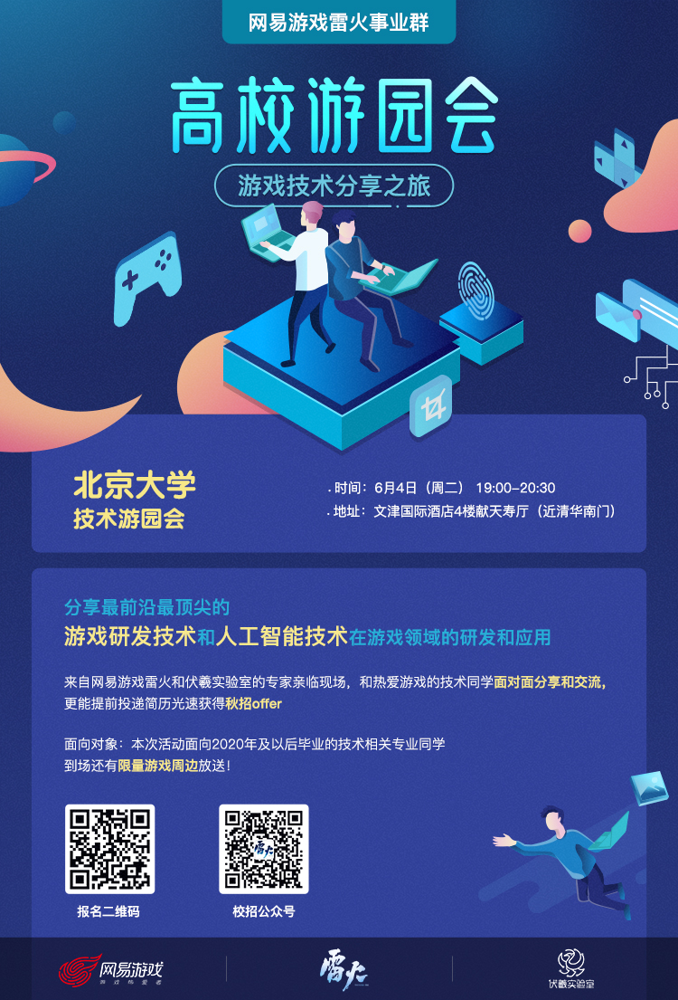

# Funplus

## 一面

前端面试，问了一些基础问题：

- TCP和UDP的区别
- 进程和线程的区别
- 手写了一下二叉树的层次遍历

## 二面

后端面试，同样是基础题：

- 如何在一堆数据中找到第k大的元素：快速选择算法
- 逻辑题：有两个人A和B，A需要通过信件把信息传给B，二人各有一把锁和一把钥匙，自己的钥匙只能打开自己的锁，已知信件在传递过程中必须加密，问如何实现可靠的通信。一个人将信件上锁，传给B，B再上锁，传给A，A解开锁，传给B，B解开自己的锁即可。

## 三面&四面

是大Leader来面试，基本没有什么技术性面试，主要是聊对游戏的看法等等。
但聊了一些图形学上渲染的优化，比如如何去掉绘制过程中的锯齿等。

# IGG G星计划

> 

## 一面

一面主要是HR面试，问了一些跟个人品质相关的问题，包括：

- 喜欢什么游戏
- 遇到压力怎么解决
- 如果你是Team Leader，怎么协调人际关系(两个同学意见不合)
- 有没有什么领导经历

感觉聊得还可以，没有问技术相关的。

## 二面

二面是技术面试，面得很差，问题包括：

- 编程语言
- C++里的内存泄漏和内存溢出
- C++里的内存碎片
- 设计模式中的观察者模式
- MVC架构中，数据存储在哪个层
- C++中的map和unordered_map是什么
- 引擎底层的渲染和管线是什么
- TCP和UDP的区别
- 基本的网络同步怎么实现
- UDP中的滑窗实现
- MMO中使用的网络传输技术(UDP还是TCP)，哪些行为适合UDP

# 网易游戏雷火事业群

> **网易游戏雷火事业群暑期实习生补录活动**
>
> 网易游戏雷火事业群暑期实习生补录进行时，名额有限，先到先得，欢迎2020届同学投递。
>
>  
>
> 一、 公司简介
>
> 网易游戏雷火事业群
>
> 2007年，雷火在西子湖畔成立，是网易在杭州的第一个游戏工作室。历经十多年发展，雷火已是拥有近两千名员工的事业群，具备国内一流研发、运营、营销实力，也是网易游戏杭州发展势头最强劲的部门。雷火团队先后成功开创《倩女幽魂》、《天谕》、《逆水寒》三大旗舰游戏品牌，并在动作、体育、休闲游戏领域做出成功尝试。
>
> 雷火具有强大的研发和技术实力。《逆水寒》在网络游戏界首次运用了由AMD开发的TressFX技术，游戏人物精致到发丝。依托havok物理引擎，在粒子层面构建真实江湖环境，借力Enlighten全局光照系统，创造一个会呼吸的江湖，并成为首款全面应用RTX技术的中国游戏。
>
> 雷火事业群还拥有国内首家专注于游戏领域人工智能研发运用的实验室-伏羲实验室，由全球人工智能领域杰出专家 - 沈向洋博士（Dr. Harry Shum）担任伏羲实验室首席顾问。伏羲实验室以“创建人工智能与游戏交叉领域的世界一流实验室”为宗旨，运用人工智能尖端技术为玩家营造新世代的游戏体验，同时借助游戏平台的海量数据和仿真环境，推动人工智能技术的发展。
>
>  
>
> 二、 招聘职位
>
> （一）  技术类
>
> 1、 游戏研发工程师暑期实习生
>
> 共同创造和开发世界一流的游戏，从客户端、服务端到游戏引擎，跨越广阔的技术 
>
> 领域，解决各种极具挑战性的问题。
>
> 职位方向：客户端、服务器、客户端引擎
>
>  
>
> 2、 游戏人工智能暑期实习生
>
> 加入国内首家专业游戏AI研究机构，从事游戏相关的人工智能系统创新性研究和
>
> 研发工作，实现人工智能在游戏的落地；借助相关技术，进行技术分享、专利申请。和学术文章发表；利用人工智能技术开发并维护相关平台及工具，提升研发效率及用户体验。
>
> 职位方向：虚拟人、计算机视觉、用户画像、自然语言处理、强化学习
>
>  
>
> 3、 游戏测试工程师暑期实习生
>
> 作为业内优秀测试团队的一员，最先接触和体验新游戏新玩法，找出设计中潜在的问题，从源头保障游戏质量；钻研和开发各种辅助测试工具，不断提高测试效率，全方面改进产品质量和用户体验。
>
>  
>
> 4、 平台开发工程师暑期实习生-Java方向
>
> 参与内部工具和系统的开发、重构和运维，提升部门各职能的工作效率和用户体验。
>
> （二）  综合类
>
> 1、 游戏交互设计师暑期实习生
>
> 亲手创造玩家与游戏世界的全新交互规则，设计出适合的交互解决方案
>
> 2、 项目管理工程师暑期实习生
>
> 与最具创造力的游戏研发团队并肩作战，参与产品研发流程的推进和优化，计划的制定、跟踪、控制以及经验总结，通过自己的项目管理工作将优秀游戏产品及时地带给玩家。
>
> （三）  艺术类
>
> 1、 游戏特效设计师
>
> 感受不同游戏场景的氛围，通过添加特效增加场景气氛，尝试将各种元素以更丰富的形态表现出来，为不同人物添加炫丽的攻击特效或属性特效，使效果更夸张、表现更震撼。
>
>  
>
> 三、 招聘流程
>
> （一）  网申地址
>
> campus.163.com
>
> （二）  投递方式
>
> 选择目标职位-->点击"投递简历”
>
> 完善信息-->上传简历
>
> （三）  招聘对象
>
> 2020届毕业的同学
>
> 暑期可以实习至少2个月及以上
>
>  
>
> 应聘流程中有任何问题欢迎邮件咨询campusleihuo@163.com
>
> 

## 一面

面试十分硬核：

- 上来没有自我介绍，直接问：你做过的项目中遇到问题或挑战怎么解决
- C++智能指针是什么
- C++虚函数表的内部结构
- Python的符号查找，即代码中怎么去根据用户键入的字符串来找到它所表示的变量
[Python变量查找LEGB原则](https://blog.csdn.net/baidu_35085676/article/details/79851251)

    - L-Local(function)；函数内的名字空间
    - E-Enclosing function locals；外部嵌套函数的名字空间(例如closure)
    - G-Global(module)；函数定义所在模块（文件）的名字空间
    - B-Builtin(Python)；Python内置模块的名字空间

    当Python访问变量值时，默认LEGB查找原则，如果都找不到，则会抛出`NameError`
- Python中的垃圾回收机制
- 还有很多特别难的问题，记不太清了，总之面得很不好

# 腾讯游戏

腾讯游戏是我面的第一个实习面试（之前那个小游戏公司除外），很尴尬地聊了不超过十分钟，最后让我去面试，所以放弃了，问的问题现在只记得一个C++的虚函数和多态是怎么实现的。

# 阿里互娱

阿里互娱是我面的第一个实习面试，一共四面，两轮技术面，一轮交叉面，一轮HR面试。

## 一面：主要是问一些基础问题

- C++虚函数
- 数组和链表的区别，各种操作的复杂度等
- 各种排序算法的复杂度
- 给定一副扑克牌和一个随机函数，如何将牌堆完全洗乱：对每张牌随机一个数，表示牌的位置，然后跟这个位置的牌进行交换。

## 二面&三面&四面：

- 二面&三面主要问项目
- 四面主要聊对游戏的认识等

# 完美世界

简历投了很久才收到回复，感觉聊得也很好，最后没过有点诧异，然后对公司印象不是很好，尤其前台，秋招时不会再投了。

# 搜狐畅游

投了简历并没有人理 :cry:

