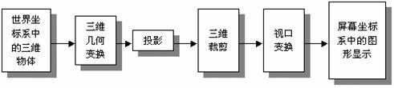
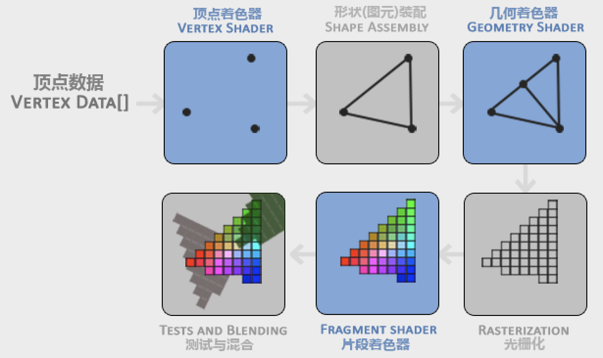
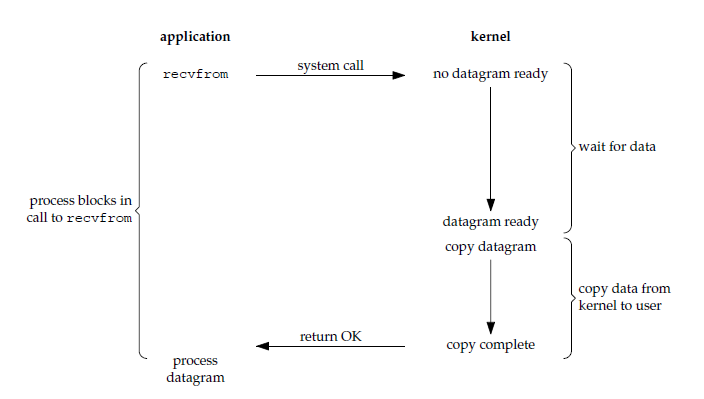
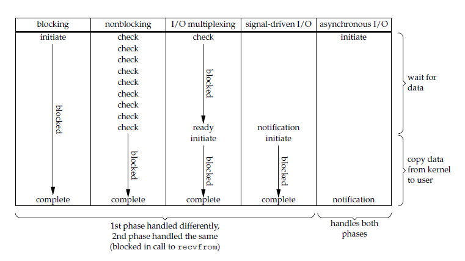

# 自我介绍
面试官您好！我叫高宜琛，本科就读于大连理工大学软件学院软件工程专业，现在是北京大学信息科学与技术系计算机应用的一名研二学生，毕业时间是2020年7月。
实验室方面，自己的研究方向主要是计算机字体的生成和压缩，完成了使用深度学习和传统图形学方法结合，通过用户输入的少量字符集，来生成完整矢量字库的任务，目前该成果计划投稿至Siggraph Asia 2019。
跟游戏相关的项目，第一是本科期间使用unity做过一些小的Demo，第二是从6月份开始，在Funplus公司实习，做游戏客户端的开发，项目是一个SLG和COC结合的手游，截止到目前完成了3个feature，包括地图编辑器功能的增加和优化、Unity编辑器的资源锁、预置体的树形结构展示等。目前正在做的是游戏中的背包系统，目的是能够使用wrpc实现服务器端数据和客户端UI界面的绑定，比如背包中物品的数量等。
之所以来应聘游戏岗位，最重要的原因是对于游戏和游戏开发的热情和兴趣，从小就觉得游戏带给了自己很多欢乐和感动，很希望能够投入到其中，给别人带来同样的感受。虽然自己可能游戏开发技术栈方面的积累不如数字媒体或图形学专业的同学强，但自己的学习能力和热情能够弥补这方面的不足，我自己很有信心能够胜任游戏开发这一职位。

# 渲染管线

- [OpenGL中的坐标转换](https://blog.csdn.net/shimazhuge/article/details/25135009):

    四种坐标系:
    1. 世界坐标

    2. 局部坐标

    3. 视坐标

    4. 屏幕坐标

    从三维物体到二维图象，就如同用相机拍照一样，通常都要经历以下几个步骤：
    1. 将相机置于三角架上，让它对准三维景物，它相当于OpenGL中调整视点的位置，即**视点变换**（Viewing Transformation）。

    2. 将三维物体放在场景中的适当位置，它相当于OpenGL中的**模型变换**（Modeling Transformation），即对模型进行旋转、平移和缩放。

    3. 选择相机镜头并调焦，使三维物体投影在二维胶片上，它相当于OpenGL中把三维模型投影到二维屏幕上的过程，即OpenGL的**投影变换**(Projection Transformation），OpenGL中投影的方法有两种，即正射投影和透视投影。为了使显示的物体能以合适的位置、大小和方向显示出来，必须要通过投影。有时为了突出图形的一部分，只把图形的某一部分显示出来，这时可以定义一个三维视景体（Viewing Volume）。正射投影时一般是一个长方体的视景体，透视投影时一般是一个棱台似的视景体。只有视景体内的物体能被投影在显示平面上，其他部分则不能。注：这里需要进行裁剪。
    4. 冲洗底片，决定二维相片的大小，它相当与OpenGL中的**视口变换**（Viewport Transformation）（在屏幕窗口内可以定义一个矩形，称为视口（Viewport），视景体投影后的图形就在视口内显示）规定屏幕上显示场景的范围和尺寸。

    通过上面的几个步骤，一个三维空间里的物体就可以用相应的二维平面物体表示了，也就能在二维的电脑屏幕上正确显示了。总的来说，三维物体的显示过程如下：

    

- [OpenGL中，如何在屏幕上绘制一个三角形](https://learnopengl.com/Getting-started/Hello-Triangle)

    

    - 对于任何一个模型，不管3D、2D,最初都是**点的数据**。比如一个正方形，就是4个角的坐标，立方体，就是8个点的坐标，一个游戏里的复杂人物，实际是许多的点拼接起来的，搜一下”三维模型“图片就有直观感受。所以整个流程输入的是顶点的数据，即Vertex Data.

    - 而最终呈现给用户的是显示屏上的图像，而图像是一个个像素构成，所以输出的是每一个像素的颜色。整个流程要做的就是：怎么把一个个坐标数据变成屏幕上正确的像素颜色呢？

    - 这张图片还是很直观的。而蓝色部分就是现代OpenGL可以让我们编写参与的部分。shader译作”着色器“，它是流程中的一段子程序，负责处理某一个阶段的任务，就像流水线上有很多不同的机器和人，它们负责一部分工作。

    1. 顶点数据(Vertex)：物体的3D坐标的数据的集合。

    2. 顶点着色器(Vertex Shader)是第一个shader,它负责处理输入的顶点数据，比如坐标变换，把3D坐标转为另一种3D坐标，同时顶点着色器允许我们对顶点属性进行一些基本处理。

    3. 图元装配(Primitive Assembly)：将顶点装配成形状。

    4. 几何着色器(Geometry Shader)：通过产生新顶点或取其他顶点来生成新形状。

    5. 光栅化阶段(Rasterization Stage)：将形状映射为最终屏幕上相应的像素，生成的东西叫片段(Fragment)。这个阶段会执行裁切，丢弃超出你的视图以外的所有像素，用来提升执行效率。（即投影）

    6. 片段着色器(Fragment Shader)：计算一个像素的最终颜色。这时接受的已经不是顶点，而是fragment,有碎片的意思，它就对应着一个像素单位。这一阶段主要就是要计算颜色，比如光照计算：在有N个光源的时候，这个fragment的颜色是什么，光的颜色、物体本身的颜色、这个fragment朝向等都要考虑。

    7. Alpha测试和混合(Blending)：进一步透明度、组合等处理。

    - 对于大多数情况，只有三步需要我们操作：准备顶点数据，配置顶点着色器和片段着色器（因为GPU中没有默认的顶点/片段着色器）。


# Lua
- Lua 是一种轻量小巧的**脚本语言**，用**标准C语言**编写并以源代码形式开放， 其设计目的是为了**嵌入应用程序**中，从而**为应用程序提供灵活的扩展和定制功能**。
- 八种基本数据类型：nil、boolean、number、string、function、userdata、thread、table.
- 语句组(chunk)和语句块(block)的[区别](https://stackoverflow.com/questions/12119846/whats-the-difference-between-chunk-and-block-in-lua):一个chunk是一系列顺序执行的语句，chunk之间的运行是相互独立的，可以理解为一个函数；一个block仅仅是一系列语句，因此所有的chunk都是block，但不是所有的block都是chunk.

# C++

## 深浅拷贝

C++中类的拷贝有两种：深拷贝，浅拷贝：当出现类的等号赋值时，即会调用拷贝函数

- 在未定义显示拷贝构造函数的情况下，系统会调用默认的拷贝函数——即浅拷贝，它能够完成成员的一一复制。当数据成员中没有指针时，浅拷贝是可行的；但当数据成员中**有指针时**（有对其他资源（如堆、文件、系统等）的引用时（引用可以是指针或引用）），如果采用简单的浅拷贝，则两类中的两个指针将指向同一个地址，当对象快结束时，会调用两次析构函数，而导致指针悬挂现象，所以，此时，必须采用深拷贝。
- 如果在类中没有显式地声明一个拷贝构造函数，编译器将会自动生成一个默认的拷贝构造函数，该构造函数完成对象之间的位拷贝。位拷贝又称浅拷贝深拷贝与浅拷贝的区别就在于深拷贝会在堆内存中另外申请空间来储存数据，从而也就解决了指针悬挂的问题。简而言之，当数据成员中有指针时，必须要用深拷贝。
- 写法：
    ```c++
    class MyString
    {
        private:
            char *m_data;
            int m_length;
            
        public:
            MyString(const char *source="")
            {
                assert(source); // make sure source isn't a null string
        
                // Find the length of the string
                // Plus one character for a terminator
                m_length = std::strlen(source) + 1;
                
                // Allocate a buffer equal to this length
                m_data = new char[m_length];
                
                // Copy the parameter string into our internal buffer
                for (int i=0; i < m_length; ++i)
                    m_data[i] = source[i];
            
                // Make sure the string is terminated
                m_data[m_length-1] = '\0';
            }
        
            ~MyString() // destructor
            {
                // We need to deallocate our string
                delete[] m_data;
            }

            // Copy constructor
            MyString::MyString(const MyString& source)
            {
                // because m_length is not a pointer, we can shallow copy it
                m_length = source.m_length;
            
                // m_data is a pointer, so we need to deep copy it if it is non-null
                if (source.m_data)
                {
                    // allocate memory for our copy
                    m_data = new char[m_length];
            
                    // do the copy
                    for (int i=0; i < m_length; ++i)
                        m_data[i] = source.m_data[i];
                }
                else
                    m_data = nullptr;
            }
            // Assignment operator
            MyString& MyString::operator=(const MyString & source)
            {
                // check for self-assignment
                if (this == &source)
                    return *this;
            
                // first we need to deallocate any value that this string is holding!
                delete[] m_data;
            
                // because m_length is not a pointer, we can shallow copy it
                m_length = source.m_length;
            
                // m_data is a pointer, so we need to deep copy it if it is non-null
                if (source.m_data)
                {
                    // allocate memory for our copy
                    m_data = new char[m_length];
            
                    // do the copy
                    for (int i=0; i < m_length; ++i)
                        m_data[i] = source.m_data[i];
                }
                else
                    m_data = nullptr;
            
                return *this;
            }
        
            char* getString() { return m_data; }
            int getLength() { return m_length; }
    ```
- 从上面可以看到，如果类内存在指针或动态申请的内存，我们就需要深拷贝，而定义深拷贝时，往往还需要写其他相关的函数：
    1. 构造函数：需要动态申请内存
    2. 拷贝构造函数：同样需要动态申请内存
    3. 析构函数：释放动态申请的内存
    4. 重载等于号：处理赋值操作，需要释放内存后重新申请

- 重载等于号和拷贝构造函数很像，因为参数都是另外一个实例，但主要有三点区别：
    1. 需要检查是否是自我赋值
    2. 返回值是`*this`
    3. 需要先释放内存，再重新申请，防止内存泄漏

- C++中的STL内部已经定义好了深拷贝，如vector、string等，所以可以放心使用，减少错误的概率

## 内存泄漏和内存溢出
- 内存泄漏（Memory Leak）：是指程序在申请内存后，无法释放已申请的内存空间，一次内存泄露危害可以忽略，但内存泄露堆积后果很严重，无论多少内存,迟早会被占光。
- 内存溢出（Out of Memory）：是指程序在申请内存时，没有足够的内存空间供其使用。
- 区别：内存泄漏是申请内存后没有释放，但它的地址已经找不到了，所以这块内存无法再被使用，也无法再被回收。内存溢出就是简单的分配空间不足以放下数据，比如栈满时再做进栈必定产生空间溢出，叫上溢，栈空时再做退栈也产生空间溢出，称为下溢。

## new/delete 和 malloc/free
- malloc与free是C++/C 语言的标准库**函数**（function），new/delete 是C++的**运算符**（operator）。
- delete 用于释放 new 分配的空间，free 有用释放 malloc 分配的空间。
- 调用free之前需要检查需要释放的指针是否为空，使用delete 释放内存则不需要检查指针是否为NULL。

- 实例：
    ```c++
    #include<stdio.h> 
    #include<stdlib.h> 
    int main() 
    { 
        int x; 
        int *ptr1 = &x; 
        int *ptr2 = (int *)malloc(sizeof(int)); 
        int *ptr3 = new int; 
        int *ptr4 = NULL; 
    
        /* delete Should NOT be used like below because x is allocated  
            on stack frame */
        delete ptr1;   
    
        /* delete Should NOT be used like below because x is allocated  
            using malloc() */
        delete ptr2;   
    
        /* Correct uses of delete */
        delete ptr3; 
        delete ptr4; 
    
        getchar(); 
        return 0; 
    } 
    ```

## C/C++中的内存布局

- 内存分为五个部分
    - 代码区(Text segment)：存放CPU执行的机器指令（machine instructions）。通常，代码区是可共享的（即另外的执行程序可以调用它），因为对于频繁被执行的程序，只需要在内存中有一份代码即可。代码区通常是只读的，使其只读的原因是防止程序意外地修改了它的指令。另外，代码区还规划了局部变量的相关信息。
    - 未初始化数据区（Uninitialized Data Segment）：亦称BSS区（uninitialized data segment），存入的是全局未初始化变量。BSS这个叫法是根据一个早期的汇编运算符而来，这个汇编运算符标志着一个块的开始。BSS区的数据在程序开始执行之前被内核初始化为0或者空指针（NULL）。例如一个不在任何函数内的声明：
        ```
            long sum[1000];
        ```
    - 全局初始化数据区/静态数据区（Initialized Data Segment）：该区包含了在程序中明确被初始化的全局变量、静态变量（包括全局静态变量和局部静态变量）和常量数据（如字符串常量）。例如，一个不在任何函数内的声明（全局数据）：
        ```c++
        int maxcount = 99;
        ```
        使得变量maxcount根据其初始值被存储到初始化数据区中。
        ```c++
        static mincount = 100; 
        ```
        这声明了一个静态数据，如果是在任何函数体外声明，则表示其为一个全局静态变量，如果在函数体内（局部），则表示其为一个局部静态变量。另外，如果在函数名前加上static，则表示此函数只能在当前文件中被调用。
    - 堆区（Heap）：就是那些由new分配的内存块，他们的释放编译器不去管，由我们的应用程序去控制，一般一个new就要对应一个delete。如果程序员没有释放掉，那么在程序结束后，操作系统会自动回收。
        ```c++
        int main() 
        { 
        // This memory for 10 integers 
        // is allocated on heap. 
        int *ptr  = new int[10]; 
        } 
        ```
    - 栈区（Stack）：在执行函数时，函数内局部变量的存储单元都可以在栈上创建，函数执行结束时这些存储单元自动被释放。栈内存分配运算内置于处理器的指令集中，效率很高，但是分配的内存容量有限。
        ```c++
        int main() 
        { 
        // All these variables get memory 
        // allocated on stack 
        int a; 
        int b[10]; 
        int n = 20; 
        int c[n]; 
        } 
        ```
## C++中new的过程
- 在内存（自由存储区）中开辟空间；

- 将this指向该空间地址；

- 通过this给该空间添加属性和方法（执行构造函数）；

- 把this返回给外部变量；
# 数据结构

## 数组、链表、Vector的区别
- 存储方面：数组和vector的底层实现都是数组，即静态分配内存，在内存中是一整块连续的空间，而链表则是动态分配内存，内存中不连续。数组元素在栈区，链表元素在堆区。另外三者都是无序且可以重复的。Vector在程序员角度上是可变长的，但本质上还是定长的，如果一开始分配的空间不够的话，会重新重新分配一个更大的空间，然后进行元素拷贝。
- 读取、增加、删除略，注意数组和vector需要移动元素，复杂度为$O(n)$即可。
- STL中的list和链表不一样，list的底层实现是双向链表

## 一些STL的底层实现
- vector为数组，list是双向链表
- deque为双端队列
- stack或queue都是list或deque实现，不用vector可能是因为扩容耗时
- priority_queue为vector+max_heap.
- set和map都是红黑树，红黑树的增删改查复杂度都是$O(logn)$.
- 前面带hash的STL，比如hash_map（可以认为就是unordered_map）和hash_set都是哈希表，增删改查复杂度都是$O(1)$，但最坏情况为$O(n)$。哈希表涉及桶的概念，类似于桶排序，另外哈希表占用的内存会比红黑树大一些，因此常用于空间换时间或查询频繁的情形。

## 几种树的概念
- 满二叉树：每层节点都排满的二叉树
- 完全二叉树：满二叉树在最后一层从右向左去掉一些节点组成的树
- 二叉堆，分为最大堆和最小堆，要求根节点比子节点都大，或都小
- 二叉搜索树（BST），也叫二叉排序树、二叉查找树，要求左子树上所有节点都比根节点小，右子树上所有节点都比根节点大。本质上借鉴了二分的思想，但存在退化的缺点。
- 平衡二叉树，即AVL树，本质上还是一颗二叉搜索树，但解决了退化的问题，里面的二叉树左右子树高度大致相等，具有左旋、右旋、左右双旋和右左双旋的操作。
- 红黑树，同样是一种二叉搜索树，具有变色和左旋、右旋的操作，具有以下五条性质：
    - 节点是红色或黑色
    - 根节点是黑色
    - 每个叶子节点都是黑色的空节点，即插入一个节点时，它本身是红色的，且它要附带两个空的黑色的子节点
    - 每个红色节点的两个子节点都是黑色的
    - 从任意节点到其每个叶子节点的所有路径都包含相同的黑色节点
- B树、B+树、B*树：同样是平衡的，但叶子节点可以是M个，M>2，属于多叉树又名平衡多路查找树（查找路径不只两个），数据库索引技术和磁盘读写里大量使用者B树和B+树的数据结构，这里不做详细介绍。

# 设计模式

# 操作系统

## 操作系统四个基本特征
### 并发和并行
- **并发是指宏观上在一段时间内能同时运行多个程序，而并行则指同一时刻能运行多个指令。**

- 并行需要硬件支持，如多流水线、多核处理器或者分布式计算系统。

- 操作系统通过引入进程和线程，使得程序能够并发运行。

### 共享
- 共享是指系统中的资源可以被多个**并发进程**共同使用。

- 有两种共享方式：互斥共享和同时共享。

- 互斥共享的资源称为临界资源，例如打印机等，在同一时刻只允许一个进程访问，需要用同步机制来实现互斥访问。

### 虚拟
- 虚拟技术**把一个物理实体转换为多个逻辑实体**。

- 主要有两种虚拟技术：**时（时间）分复用技术和空（空间）分复用技术**。

- 多个进程能在同一个处理器上**并发执行**使用了时分复用技术，让每个进程轮流占用处理器，**每次只执行一小个时间片并快速切换**。

- **虚拟内存**使用了空分复用技术，它将物理内存抽象为地址空间，每个进程都有各自的地址空间。地址空间的页被映射到物理内存，地址空间的页并不需要全部在物理内存中，当使用到一个没有在物理内存的页时，执行页面置换算法，将该页置换到内存中。

### 异步
- 异步指进程不是一次性执行完毕，而是走走停停，以不可知的速度向前推进。

## 操作系统的四大功能
进程管理、内存管理、文件管理、设备管理

## 进程和线程
- 进程
    - 进程是资源分配的基本单位。
    - 进程控制块 (Process Control Block, PCB) 描述进程的基本信息和运行状态，所谓的创建进程和撤销进程，都是指对 PCB 的操作。
    - 进程可以通过时分复用来并发执行
- 线程
    - 线程是独立调度的基本单位。
    - 一个进程中可以有多个线程，它们共享进程资源。
    - QQ 和浏览器是两个进程，浏览器进程里面有很多线程，例如 HTTP 请求线程、事件响应线程、渲染线程等等，线程的并发执行使得在浏览器中点击一个新链接从而发起 HTTP 请求时，浏览器还可以响应用户的其它事件。
- 区别
    - 拥有资源：进程是资源分配的基本单位，线程不拥有资源，线程只可以访问隶属进程的资源。
    - 调度：线程是独立调度的基本单位，在同一进程中，线程的切换不会引起进程切换，从一个进程中的线程切换到另一个进程中的线程时，会引起进程切换。如果是多核CPU，则同一进程中的不同线程可以实现真正的并行执行。（还有一种情况，即一台计算机中有多个CPU，这样就可以实现多进程的并行，这里只需要记住一点即可，就是**CPU只能看到线程**，每个CPU看到的是一个进程中的不同线程，而不是多个进程）
    - 系统开销：进程大，线程小。由于创建或撤销进程时，系统都要为之分配或回收资源，如内存空间、I/O 设备等，所付出的开销远大于创建或撤销线程时的开销。类似地，在进行进程切换时，涉及当前执行进程 CPU 环境的保存及新调度进程 CPU 环境的设置，而线程切换时只需保存和设置少量寄存器内容，开销很小。
    - 通信：线程间可以通过直接读写同一进程中的数据进行通信，但是进程通信需要借助IPC（Inter-Process Communication）机制。

## 进程的状态切换
- 创建(Created)状态：进程在创建时需要申请一个空白PCB，向其中填写控制和管理进程的信息，完成资源分配。如果创建工作无法完成，比如资源无法满足，就无法被调度运行，把此时进程所处状态称为创建状态

- 就绪(Ready)状态：进程已经准备好，已分配到所需资源，只要分配到CPU就能够立即运行

- 执行(Running)状态：进程处于就绪状态被调度后，进程进入执行状态

- 阻塞(Waiting)状态：正在执行的进程由于某些事件（I/O请求，申请缓存区失败）而暂时无法运行，进程受到阻塞。在满足请求时进入就绪状态等待系统调用

- 终止(Terminated)状态：进程结束，或出现错误，或被系统终止，进入终止状态。无法再执行

- 状态转换：只有running和ready状态是可以相互转换的，发生在时间片用完和重新分配。然后IO阻塞会导致程序从running转到waiting，然后IO执行完成后，回到ready状态。


## 进程同步
- 临界区、同步与互斥、信号量、管程

## 进程通信
- 进程同步与进程通信很容易混淆，它们的区别在于：

    - 进程同步：控制多个进程**按一定顺序执行**；
    - 进程通信：进程间传输信息。
    - 进程通信是一种手段，而进程同步是一种目的。也可以说，为了能够达到进程同步的目的，需要让进程进行通信，传输一些进程同步所需要的信息。

- 方法：
    - 管道：只支持半双工通信（只允许交替单向传输，而不是双向同时传输。另外单工指只能单向传输，全双工指可以同时传输）；只能在父子进程或者兄弟进程中使用。
    - FIFO：也称为命名管道，去除了管道只能在父子进程中使用的限制。
    - 消息队列：相比于 FIFO，消息队列具有以下优点：
        - 消息队列可以独立于读写进程存在，从而避免了 FIFO 中同步管道的打开和关闭时可能产生的困难；
        - 避免了 FIFO 的同步阻塞问题，不需要进程自己提供同步方法；
        - 读进程可以根据消息类型有选择地接收消息，而不像 FIFO 那样只能默认地接收。
    - 信号量：它是一个计数器，用于为多个进程提供对共享数据对象的访问。
    - 共享存储：允许多个进程共享一个给定的存储区。因为数据不需要在进程之间复制，所以这是最快的一种IPC。需要使用信号量用来同步对共享存储的访问。多个进程可以将同一个文件映射到它们的地址空间从而实现共享内存。另外 XSI 共享内存不是使用文件，而是使用内存的匿名段。
    - 套接字：与其它通信机制不同的是，它可用于不同机器间的进程通信。

## 死锁
- 定义：是指两个或两个以上的进程在执行过程中，因争夺资源而造成的一种互相等待的现象，若无外力作用，它们都将无法推进下去。
- 四个必要条件：
    1. 互斥：一个资源每次只能被一个进程使用。
    2. 占有并等待：一个进程因请求资源而阻塞时，对已获得的资源保持不放。
    3. 不可抢占：进程已获得的资源，在末使用完之前，不能强行剥夺。
    4. 循环等待：若干进程之间形成一种头尾相接的循环等待资源关系（即有一系列进程试图请求相同的资源）
- 解决死锁的基本方法：
    1. 死锁预防：通过设置某些限制条件，去破坏死锁的四个条件中的一个或几个条件，来预防发生死锁。但由于所施加的限制条件往往太严格，因而导致系统资源利用率和系统吞吐量降低。
    2. 死锁避免：允许前三个必要条件，但通过明智的选择，确保永远不会到达死锁点，因此死锁避免比死锁预防允许更多的并发。
    3. 死锁检测：无需采取任何限制性措施，而是允许系统在运行过程发生死锁，但可通过系统设置的检测机构及时检测出死锁的发生，并精确地确定于死锁相关的进程和资源，然后采取适当的措施，从系统中将已发生的死锁清除掉。
    4. 死锁解除：**与死锁检测相配套的一种措施**。当检测到系统中已发生死锁，需将进程从死锁状态中解脱出来。常用方法：撤销或挂起一些进程，以便回收一些资源，再将这些资源分配给已处于阻塞状态的进程。死锁检测盒解除有可能使系统获得较好的资源利用率和吞吐量，但在实现上难度也最大。

- 死锁预防：
    1. 破坏互斥条件（不可以）：它是设备的固有属性所决定的，不仅不能改变，还应该加以保证；
    2. 破坏占有并等待条件（低效）：为预防占有且等待条件，可以要求进程一次性的请求所有需要的资源，并且阻塞这个进程直到所有请求都同时满足。这个方法比较低效；
    3. 破坏不可抢占条件：允许进程抢占其他程序的资源或者进程在申请资源失败时，要释放已有的资源（跟2不同，2是一次性请求全部资源）；
    4. 破坏循环等待条件（低效）：通过定义资源类型的线性顺序来预防，即如果一个进程已经分配了R类资源，那么接下来请求的资源只能是那些排在R类型之后的资源类型，类似于先修课程。

- 死锁避免：
    - 进程启动拒绝：如果一个进程的请求会导致死锁，则不启动该进程
    - 资源分配拒绝(银行家算法)：如果一个进程增加的资源请求会导致死锁，则不允许此分配。

- 死锁检测和解除：剥夺资源和撤销进程。

## 乐观锁与悲观锁
- 悲观锁：总是假设最坏的情况，每次去拿数据的时候都认为别人会修改，所以每次在拿数据的时候都会上锁，这样别人想拿这个数据就会阻塞直到它拿到锁（共享资源每次只给一个线程使用，其它线程阻塞，用完后再把资源转让给其它线程）。传统的关系型数据库里边就用到了很多这种锁机制，比如行锁，表锁等，读锁，写锁等，都是在做操作之前先上锁。Java中synchronized和ReentrantLock等独占锁就是悲观锁思想的实现。
- 乐观锁：总是假设最好的情况，每次去拿数据的时候都认为别人不会修改，所以不会上锁，但是在更新的时候会判断一下在此期间别人有没有去更新这个数据，可以使用版本号机制和CAS算法实现。乐观锁适用于多读的应用类型，这样可以提高吞吐量，像数据库提供的类似于write_condition机制，其实都是提供的乐观锁。在Java中java.util.concurrent.atomic包下面的原子变量类就是使用了乐观锁的一种实现方式CAS实现的。
- 从上面对两种锁的介绍，我们知道两种锁各有优缺点，不可认为一种好于另一种，像**乐观锁适用于写比较少的情况下（多读场景）**，即冲突真的很少发生的时候，这样可以省去了锁的开销，加大了系统的整个吞吐量。但如果是**多写的情况**，一般会经常产生冲突，这就会导致上层应用会不断的进行retry，这样反倒是降低了性能，所以一般多写的场景下用悲观锁就比较合适。
- 乐观锁一般会使用版本号机制或CAS算法实现。


## 内存管理
- 为了更好的管理内存，**操作系统将内存抽象成地址空间**。每个程序拥有自己的地址空间，这个地址空间被分割成多个块，每一块称为一页。**这些页被映射到物理内存**，但不需要映射到连续的物理内存，也不需要所有页都必须在物理内存中。当程序引用到不在物理内存中的页时，由硬件执行必要的映射，将缺失的部分装入物理内存并重新执行失败的指令。
从上面的描述中可以看出，**虚拟内存允许程序不用将地址空间中的每一页都映射到物理内存**，也就是说一个程序不需要全部调入内存就可以运行，这使得有限的内存运行大程序成为可能。
- 分页系统地址映射
内存管理单元（MMU）管理着地址空间和物理内存的转换，其中的页表（Page table）存储着页（程序地址空间）和页框（物理内存空间）的映射表，使用红黑树实现。

- 一个虚拟地址分成两个部分，一部分存储页面号，一部分存储偏移量。

### 页置换算法
- 最佳（OPT, Optimal replacement algorithm）：所选择的被换出的页面将是最长时间内不再被访问，通常可以保证获得最低的缺页率。是一种理论上的算法，因为无法知道一个页面多长时间不再被访问。
- 最近最久未使用（LRU, Least Recently Used）：虽然无法知道将来要使用的页面情况，但是可以知道过去使用页面的情况。LRU 将最近最久未使用的页面换出。为了实现 LRU，需要在内存中维护一个所有页面的链表。当一个页面被访问时，**将这个页面移到链表表头**。这样就能保证**链表表尾的页面是最近最久未访问的**。因为每次访问都需要更新链表，因此这种方式实现的 LRU 代价很高。
- 最近未使用（NRU, Not Recently Used）：每个页面都有两个状态位：R 与 M，当页面被访问时设置页面的 R=1，当页面被修改时设置 M=1。其中 R 位会定时被清零。可以将页面分成以下四类：R=0，M=0、R=0，M=1、R=1，M=0、R=1，M=1。NRU 优先换出已经被修改的脏页面（R=0，M=1），而不是被频繁使用的干净页面（R=1，M=0）。
- 先进先出（FIFO, First In First Out）：选择换出的页面是最先进入的页面。该算法会将那些经常被访问的页面也被换出，从而使缺页率升高。
- 第二次机会算法：当页面被访问 (读或写) 时设置该页面的 R 位为 1。需要替换的时候，检查最老页面的 R 位。如果 R 位是 0，那么这个页面既老又没有被使用，可以立刻置换掉；如果是 1，就将 R 位清 0，并把该页面放到链表的尾端，修改它的装入时间使它就像刚装入的一样，然后继续从链表的头部开始搜索。
- 时钟：第二次机会算法需要在链表中移动页面，降低了效率。时钟算法使用环形链表将页面连接起来，再使用一个指针指向最老的页面。

### 分页和分段的比较
- 对程序员的透明性：分页透明，但是分段需要程序员显式划分每个段。
- 地址空间的维度：分页是一维地址空间，分段是二维的。
- 大小是否可以改变：页的大小不可变，段的大小可以动态改变。
- 出现的原因：分页主要用于实现虚拟内存，从而获得更大的地址空间；分段主要是为了使程序和数据可以被划分为逻辑上独立的地址空间并且有助于**共享和保护**。

# 计算机网络
## OSI，TCP/IP，五层协议的体系结构，以及各层协议

- **OSI分层 （7层）**：物理层、数据链路层、网络层、传输层、会话层、表示层、应用层。
- **TCP/IP分层（4层）**：网络接口层、 网际层、运输层、 应用层。
- **五层协议 （5层）**：物理层、数据链路层、网络层、运输层、 应用层。

- **每一层的协议如下**：

    - 物理层：RJ45、CLOCK、IEEE802.3 （中继器，集线器） 
    - 数据链路：PPP、FR、HDLC、VLAN、MAC （网桥，交换机）
    - 网络层：IP、ICMP、ARP、RARP、OSPF、IPX、RIP、IGRP、 （路由器）
    - 传输层：TCP、UDP、SPX
    - 会话层：NFS、SQL、NETBIOS、RPC
    - 表示层：JPEG、MPEG、ASII
    - 应用层：FTP、DNS、Telnet、SMTP、HTTP、WWW、NFS

- **每一层的作用如下**：
    - 物理层：通过媒介传输比特,确定机械及电气规范（比特Bit）
    - 数据链路层：将比特组装成帧和点到点的传递（帧Frame）
    - 网络层：负责数据包从源到宿的传递和网际互连（包PackeT）
    - 传输层：提供端到端的可靠报文传递和错误恢复（段Segment）
    - 会话层：建立、管理和终止会话（会话协议数据单元SPDU）
    - 表示层：对数据进行翻译、加密和压缩（表示协议数据单元PPDU）
    - 应用层：允许访问OSI环境的手段（应用协议数据单元APDU）

## IP地址的分类

- **A类地址**：以0开头， 第一个字节范围：1~126（1.0.0.0 - 126.255.255.255）；
- **B类地址**：以10开头， 第一个字节范围：128~191（128.0.0.0 - 191.255.255.255）；
- **C类地址**：以110开头， 第一个字节范围：192~223（192.0.0.0 - 223.255.255.255）；
- **D类地址**：以1110开头，第一个字节范围：224~239（224.0.0.0 - 239.255.255.255）；（作为多播使用）
- **E类地址**：保留。

    其中A、B、C是基本类，D、E类作为多播和保留使用。

- 以下是留用的内部私有地址：

    A类 10.0.0.0--10.255.255.255

    B类 172.16.0.0--172.31.255.255

    C类 192.168.0.0--192.168.255.255
- IP地址与子网掩码相与得到网络号：

    ip : 192.168.2.110

    &

    Submask : 255.255.255.0

    =
    网络号 ：192.168.2 .0

    注:主机号，全为0的是网络号（例如：192.168.2.0），主机号全为1的为广播地址（192.168.2.255）

## ARP是地址解析协议，简单语言解释一下工作原理。

1. 首先，每个主机都会在自己的ARP缓冲区中建立一个ARP列表，以表示IP地址和MAC地址之间的对应关系。
2. 当源主机要发送数据时，首先检查ARP列表中是否有对应IP地址的目的主机的MAC地址，如果有，则直接发送数据，如果没有，就向本网段的所有主机发送ARP数据包，该数据包包括的内容有：源主机 IP地址，源主机MAC地址，目的主机的IP 地址。
3. 当本网络的所有主机收到该ARP数据包时，首先检查数据包中的IP地址是否是自己的IP地址，如果不是，则忽略该数据包，如果是，则首先从数据包中取出源主机的IP和MAC地址写入到ARP列表中，如果已经存在，则覆盖，然后将自己的MAC地址写入ARP响应包中，告诉源主机自己是它想要找的MAC地址。
4. 源主机收到ARP响应包后。将目的主机的IP和MAC地址写入ARP列表，并利用此信息发送数据。如果源主机一直没有收到ARP响应数据包，表示ARP查询失败。
5. 广播发送ARP请求，单播发送ARP响应。

## 各种协议的介绍

- ICMP协议： 因特网控制报文协议。它是TCP/IP协议族的一个子协议，用于在IP主机、路由器之间传递控制消息。
- TFTP协议： 是TCP/IP协议族中的一个用来在客户机与服务器之间进行简单文件传输的协议，提供不复杂、开销不大的文件传输服务。
- HTTP协议： 超文本传输协议，是一个属于应用层的面向对象的协议，由于其简捷、快速的方式，适用于分布式超媒体信息系统。
- NAT协议：网络地址转换属接入广域网(WAN)技术，是一种将私有（保留）地址转化为合法IP地址的转换技术，
- DHCP协议：动态主机配置协议，是一种让系统得以连接到网络上，并获取所需要的配置参数手段，使用UDP协议工作。具体用途：给内部网络或网络服务供应商自动分配IP地址，给用户或者内部网络管理员作为对所有计算机作中央管理的手段。

## 描述RARP协议

RARP是逆地址解析协议，作用是完成硬件地址到IP地址的映射，主要用于无盘工作站，因为给无盘工作站配置的IP地址不能保存。工作流程：在网络中配置一台RARP服务器，里面保存着IP地址和MAC地址的映射关系，当无盘工作站启动后，就封装一个RARP数据包，里面有其MAC地址，然后广播到网络上去，当服务器收到请求包后，就查找对应的MAC地址的IP地址装入响应报文中发回给请求者。因为需要广播请求报文，因此RARP只能用于具有广播能力的网络。

## TCP三次握手和四次挥手的全过程

- 三次握手：

    
    - 第一次握手：客户端发送syn包(syn=x)到服务器，并进入SYN_SEND状态，等待服务器确认；
    - 第二次握手：服务器收到syn包，必须确认客户的SYN（ack=x+1），同时自己也发送一个SYN包（syn=y），即SYN+ACK包，此时服务器进入SYN_RECV状态；
    - 第三次握手：客户端收到服务器的SYN＋ACK包，向服务器发送确认包ACK(ack=y+1)，此包发送完毕，客户端和服务器进入ESTABLISHED状态，完成三次握手。

    握手过程中传送的包里不包含数据，三次握手完毕后，客户端与服务器才正式开始传送数据。理想状态下，TCP连接一旦建立，在通信双方中的任何一方主动关闭连接之前，TCP 连接都将被一直保持下去。
- 四次挥手

    
    与建立连接的“三次握手”类似，断开一个TCP连接则需要“四次握手”。
    - 第一次挥手：主动关闭方发送一个FIN，用来关闭主动方到被动关闭方的数据传送，也就是主动关闭方告诉被动关闭方：我已经不 会再给你发数据了(当然，在fin包之前发送出去的数据，如果没有收到对应的ack确认报文，主动关闭方依然会重发这些数据)，但是，此时主动关闭方还可 以接受数据。
    - 第二次挥手：被动关闭方收到FIN包后，发送一个ACK给对方，确认序号为收到序号+1（与SYN相同，一个FIN占用一个序号）。
    - 第三次挥手：被动关闭方发送一个FIN，用来关闭被动关闭方到主动关闭方的数据传送，也就是告诉主动关闭方，我的数据也发送完了，不会再给你发数据了。
    - 第四次挥手：主动关闭方收到FIN后，发送一个ACK给被动关闭方，确认序号为收到序号+1，至此，完成四次挥手。

## HTTP
- Http协议：HTTP（Hyper Text Transfer Protocol），超文本传输协议，是一种建立在TCP上的**无状态连接**，整个基本的工作流程是客户端发送一个HTTP请求，说明客户端想要访问的资源和请求的动作，服务端收到请求之后，服务端开始处理请求，并根据请求做出相应的动作访问服务器资源，最后通过发送HTTP响应把结果返回给客户端。
- Http工作在应用层，默认端口号为80
- 特点：
    - 支持客户/服务器模式
    - 简单快速
    - 灵活
    - 无连接：无连接的含义是限制每次连接只处理一个请求。服务器处理完客户的请求，并收到客户的应答后，即断开连接。采用这种方式可以节省传输时间。
    - 无状态：无状态是指协议对于事务处理没有记忆能力，服务器不知道客户端是什么状态。即我们给服务器发送 HTTP 请求之后，服务器根据请求，会给我们发送数据过来，但是，发送完，不会记录任何信息。
- HTTP使用统一资源标识符（Uniform Resource Identifiers, URI）来传输数据和建立连接，URI包括URL（Uniform Resource Locator）和URN（Uniform Resource Name）
- HTTP 消息结构：HTTP是基于客户端/服务端（C/S）的架构模型，通过一个**可靠的链接来交换信息**，是一个无状态的请求/响应协议。一个HTTP"客户端"是一个应用程序（Web浏览器或其他任何客户端），通过连接到服务器达到向服务器发送一个或多个HTTP的请求的目的。一个HTTP"服务器"同样也是一个应用程序（通常是一个Web服务，如Apache Web服务器或IIS服务器等），通过接收客户端的请求并向客户端发送HTTP响应数据。
- 客户端发送一个HTTP请求到服务器的请求消息包括以下格式：请求行（request line）、请求头部（header）、空行和请求数据四个部分组成。请求行中包含请求方式Method、资源路径URL、协议版本Version；
- 八种请求方式
    - GET：获取资源，当前网络请求中，绝大部分使用的是 GET 方法。
    - HEAD：获取报文首部，和 GET 方法类似，但是不返回报文实体主体部分。主要用于确认 URL 的有效性以及资源更新的日期时间等。
    - POST：主要用来传输数据，而 GET 主要用来获取资源。
    - PUT：上传文件，由于自身不带验证机制，任何人都可以上传文件，因此存在安全性问题，一般不使用该方法。
    - PATCH：对资源进行部分修改，PUT 也可以用于修改资源，但是只能完全替代原始资源，PATCH 允许部分修改。
    - DELETE：删除文件，与 PUT 功能相反，并且同样不带验证机制。
    - OPTIONS：查询支持的方法，查询指定的 URL 能够支持的方法。
    - CONNECT：要求在与代理服务器通信时建立隧道，使用 SSL（Secure Sockets Layer，安全套接层）和 TLS（Transport Layer Security，传输层安全）协议把通信内容加密后经网络隧道传输。
    - TRACE：追踪路径，服务器会将通信路径返回给客户端。发送请求时，在 Max-Forwards 首部字段中填入数值，每经过一个服务器就会减 1，当数值为 0 时就停止传输。通常不会使用 TRACE，并且它容易受到 XST 攻击（Cross-Site Tracing，跨站追踪）。

- GET和POST的比较：
    - GET 用于获取资源，而 POST 用于传输实体主体。
    - GET的参数在URL中，而POST的参数在实体中，如JSON
    - 安全 ：安全的 HTTP 方法不会改变服务器状态，也就是说它只是可读的。因此GET是安全的，而POST却不是，因为POST的目的是传送实体主体内容，这个内容可能是用户上传的表单数据，上传成功之后，服务器可能把这个数据存储到数据库中，因此状态也就发生了改变。
    - 幂等的HTTP方法，同样的请求被执行一次与连续执行多次的效果是一样的，服务器的状态也是一样的。因此安全的方法同样是幂等的，而POST方法不是，比如增加多行记录。
    - 缓存：请求报文的 HTTP 方法本身是可缓存的，包括 GET 和 HEAD，但是 PUT 和 DELETE 不可缓存，POST 在多数情况下不可缓存的。

- HTTP响应由三部分组成：状态行、响应头、响应正文；

- c#中如何写HTTP请求：
    ```c#
    // 定义url
    var url = _baseUrl + "/" + method;
    // 新建连接，选择Method为post
    _request = new UnityWebRequest(url, "POST");
    // 设置传输的内容
    byte[] bodyRaw = Encoding.UTF8.GetBytes(body);
    // 初始化上载handler，设置请求正文
    _request.uploadHandler = new UploadHandlerRaw(bodyRaw);
    // 初始化下载handler
    _request.downloadHandler = new DownloadHandlerBuffer(); 
    // 设置请求头
    _request.SetRequestHeader("Content-Type", "application/x-www-form-urlencoded");
    // 传输并等待
    _request.SendWebRequest();
    while (!_request.isDone)
    {
        Thread.Sleep(1);
    }
    // 定义Json类，解析返回值
    XAnalyseJsonBasic jsonAnalysed = JsonUtility.FromJson<XAnalyseJsonBasic>(_request.downloadHandler.text);
    ```

## 同步I/O和异步I/O
- 首先需要强调的是同步和异步的概念
    - 所谓同步，就是在发出一个功能调用时，在没有得到结果之前，该调用就不返回。也就是必须一件一件事做,等前一件做完了才能做下一件事。例如普通B/S模式（同步）：提交请求->等待服务器处理->处理完毕返回 这个期间客户端浏览器不能干任何事
    - 异步的概念和同步相对。当一个异步过程调用发出后，调用者不能立刻得到结果。实际处理这个调用的部件在完成后，通过状态、通知和回调来通知调用者。例如 ajax请求（异步）: 请求通过事件触发->服务器处理（这是浏览器仍然可以作其他事情）->处理完毕
- 之后是阻塞和非阻塞
    - 阻塞调用是指调用结果返回之前，**当前线程会被挂起**（线程进入非可执行状态，在这个状态下，cpu不会给线程分配时间片，即线程暂停运行）。函数只有在得到结果之后才会返回。有人也许会把阻塞调用和同步调用等同起来，实际上他是不同的。对于同步调用来说，很多时候当前线程还是激活的，只是从逻辑上当前函数没有返回,它还会抢占cpu去执行其他逻辑，也会主动检测io是否准备好。
    - 非阻塞和阻塞的概念相对应，指在不能立刻得到结果之前，该函数不会阻塞当前线程，而会立刻返回。
- 阻塞的概念往往伴随着线程。阻塞一般是指：**在调用结果返回之前，当前线程会被挂起**。调用线程只有在得到结果之后才会被唤醒执行后续的操作。非阻塞式的调用指：**在结果没有返回之前，该调用不会阻塞住当前线程。**
- 区别：阻塞/非阻塞和同步/异步的本质区别在于**面向的对象是不同的**。阻塞/非阻塞：进程/线程需要操作的数据如果尚未就绪，是否妨碍了当前**进程/线程**的后续操作。同步/异步：数据如果尚未就绪，是否需要**等待数据**结果。
- 五种IO模型：

    - 首先需要明确，一个输入操作通常包括两个阶段：
        - 等待数据准备好
        - 从内核向进程复制数据

        对于一个套接字上的输入操作，**第一步通常涉及等待数据从网络中到达**。当所等待数据到达时，它被复制到内核中的某个缓冲区。第二步就是把数据从内核缓冲区复制到**应用进程缓冲区**。
    - 阻塞式 I/O：

    
    应用进程被阻塞，直到数据从内核缓冲区复制到应用进程缓冲区中才返回。应该注意到，在阻塞的过程中，其它应用进程还可以执行，因此阻塞不意味着整个操作系统都被阻塞。因为其它应用进程还可以执行，所以不消耗 CPU 时间，这种模型的 CPU 利用率会比较高。
    
    - 非阻塞式 I/O

    
    应用进程执行系统调用之后，内核返回一个错误码。应用进程可以继续执行，但是需要不断的执行系统调用来获知 I/O 是否完成，这种方式称为轮询（polling）。由于 CPU 要处理更多的系统调用，因此这种模型的 CPU 利用率比较低。

    - I/O 复用

    
    使用 `select` 或者 `poll` 等待数据，并且可以等待多个套接字中的任何一个变为可读。这一过程会被阻塞，当某一个套接字可读时返回，之后再使用 recvfrom 把数据从内核复制到进程中。它可以让单个进程具有处理多个 I/O 事件的能力。又被称为 Event Driven I/O，即事件驱动 I/O。
    
    如果一个 Web 服务器没有 I/O 复用，那么每一个 Socket 连接都需要创建一个线程去处理。如果同时有几万个连接，那么就需要创建相同数量的线程。相比于多进程和多线程技术，I/O 复用不需要进程线程创建和切换的开销，系统开销更小。

    - 信号驱动 I/O

    
    应用进程使用 sigaction 系统调用，内核立即返回，应用进程可以继续执行，也就是说等待数据阶段应用进程是非阻塞的。内核在数据到达时向应用进程发送 SIGIO 信号，应用进程收到之后在信号处理程序中调用 recvfrom 将数据从内核复制到应用进程中。

    相比于非阻塞式 I/O 的轮询方式，信号驱动 I/O 的 CPU 利用率更高。

    - 异步 I/O

    
    应用进程执行 aio_read 系统调用会立即返回，应用进程可以继续执行，不会被阻塞，内核会在所有操作完成之后向应用进程发送信号。

    异步 I/O 与信号驱动 I/O 的区别在于，异步 I/O 的信号是通知应用进程 I/O 完成，而信号驱动 I/O 的信号是通知应用进程可以开始 I/O。

- 同步I/O与异步I/O
前四种都是同步I/O，它们的共同点是，在数据被复制到进程缓冲区时（第二阶段），进程会被阻塞。而异步I/O的第二阶段不会阻塞。



# 数据库
## 关系型数据库
- 关系型数据库最典型的数据结构是表，由二维表及其之间的联系所组成的一个数据组织
- 非关系型数据库严格上不是一种数据库，应该是一种数据结构化存储方法的集合，可以是文档或者键值对等。存储数据的格式可以是key,value形式、文档形式、图片形式等等，文档形式、图片形式等等，使用灵活，应用场景广泛，而关系型数据库则只支持基础类型。

## 数据库事务(Transaction)
- 事务指的是满足 ACID 特性的一组操作，可以通过 Commit 提交一个事务，也可以使用 Rollback 进行回滚。
- 原子性（Atomicity）：事务被视为不可分割的最小单元，事务的所有操作要么全部提交成功，要么全部失败回滚。回滚可以用回滚日志来实现，回滚日志记录着事务所执行的修改操作，在回滚时反向执行这些修改操作即可。
- 一致性（Consistency）：数据库在事务执行前后都保持一致性状态。在一致性状态下，所有事务对一个数据的读取结果都是相同的,即数据库事务不能破坏关系数据的完整性以及业务逻辑上的一致性。例如对银行转帐事务，不管事务成功还是失败，应该保证事务结束后ACCOUNTS表中Tom和Jack的存款总额为2000元。
- 隔离性（Isolation）：一个事务所做的修改在最终提交以前，对其它事务是不可见的。
- 持久性（Durability）：一旦事务提交，则其所做的修改将会永远保存到数据库中。即使系统发生崩溃，事务执行的结果也不能丢失。使用重做日志来保证持久性。
- 事务的 ACID 特性概念简单，但不是很好理解，主要是因为这几个特性不是一种平级关系：
    - 只有满足一致性，事务的执行结果才是正确的。
    - 在无并发的情况下，事务串行执行，隔离性一定能够满足。此时只要能满足原子性，就一定能满足一致性。
    - 在并发的情况下，多个事务并行执行，事务不仅要满足原子性，还需要满足隔离性，才能满足一致性。
    - 事务满足持久化是为了能应对数据库崩溃的情况。

# 面向对象
三大特征：封装、继承、多态
## 封装
把客观事物封装成抽象的类，并且类可以把自己的数据和方法只让可信的类或者对象操作，对不可信的进行信息隐藏。关键字：public, protected, private。不写默认为 private。

- public 成员：可以被任意实体访问
- protected 成员：只允许被子类及本类的成员函数访问
- private 成员：只允许被本类的成员函数、友元类或友元函数访问

## 继承
基类（父类）—> 派生类（子类）

## 多态
- 多态，就是用父类型别的指针指向其子类的实例，然后通过父类的指针调用实际子类的成员函数。简单来说，我们可以将多态定义为消息以多种形式显示的能力。
多态是以封装和继承为基础的。

- C++ 多态分类及实现：
    - 重载多态（Ad-hoc Polymorphism，编译期）：函数重载、运算符重载
    - 子类型多态（Subtype Polymorphism，运行期）：虚函数
    - 参数多态性（Parametric Polymorphism，编译期）：类模板、函数模板
    - 强制多态（Coercion Polymorphism，编译期/运行期）：基本类型转换、自定义类型转换

- 重载多态（静态多态，编译期/早绑定）：函数重载
    ```c++
    class A
    {
    public:
        void do(int a);
        void do(int a, int b);
    };
    ```
- 子类型多态（动态多态，运行期期/晚绑定）：虚函数：用 virtual 修饰成员函数，使其成为虚函数
    
    - 注意：
        - 普通函数（非类成员函数）不能是虚函数
        - 静态函数（static）不能是虚函数
        - 构造函数不能是虚函数（因为在调用构造函数时，虚表指针并没有在对象的内存空间中，必须要构造函数调用完成后才会形成虚表指针）
        - 内联函数不能是表现多态性时的虚函数，

    - 动态多态使用：
        ```c++
        class Shape                     // 形状类
        {
        public:
            virtual double calcArea()
            {
                ...
            }
            virtual ~Shape();
        };
        class Circle : public Shape     // 圆形类
        {
        public:
            virtual double calcArea();
            ...
        };
        class Rect : public Shape       // 矩形类
        {
        public:
            virtual double calcArea();
            ...
        };
        int main()
        {
            Shape * shape1 = new Circle(4.0);
            Shape * shape2 = new Rect(5.0, 6.0);
            shape1->calcArea();         // 调用圆形类里面的方法
            shape2->calcArea();         // 调用矩形类里面的方法
            delete shape1;
            shape1 = nullptr;
            delete shape2;
            shape2 = nullptr;
            return 0;
        }
        ```

    - 虚析构函数：虚析构函数是为了解决基类的指针指向派生类对象，并用基类的指针删除派生类对象。

        ```c++
        class Shape
        {
        public:
            Shape();                    // 构造函数不能是虚函数
            virtual double calcArea();
            virtual ~Shape();           // 虚析构函数
        };
        class Circle : public Shape     // 圆形类
        {
        public:
            virtual double calcArea();
            ...
        };
        int main()
        {
            Shape * shape1 = new Circle(4.0);
            shape1->calcArea();    
            delete shape1;  // 因为Shape有虚析构函数，所以delete释放内存时，先调用子类析构函数，再调用基类析构函数，防止内存泄漏。
            shape1 = NULL;
            return 0；
        }
        ```

    - 纯虚函数：纯虚函数是一种特殊的虚函数，在基类中不能对虚函数给出有意义的实现，而把它声明为纯虚函数，它的实现留给该基类的派生类去做。
        ```c++
        virtual int A() = 0;
        ```

    - 虚函数和纯虚函数的区别:
    
        - 类里如果声明了虚函数，这个函数是实现的，哪怕是空实现，它的作用就是为了能让这个函数在它的子类里面可以被覆盖，这样的话，编译器就可以使用后期绑定来达到多态了。纯虚函数只是一个接口，是个函数的声明而已，它要留到子类里去实现。
        - **虚函数在子类里面也可以不重载的；但纯虚函数必须在子类去实现**。
        - 虚函数的类用于 “实作继承”，继承接口的同时也继承了父类的实现。当然大家也可以完成自己的实现。纯虚函数关注的是接口的统一性，实现由子类完成。
        - **带纯虚函数的类叫抽象类**，这种类**不能直接生成对象，而只有被继承，并重写其虚函数后，才能使用**。抽象类被继承后，子类可以继续是抽象类，也可以是普通类。
        - 抽象类：含有纯虚函数的类。接口类：**仅含有纯虚函数**的抽象类
        - 虚基类是虚继承中的基类。

    - 虚函数指针和虚函数表：
        - 虚函数指针：在含有虚函数类的对象中，指向虚函数表，在运行时确定。
        - 虚函数表：在程序只读数据段（.rodata section，见：目标文件存储结构），存放虚函数指针，如果派生类实现了基类的某个虚函数，则在虚表中覆盖原本基类的那个虚函数指针，在编译时根据类的声明创建。
        - 关于虚函数表的覆盖，[这篇文章讲得很好](https://blog.csdn.net/lyztyycode/article/details/81326699)

    - 虚继承
        - 虚继承用于解决多继承条件下的菱形继承问题（浪费存储空间、存在二义性）。

        - 底层实现原理与编译器相关，一般通过虚基类指针和虚基类表实现，每个虚继承的子类都有一个虚基类指针（占用一个指针的存储空间，4字节）和虚基类表（不占用类对象的存储空间）（需要强调的是，虚基类依旧会在子类里面存在拷贝，只是仅仅最多存在一份而已，并不是不在子类里面了）；当虚继承的子类被当做父类继承时，虚基类指针也会被继承。

        - 实际上，vbptr 指的是虚基类表指针（virtual base table pointer），该指针指向了一个虚基类表（virtual table），虚表中记录了虚基类与本类的偏移地址；通过偏移地址，这样就找到了虚基类成员，而虚继承也不用像普通多继承那样维持着公共基类（虚基类）的两份同样的拷贝，节省了存储空间。

    - 虚继承和虚函数
        - 相同之处：都利用了虚指针（均占用类的存储空间）和虚表（均不占用类的存储空间）
        - 不同之处：

            虚继承：虚基类依旧存在继承类中，只占用存储空间。虚基类表存储的是虚基类相对直接继承类的偏移
            
            虚函数：虚函数不占用存储空间，虚函数表存储的是虚函数地址
## 智能指针
由于 C++ 语言没有自动内存回收机制，程序员每次 new 出来的内存都要手动 delete，比如流程太复杂，最终导致没有 delete，异常导致程序过早退出，没有执行 delete 的情况并不罕见，并造成内存泄露。如此c++引入 智能指针 ，在 `<memory>`标头文件的 std 命名空间中定义。引入智能指针的作用是为了保证在出现异常时，也能保证堆内存会被释放掉，同时智能指针使用了引用计数的想法，从此我们不再需要手动释放内存。主要包括：
`std::shared_ptr`, `std::unique_ptr`, `std::weak_ptr`

- shared_ptr: 多个shared_ptr可指向同一个动态对象，并维护了一个共享的引用计数器，记录了引用同一对象的shared_ptr实例的数量。当最后一个指向动态对象的shared_ptr销毁时，会自动销毁其所指对象(通过delete操作符)，从而不需要手动调用 delete，当引用计数变为零的时候就会自动的将对象删除。std::make_shared会分配创建传入参数中的对象，并返回这个对象类型的 shared_ptr指针：
    ```c++
    auto pointer = std::make_shared<int>(10);
    ```
    当pointer离开其作用域的时候，会自动释放资源。就这样，程序中再也看不见 new和 delete了
- unique_ptr: 一种独占的智能指针，它禁止其他智能指针与其共享同一个对象，从而保证了代码的严格安全，既然是独占，就不要想可以复制了。但是，这里可以使用 std::move将对象所有权转移给其他的 unique_ptr，其他的复制方式就是不允许的了。

- weak_ptr: 如果我们仔细想一下最开始介绍的 shared_ptr的话，其实有这么一种情况是无法释放资源的: 对象1和对象2都由智能指针管理，对象1的智能指针成员指向对象2，对象2的智能指针成员指向对象1。那么，在离开对象1和对象2的作用域时，对象1和对象2的引用是没有了，但是对象的智能指针成员还是互相引用着，这样就造成了**循环引用**，导致资源无法释放。上面循环引用问题的解决办法就是使用 weak_ptr，weak_ptr是一种弱引用（与 shared_ptr对比而言），弱引用不会引起智能指针的引用计数增加。比如上面的问题，我们只要把对象的智能指针成员由 shared_ptr类型换为 weak_ptr类型就可以解决。

    示例：注意程序中共有4个智能指针，两个指向A和B的实例，每个实例中还各有一个智能指针，指向另一个类。

    ```c++
    #include <iostream>
    #include <memory>
    using namespace std;
    
    class B;
    class A
    {
    public:// 为了省去一些步骤这里 数据成员也声明为public
        //weak_ptr<B> pb;
        shared_ptr<B> pb;
        void doSomthing()
        {
    //        if(pb.lock())
    //        {
    //
    //        }
        }
    
        ~A()
        {
            cout << "kill A\n";
        }
    };
    
    class B
    {
    public:
        //weak_ptr<A> pa;
        shared_ptr<A> pa;
        ~B()
        {
            cout <<"kill B\n";
        }
    };
    
    int main(int argc, char** argv)
    {
        shared_ptr<A> sa(new A());
        shared_ptr<B> sb(new B());
        if(sa && sb)
        {
            sa->pb=sb;
            sb->pa=sa;
        }
        cout<<"sa use count:"<<sa.use_count()<<endl;
        return 0;
    }
    ```

## 循环引用
现在有两个类A和B需要定义，定义A的时候需要用到B，定义B的时候需要用到A。

A和B的定义和调用都放在一个文件中肯定是不可以的，这样就会造成两个循环调用的死循环。根本原因是：定义A的时候，A的里面有B，所以就需要去查看B的占空间大小，但是查看的时候又发现需要知道A的占空间大小，造成死循环。

解决方法：
- 写两个头文件A.h和B.h分别用于声明类A和B；

- 写两个.cpp文件分别用于定义类A和B；

- 在A的头文件中导入B的头文件；

- 在B的头文件中不导入A的头文件，但是用extern 的方式声明类A，并且，在B中使用A的时候要用指针的形式。

原理：在B中用指针调用A，那么在A需要知道B占空间大小的时候，就会去找到B的定义文件，虽然B的定义文件中并没有导入A的头文件，不知道A的占空间大小，但是由于在B中调用A的时候用的指针形式，B只知道指针占4个字节就可以，不需要知道A真正占空间大小，也就是说，A也是知道B的占空间大小的。

# 算法

# 面经

#