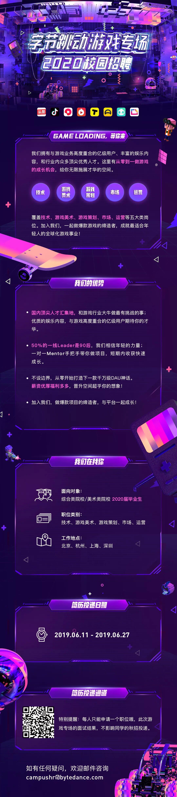
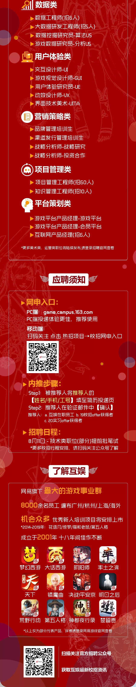
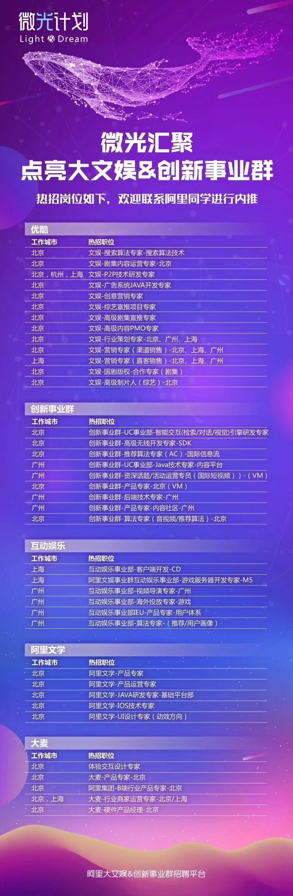
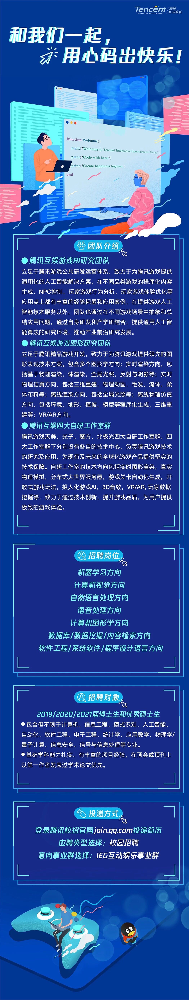

# 字节跳动提前批

1. 6.23投递简历
2. 6.30线上笔试
    
    笔试包含三种题型：选择、简答和编程，简单记录一下：
    - 选择
    1. 下列哪些算法是基于比较的排序算法：桶排序、基数排序、冒泡排序、希尔排序（冒泡排序和希尔排序）
    2. 子网掩码:255.255.255.0，最多接入多少个主机 （答案是254，即2的8次方减2，减去的2是全0的网络地址和全1的广播地址）
    3. hash_map中能否存null值和null键（可以，但hash_table不可以）
    - 简答
    1. 网络传输层协议在游戏中的应用（[腾讯游戏学院](https://gameinstitute.qq.com/community/detail/108640)，总结一下就是如果是由客户端间歇性的发起无状态的查询，并且偶尔发生延迟是可以容忍，那么使用HTTP/HTTPS吧。如果客户端和服务器都可以独立发包，但是偶尔发生延迟可以容忍（比如：在线的纸牌游戏，许多MMO类的游戏），那么使用TCP长连接吧。如果客户端和服务器都可以独立发包，而且无法忍受延迟（比如：大多数的多人动作类游戏，一些MMO类游戏），那么使用UDP吧。这些也应该考虑在内：你的MMO客户端也许首先使用HTTP去获取上一次的更新内容，然后使用UDP跟游戏服务器进行连接。）
    2. 数组、链表、vector的区别（主要是Vector:Vector在程序员角度上是可变长的，但本质上还是定长的，如果一开始分配的空间不够的话，会重新重新分配一个更大的空间，然后进行元素拷贝。）
    3. 同步io与异步io的区别（所谓同步，就是在发出一个功能调用时，在没有得到结果之前，该调用就不返回。也就是必须一件一件事做,等前一件做完了才能做下一件事。同步，就是我调用一个功能，该功能没有结束前，我死等结果。异步的概念和同步相对。当一个异步过程调用发出后，调用者不能立刻得到结果。实际处理这个调用的部件在完成后，通过状态、通知和回调来通知调用者。异步，就是我调用一个功能，不需要知道该功能结果，该功能有结果后通知我（回调通知）。）
    4. 设计一个monster的AI
    - 编程
    1. 输出链表中终点距离为k的节点值（水题）
    2. Leetcode 135 Candy
    3. 马里奥跳板。大意是，给定一个数组，[3,0,2,1]，和一个起始位置p，数组的值表示最大跳跃的距离，问从起始位置能够跳到终点，即数组长度加1的地方。（简单的BFS）

3. 7.5日十一点半接到短信和邮件，通知视频面试，但可供选择的周六和周日两个时间已经全部灰了。第二天再看，可供选择的天数变多了，所以约了周二下午3点。

4. 7.8日晚十点，电话通知修改面试时间，改到了周四上午十一点。

# 网易游戏校园招聘

1. 6.30投递简历，两个志愿，一个客户端一个图形渲染。

# 阿里互娱微光计划
（了解一下基本岗位，貌似只能内推，所以没投）

# 腾讯大咖IEG

1. 8.1才能投递简历