# 腾讯

## 腾讯大咖

并没有找到投递入口，据说只有8.1的正式招聘

## 腾讯光子技术中心


参加了个光子技术中心游戏引擎方向的沙龙，有现场面试但是觉得跟自己不太匹配就提前离开了，然后过几天那边回了电话，进行了电话面试，感觉回答地还行，但面试官好像不是很满意，又给了学习建议，总结一下就是永远不要说自己的缺点，要多看未来的东西，说自己在未来即将接触和学习这方面的东西才可以，目前还不会这种否定语句。

这里记录一下面试的问题：
1. 渲染管线
2. c++堆内存和栈内存的区别
3. 虚函数表指针在什么位置（对象头部有4个字节，存储虚函数表的位置）

## 腾讯互娱
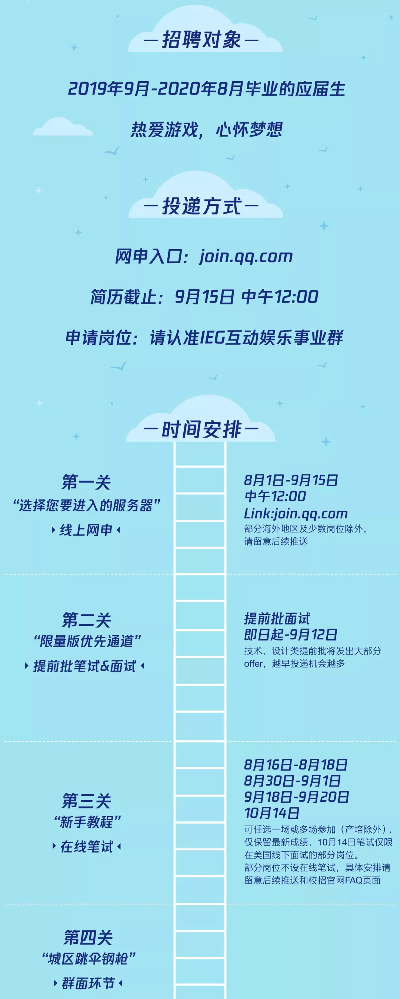
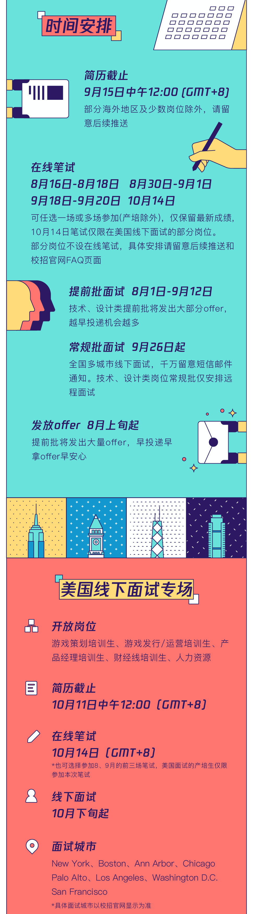
1. 8.18 在[网申链接](http://join.qq.com)投递简历，地点选择了腾讯深圳总部


# 网易

## 网易游戏


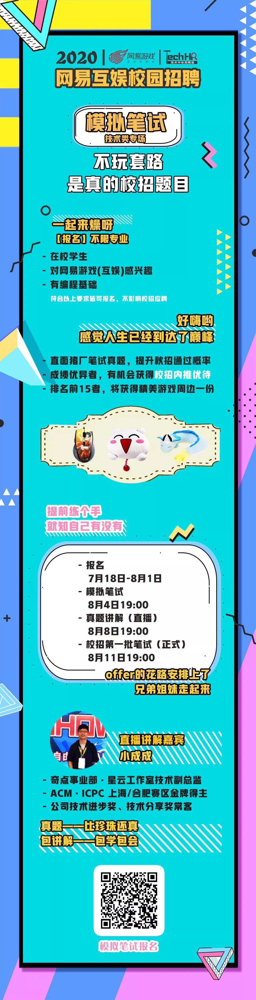

1. 6.30 投递简历，两个志愿，一个客户端一个图形渲染。
2. 8.4 模拟笔试，时长两小时，一共三道题，第一题算个人所得税；第二题字符串压缩，将超过4个的连续递增的字符压缩为“开头-结尾”的形式，比如ABCDE压缩为A-E；第三题为简单的n进制转10进制+遍历。一个小时AK
3. 8.9 收到通知，直接进入复试
4. 8.11 正式笔试，有一道题比较有意思。有一个字符串，由N和非N字母组成，最多可以修改其中两个字符，求能得到的最长的连续N的子串长度。比如NNEN，答案为4，即只将E改为N；还有NNENNE，答案为6，将两个E改为N。
    - 简单分析一下题目就会知道，我们修改不可能将N改为其他字符
    - 非N的字符都是一样的
    - 答案一定是我们修改了连续两个非N字符后产生的
    - 所以对于NNENNE，我们进行如下修改，变成2020，其中的2表示有连续多少个N，之后我们遍历连续的两个0，将其改为1，看是否能连起来，比如这道题修改完之后就是2121，中间没有0，因此可以得到此时的最长N串长度为6

## 网易雷火事业群

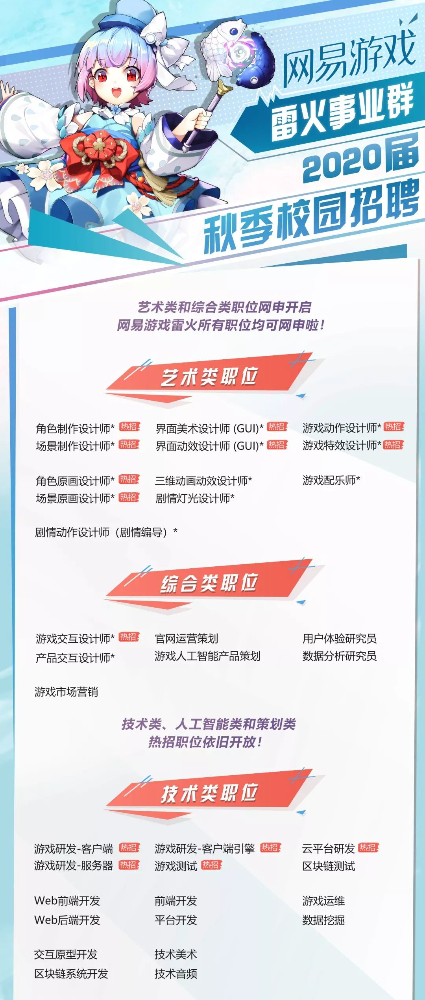
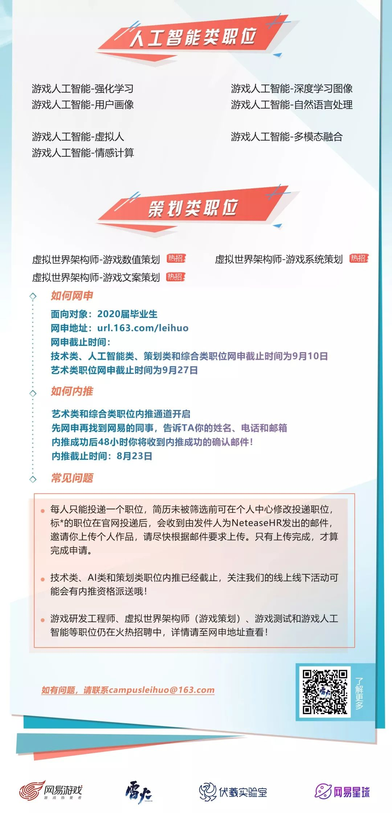
1. 7.15投递简历，游戏研发工程师(客户端方向)。
2. 7.25日参加线下宣讲会，当场面试，遇到了自己之前面试网易雷火暑期实习生的面试官，问的问题差不多，因为之前做了些总结，所以结果还可以。
    
    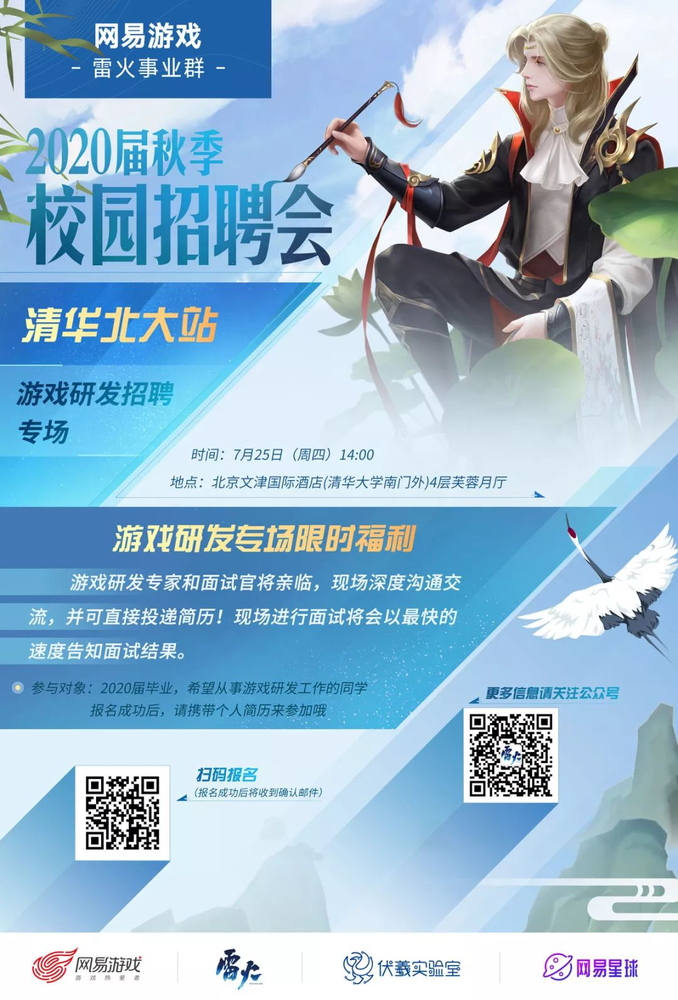

3. 7.26日主动问了下Hr，说是通过了，所以等后期通知吧。
4. 8.9日接到电话和预录取函，年薪30+，算是自己的第一个offer了吧，个人比较满意，也有信心去投其他的公司了。

总结一下面试问到的问题，主要是一面的内容，因为二面一直在问简历上的项目，数模IBM这些很久远的东西，都有点记不清了，好在是自己实打实做过的东西，所以还是能回忆起来一部分内容的。Hr面就是闲聊，没啥好记录的。

- dynamic_cast和static_cast的区别
- c++ new() 失败了会怎么办
- 说几种Unity中的MonoBehaviour
- 渲染管线分别对应Unity中的部分哪些
- UGUI和IMGUI的区别
- 虚拟内存
- 智能指针
- 回去写写多线程程序

## 网易游戏其他
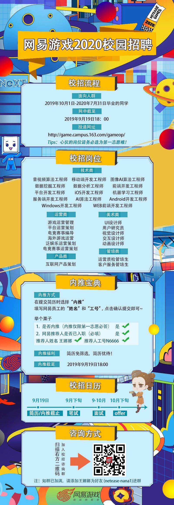
没有发现比较合适的岗位。后来发现这个里面并没有游戏研发，这条线就不跟踪了。

# 字节跳动
## 字节跳动提前批


1. 6.23投递简历
2. 6.30线上笔试
    
    笔试包含三种题型：选择、简答和编程，简单记录一下：
    - 选择
    1. 下列哪些算法是基于比较的排序算法：桶排序、基数排序、冒泡排序、希尔排序（冒泡排序和希尔排序）
    2. 子网掩码:255.255.255.0，最多接入多少个主机 （答案是254，即2的8次方减2，减去的2是全0的网络地址和全1的广播地址）
    3. hash_map中能否存null值和null键（可以，但hash_table不可以）
    - 简答
    1. 网络传输层协议在游戏中的应用（[腾讯游戏学院](https://gameinstitute.qq.com/community/detail/108640)，总结一下就是如果是由客户端间歇性的发起无状态的查询，并且偶尔发生延迟是可以容忍，那么使用HTTP/HTTPS吧。如果客户端和服务器都可以独立发包，但是偶尔发生延迟可以容忍（比如：在线的纸牌游戏，许多MMO类的游戏），那么使用TCP长连接吧。如果客户端和服务器都可以独立发包，而且无法忍受延迟（比如：大多数的多人动作类游戏，一些MMO类游戏），那么使用UDP吧。这些也应该考虑在内：你的MMO客户端也许首先使用HTTP去获取上一次的更新内容，然后使用UDP跟游戏服务器进行连接。）
    2. 数组、链表、vector的区别（主要是Vector:Vector在程序员角度上是可变长的，但本质上还是定长的，如果一开始分配的空间不够的话，会重新重新分配一个更大的空间，然后进行元素拷贝。）
    3. 同步io与异步io的区别（所谓同步，就是在发出一个功能调用时，在没有得到结果之前，该调用就不返回。也就是必须一件一件事做,等前一件做完了才能做下一件事。同步，就是我调用一个功能，该功能没有结束前，我死等结果。异步的概念和同步相对。当一个异步过程调用发出后，调用者不能立刻得到结果。实际处理这个调用的部件在完成后，通过状态、通知和回调来通知调用者。异步，就是我调用一个功能，不需要知道该功能结果，该功能有结果后通知我（回调通知）。）
    4. 设计一个monster的AI
    - 编程
    1. 输出链表中终点距离为k的节点值（水题）
    2. Leetcode 135 Candy
    3. 马里奥跳板。大意是，给定一个数组，[3,0,2,1]，和一个起始位置p，数组的值表示最大跳跃的距离，问从起始位置能够跳到终点，即数组长度加1的地方。（简单的BFS）

3. 7.5日十一点半接到短信和邮件，通知视频面试，但可供选择的周六和周日两个时间已经全部灰了。第二天再看，可供选择的天数变多了，所以约了周二下午3点。

4. 7.8日晚十点，电话通知修改面试时间，改到了周四上午十一点。
5. 最后也没过，写个面经供大家参考吧：

    1. 中午十一点开始一面：时长约40分钟（代码题给了20分钟）
        1. `const` 和 `static` 的区别，修饰不同变量或函数时的区别，变量的生命周期？看一道代码题，说说第三次运行`func()`输出的内容。
        ```c++
        //
        // Created by YCIrving on 2019-07-15.
        //

        #include <stdio.h>

        void func() {
            static int x = 1; // 在对func的三次调用中,x只进行一次初始化
            x = x + 1;
            printf("%d\n", x); // 输出x的值
        }

        int main(int argc, char * const argv[]) {
            func(); // 输出2
            func(); // 输出3
            func(); // 输出4
            return 0;
        }
        ```
        2. 渲染管线了解吗？主要说了渲染流程，谈了谈顶点shader和片段shader
        3. 说一种你熟悉的设计模式？目前只接触到了MVC
        4. 基本STL的底层实现及复杂度？包括`vector`、`map`、`list`
        5. 构造函数和析构函数能否是虚函数？这道题没答好，复习的时候只注意到析构函数可以是虚函数，所以猜测构造函数也可以是虚函数，下来看了答案，只有析构函数可以是虚函数。
        6. 聊了聊项目，问了一下项目中地图编辑器有没有想过撤销操作怎么实现？树形结构怎么解析？
        7. 代码题：十分简单的dp，类似于上楼梯，原题目是给定一个n，从零开始，每次操作只能加6或者加8，输出到达n的最小操作次数。
    2. 面试结束半小时接到电话，下午三点二面：
        1. 说说C++中的`union`（联合体）？没复习到/(ㄒoㄒ)/~~
        2. 说说如何理解`(*(void (*)())0)()`的含义吧？我……（后来面试官给了思路，说里面涉及函数的声明和调用、类型转换、函数指针）
        3. 说说C++中，子类继承父类时，子类实例的内存布局？复习时只看了虚函数表的覆盖，只说了这部分
        4. 看你项目用到了Unity，说说c#中装箱和拆箱？一脸懵逼:)
        5. 那说说C++和C#是类型安全的语言吗？反问了什么叫类型安全，面试官说就是一个概念，我说不知道。面试官友好地做了解答，可以简单理解为能否直接操作内存，C++中有指针，所以不是类型安全的。
        6. 那说说unity中的协程(coroutine)吧？我说自己项目之前打算用，但是写法比较复杂，所以用了`while(true)`，然后不断检查状态的方式实现同步
        7. 那说说Unity中的`yield return`吧，跟你上面的`while(true)`有什么区别？我说`yield return`没有按照我预期的顺序执行代码，所以也没用。面试官继续友好地给出了答案，说`yield return`类似于语法糖，是逐帧进行轮询的，而`while (true)`是按照时间片来轮询的，所以`yield return`效率上会更好一些。（5和6感觉是自己回答最不好的两题，自己下来反思了一下，回答从侧面反映了自己遇到问题会找不同的方法解决，但没有深挖某种方法，比如效率更高的coroutine，只求能运行，这种态度很不好。）
        8. Lua熟悉吗？我说项目正在用，只了解基本的八种数据类型。面试官说……那算了。
        9. 看看你逻辑吧？平面上有一个三角形，已知三个顶点的坐标信息，现在给你另外一个点的坐标，怎么判断这个点在不在三角形内部？看我画了半天，面试官提示说点乘叉乘说一下计算方法和几何意义，我说完之后还是不会。面试官说没关系，就是一些技巧方面的判断。
        10. 说说大顶堆、小顶堆的结构有什么要求？如何删除一个堆顶元素？
        11. 聊了聊动规的本质，我说是状态的转移，通过避免访问已经访问过的状态来提高效率。然后面试官又以最长递增子序列和切木材的例题让我讲一下转移方程（切木材问题是说不同长度的木材有不同的价值，现在有一条长度为n的木材，问怎么切价值最大。我开始说像恰好装满的完全背包问题，面试官说有区别，让我写方程，我写了$dp(n) = max (dp(n-l_i) + v_i)$，面试官还说不对，说$dp(n)$只跟$dp(n-1)$有关，最后我还是觉得有问题，但时间关系只能先接受面试官的意见，然后说我下去再思考一下）
        12. 最后让写一道代码题，是字符串解码。题目是给定一个字符串，目标是将写在`#`和`%`之间的字符串，重复#号前面的数字次(数字只会是个位数)，比如下面这个`he3#llo%world`，解码后是`hellollolloworld`。比较难的点是存在嵌套，比如`he3#ll2#o%wo%rld`,答案是`helloowolloowollooworld`，（原题的样例比这个好看一些，但我实在想不起来了）。类似括号匹配，但还涉及到字符串的复写啥的，规定时间没写出来。面试官说除了使用基本的栈以外，还需要一些数据结构的支持，存储字符串起止点之类的信息。

    3. 二面结束后，一个小时没有接到通知，遂加了面试官微信，确认了确实GG。整个面试“轻松愉快”，面试官友好热情，温文尔雅，给五星好评，秋招还会再来。

    4. 玩笑归玩笑，总结一下自己这次面试失败学到的教训：
        1. 自己只找游戏开发岗，是底线，所以这次面试的目的就是找工作，并不是积累经验，没过有点不开心。
        2. 一面答错了一些问题，主要原因是临时抱佛脚，知识没有深入理解和形成体系。
        3. 二面难度不太适应，基本没有完全符合面试官预期的答案，跟我自己看到的二面面经也有差距（说好的tcp udp呢啊喂！）。上来几个问题问懵了之后就开始慌了，以后心态需要调整好，面试没结束之前永远不要放弃，这也是自己抗压能力的一种体现。
        4. 最后反问环节的问题一定要准备一下，可以问一下游戏相关的，不打算再问新员工培训的问题了，不知道会不会让对方觉得我是到了公司才要开始学习的。
        5. 自己貌似深受“读书无用论”的荼毒，虽然没有表达过，但潜意识里还是认为学校学的东西在工作中用到的概率很少，但现在我连扇自己十个大耳刮子道歉，经典和基础的知识是以后拓展技术栈的基础，十分十分重要，奉劝类似的同学早点摒弃这种想法，打牢基础，至少也能让你在面试中脱颖而出。
        6. 现实很残酷，没必要玻璃心，没过就是没过，重振旗鼓然后再去学习吧~

## 秋招

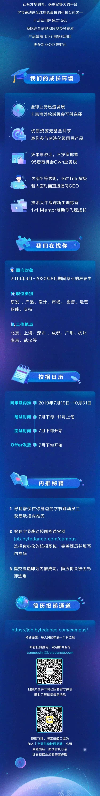

简历投递时间：2019年7月19日至2019年10月31日
      笔试时间：7月下旬至11月上旬
      面试时间：7月下旬开始
      offer时间：7月下旬开始

投递网址：job.bytedance.com/campus

笔试时间：统一笔试共5次，分别是7月28日、8月11日、8月25日、9月8日、9月22日，笔试前1-3个工作日会发送笔试邀请，请耐心等待邮件和短信通知。部分职位的笔试时间可能有调整，具体时间以收到的邮件和短信通知为准。

内推码：ZKTKBDR

- 8.13 官网投递了上海的岗位，发现北京目前只剩下一个引擎研发，所以投了上海的游戏研发

# 阿里巴巴

## 微光计划
（了解一下基本岗位，貌似只能内推，所以没投）

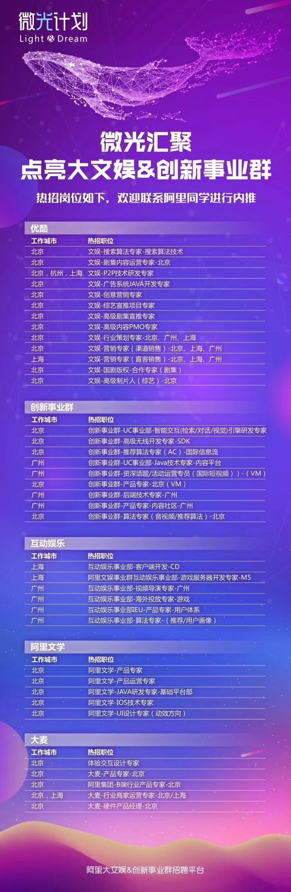

之后找HR内推了，说是可以直通面试，但是还没消息。
## 互娱内推


- 8.9日接到电话，说下周安排面试，一共就两轮，hr和技术。

- 8.12日收到通知，当天进行hr面试。后来说hr要开会，所以耽搁了一会儿。


# 疯狂游戏
## 提前批

投递完简历很快就收到回复了，然后7月20日参加笔试

### 笔试

笔试内容分为9道选择题，9道简答题和1道编程题
考的大部分是一些基本的内容，有几道题印象比较深刻：
1. 说出一个序列，以第一个数为轴，执行一次快排之后的样子；
2. 给定一个ip地址，要求划分4个子网，问子网掩码和各个子网的ip范围
3. 向量点乘和叉乘的区别
4. 位运算：
```c++
#include <iostream>
using namespace std;

int main()
{
    int a = 998;
    int i =0;
    while(a)
    {
        i ++;
        a = a&(a-1);
    }
    cout<<i;
    return 0;
}
```
就是求这个数中1的个数。

5. 算法题是一道动规，没做出来。题目是给定n个数字，求它们之间的大小关系一共有多少种。

### 面试
28号面试，面试官超级讨厌，首先面试前期一直玩手机，然后问不出什么有水平的问题，就是常见的面试题来回问，也不给提示，最讨厌的是还劝我不要进入游戏行业，我可QNMLGB吧，这样的公司不去也罢，招聘群里也是一帮愣头青，还推测Hr打电话的顺序，Hr还有空回复他们，我也是醉醉的。

不过，吐槽归吐槽，问的问题确实不太会，面试官也给了一些建议，包括学习基础和渲染的东西，这里记一下。
1. 说说你知道的排序算法
2. 对一个基本有序的数组排序，用哪种算法比较合适，时间复杂度呢（插入排序比较好）
3. 有n个文件，需要动态返回最近使用的k个文件，文件按文件名索引，时间用时间戳表示。

# 搜狐畅游
- 8.13 打算申请C++和U3D开发工程师两个职位，[投递链接](http://zhaopin.changyou.com/wt/changyou/web/index/campus)，但现实我已经申请过了，不让再申请了。

# 完美世界
## 内推


[内推链接](https://www.nowcoder.com/careers/pwrd/6040?source=5992C001305F117D443FC85CDB90BABC213CE488DB49A380&type=neitui&ncsr=)

[网申链接](http://campus.wanmei.com/job.html)

- 8.13从内推链接里投递了两个职位：游戏C++开发工程师、C++客户端开发工程师（互联网业务）

## 核心舱计划
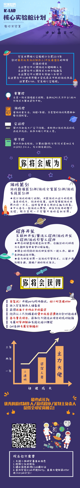

- 8.14 网上投递了简历
- 接到通知让28号去现场面试，问了自己的细分方向，估计面试时C++会问很多问题，但是给报销出租车，还不错哦

# 西山居
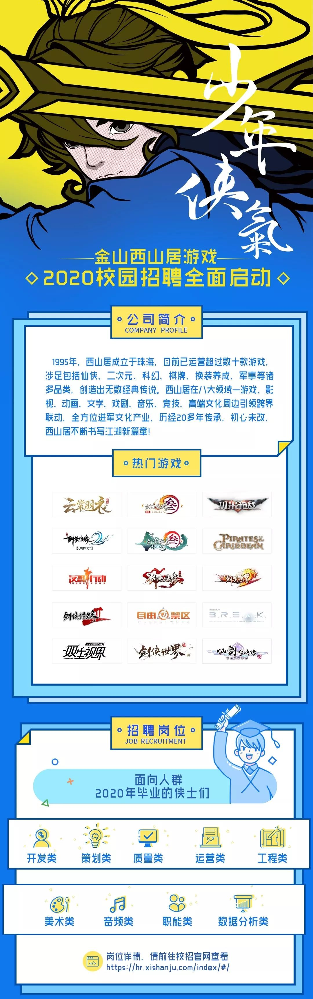
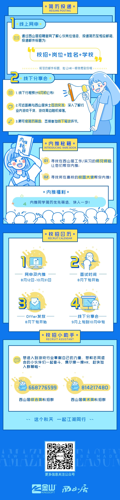

[职位链接](https://hr.xishanju.com/school-job.html?typeId=1&t=1&page_list=2)，应聘客户端开发工程师。简单粗暴，直接发邮件：
发送电子版简历＋作品，至xsj_bjhr@kingsoft.com邮箱
邮件标题及简历命名格式：【应聘岗位】+姓名+学校
如 【客户端开发工程师】+高宜琛+北京大学
- 8.13 发了邮件

# 盛趣游戏（上海）
[公众号推送链接](https://mp.weixin.qq.com/s/ido5IoNopDjGoC_BCH86QA)

[网申链接](http://recruit.shengqugames.com/2020/index.html#slide2)
- 8.13 手机验证码登录，投递了两个职位，U3D和UE4客户端开发工程师。

# 猎豹移动（北京）

[网申链接](http://hr.cmcm.com/campus)上目前还没有任何职位可供选择，及时关注公众号和网申链接

# 盖娅游戏

[网申链接](http://www.gaea.com/cn/position)
- 8.18 直接给Hr发了邮件

# 莉莉丝
## 内推
- 8.18 因为在[校招链接](http://www.hotjob.cn/wt/LilithGames/web/index/campus)上看招的全部是实习生，所以在牛客网上找到了相关帖子，发现只面向社招，但还是允许校招投递，所以给内推人邮箱（417875723@qq.com）发了简历。

# 4399（广州）
## 内推
[网申链接](http://web.4399.com/campus/zhaopin/#314175)
内推码：8xxhz

- 申请了U3D开发工程师
- 报名了9.23日晚7点的清华大学宣讲会

# 尚游（深圳）
[网申链接](http://campus.syyx.com/)上还没开放20届校招

# IGG（福州）
[网申链接](http://cn.jobs.igg.com/careers.php)目前还没开始校招

# 快手

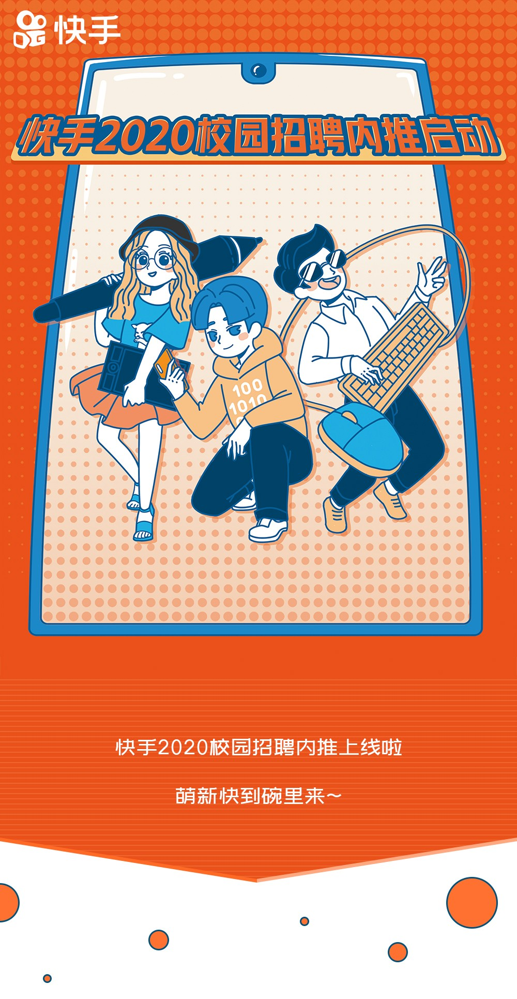
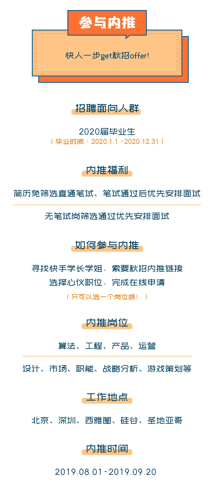


8.13 投递简历，并找人内推：
[投递链接](https://campus.kuaishou.cn/recruit/campus/e/#/campus/index/)

# 吉比特&雷霆游戏
## 网申
[网申链接](https://campus.g-bits.com/recruit)

内推码：G-Offer
- 8.19 申请游戏研发职位

# 祖龙娱乐（北京）
## 网申
[网申链接](http://zulongwx.tupu360.com/position/positionList?enter=menu)

[网申链接2](http://zulong.tupu360.com/campus/resumeMgt/edit)

- 8.19 投递了游戏开发工程师（客户端）

## 校招直通车
8月22日（周四）10:00
北京东城区 祖龙娱乐公司
将简历发送至：huangwanqiu@zulong.com
2020校招直通车报名-姓名-应聘职位

# Garena竞乐（上海）

[网申链接](https://www.nowcoder.com/careers/Garena/6419)
- 8.19 申请游戏客户端开发工程师，同时给hr发了邮件内推(hr@garena.cn)

# 巨人网络（上海）

## 内推
- 8.19 投递游戏开发工程师岗位

# 米哈游（上海）

## 网申
[网申链接](https://campus.mihoyo.com/#/)

# 三七互娱（广州）

## 网申
[网申链接](http://zhaopin.37.com/index.php?m=Home&c=campus&a=post_info&id=998)

# 农业银行
本不该出现在这里……

>中国农业银行总行研发中心2020年校园招聘 2019-08-13 

>一、应聘基本条件
1.境内外院校全日制大学本科及以上学历应届毕业生。其中，境内院校毕业生应于2020年毕业，并在7月31日前取得毕业证、学位证、就业报到证；境外留学生应为2019年1月1日至2020年7月31日间毕业，入行报到时需取得国家教育部国外学历学位认证书。
2.计算机、软件工程、电子工程、自动化、管理科学与工程、数学等计算机相关专业。
3.全日制硕士研究生及以上学历英语须通过国家大学英语六级（CET6）考试（成绩425分及以上），或托业（TOEIC）听读公开考试715分及以上，或新托福（TOEFL-IBT）考试85分及以上，或雅思（IELTS）考试6.5分及以上；全日制本科学历英语须通过国家大学英语四级（CET4）考试（成绩425分及以上），或托业（TOEIC）听读公开考试630分及以上，或新托福（TOEFL-IBT）考试75分及以上，或雅思（IELTS）考试5.5分及以上。 
4.诚实守信、遵纪守法；综合素质较好，具有较强的研究分析、文字综合、沟通协调和开拓创新能力，有团队合作精神。 
5.身心健康。 
6.其他应聘条件见具体岗位要求。
>
>二、招聘岗位与需求
软件研发岗和测试开发岗共650人，其中，北京130人，广州60人，上海110人，天津60人，成都60人，西安130人，武汉100人。
软件研发岗从事银行核心业务、互联网金融、大数据与人工智能应用、云计算及分布式平台、微服务框架、开放银行平台、业务及技术中台、精准营销、数字化运营、智能风控、智慧信贷、金融市场、信息安全等应用领域的研发、测试与工程实施。工作地点分设在北京（丽泽金融商圈，稻香湖科技创新园）、广州、上海、天津、成都、西安、武汉。
测试开发岗承担农业银行测试管理规范研究和前瞻性测试技术研究，以及测试平台与测试工具的研发与维护推广；承担全行应用项目的系统测试和重要系统的用户体验测试，以及全行性应用的支撑软件与金融机具的适应性测试等等。工作地点分设在北京（丽泽金融商圈，稻香湖科技创新园）、广州、上海、西安、武汉。

>三、招聘流程及宣讲城市
（一）招聘流程
具体招聘流程：启动报名——首批笔试（初定8月31日）——入校宣讲及面试（9月）——首批集中面试（9月中旬）——首批体检——第二批笔试（初定9月28日）——第二批集中面试（10中旬）——第二批体检——分批发放offer（9月上旬-10月中旬）。

>（二）网申时间
报名时间：即日起——2019年9月24日。
报名地址：https://career.abchina.com/
（敲黑板）我中心将从截至8月26日前接收的简历中择优邀请参加首批笔、面试，并在入校宣讲的同时组织现场面试。未参加第一批笔试的同学，仍有机会参加第二批笔试。
投递简历后也可以寻找研发中心内部的师兄师姐们帮助内推。

>（三）笔、面试安排与入校宣讲
>1.第一批笔试：初定于8月31日，笔试地点设在全国25个宣讲城市，应聘人员可在应聘职位时根据时间安排自行选择，初步计划笔试结束后3个工作日左右发送面试邀请。

>2.入校宣讲及现场面试：我中心将于9月2日－9月24日期间在全国25个城市54所高校入校宣讲，并组织现场面试，面试通过后第一时间组织体检。初步安排如下：

>北京线：北京；

>东北线：沈阳，长春，哈尔滨；
>西北线：太原，西安、兰州；
>华南线：广州，长沙，武汉，厦门，南宁；
>东南线：上海，杭州，合肥，南京，苏州；
>东线：天津，大连，济南，青岛；
>西南线：成都，重庆，昆明，贵阳。
>
>各个城市、高校具体的入校宣讲时间，我中心将于8月下旬陆续发布，请关注我行招聘网站和我中心招聘微信公众号：abcrkhr。

>3.第一批集中面试（北京、广州、上海、天津、成都、西安、武汉七地开展

- 8.17 报名 [网申链接](https://career.abchina.com/)
