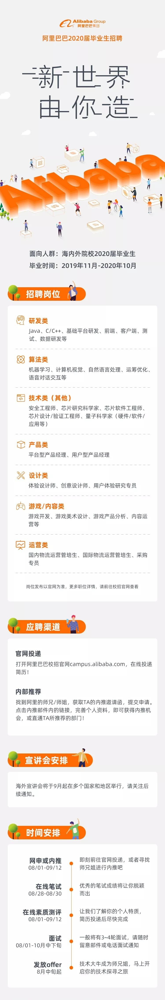

# 腾讯（上海）

## 腾讯大咖

并没有找到投递入口，据说只有8.1的正式招聘。游戏研发方向应该没有大咖吧。

## 腾讯光子技术中心

参加了个光子技术中心游戏引擎方向的沙龙，有现场面试但是觉得跟自己不太匹配就提前离开了，然后过几天那边回了电话，进行了电话面试，感觉回答地还行，但面试官好像不是很满意，又给了学习建议，吸取的经验就是永远不要说自己的缺点，要多看未来的东西，说自己在未来即将接触和学习这方面的东西才可以，目前还不会这种否定语句。

## 腾讯互娱

1. 8.18 在[网申链接](http://join.qq.com)投递简历，地点选择了腾讯深圳总部
2. 8.28 视频一面，顺利通过。这么多面试官中，腾讯是唯一一个找到我github的，我觉得很厉害。
3. 9.14 视频二面，没有通过o(╥﹏╥)o，算法题三问只答出了两问，后面问了为什么没过，那边给的回复是缺少一些好的demo。
4. 后面又打电话说，当时是因为没有hc了，现在有个那边有个同学突然离职了，所以空出了一个hc，问我是否愿意去。当然愿意了哈哈哈。
5. 之后走了正式批的流程，简历之前还被光子拿到了，沟通后顺利释放并被北极光这边拿到，最后就是顺利拿到offer。

# 网易（上海、杭州）

## 网易互娱（上海）

1. 6.30 投递简历，两个志愿，一个客户端一个图形渲染。
2. 8.4 模拟笔试，时长两小时，一共三道题，第一题算个人所得税；第二题字符串压缩，将超过4个的连续递增的字符压缩为“开头-结尾”的形式，比如ABCDE压缩为A-E；第三题为简单的n进制转10进制+遍历。一个小时AK
3. 8.9 收到通知，直接进入复试
4. 8.11 正式笔试，有一道题比较有意思。有一个字符串，由N和非N字母组成，最多可以修改其中两个字符，求能得到的最长的连续N的子串长度。比如NNEN，答案为4，即只将E改为N；还有NNENNE，答案为6，将两个E改为N。
    - 简单分析一下题目就会知道，我们修改不可能将N改为其他字符
    - 非N的字符都是一样的
    - 答案一定是我们修改了连续两个非N字符后产生的
    - 所以对于NNENNE，我们进行如下修改，变成2020，其中的2表示有连续多少个N，之后我们遍历连续的两个0，将其改为1，看是否能连起来，比如这道题修改完之后就是2121，中间没有0，因此可以得到此时的最长N串长度为6
5. 收到邮件，约了29号下午3-4点的面试，需要好好准备一下
6. 感觉面试官没有睡醒的样子，不过还是顺利通过了，后来接到短信说要安排现场面试，到时候一定要记得换一下城市。
7. 现场面试一开始就五六个人拉到一个屋子写题，写了一下strncpy的实现，写得不是很好，但时间很充裕。
8. 现场二面面试官人很好，聊了聊项目，问了一个“挤163”的题目，在一堆数字中将所有的“1、6、3”移动到数组末尾，并保持顺序不变。题目要求不使用额外空间，并且在On时间内解决，只想到了双指针的方式，但需要额外空间来存储所有的“1、6、3”。没有想到其他解法。之后strncpy这个题被说写的很一般，是减分项吧。
9. hr面是一个很蠢的hr，全程没看过我，问问题也爱答不理，我跟他提了换工作地点的事，最后的offer还是广州，真的蠢。
10. 后面接到消息说面试通过，奇葩的是现场领取纸质版offer，由二面面试官亲自颁发，现场签约，于是大早晨又跑过去拿offer，改了工作地点，不过好在薪资是自己目前所有offer里最高的，知足了。

## 网易雷火（杭州）

1. 7.15投递简历，游戏研发工程师(客户端方向)。
2. 7.25日参加线下宣讲会，当场面试，遇到了自己之前面试网易雷火暑期实习生的面试官，问的问题差不多，因为之前做了些总结，所以结果还可以。
    
    

3. 7.26日主动问了下Hr，说是通过了，所以等后期通知吧。
4. 8.9日接到电话和预录取函，年薪30+，算是自己的第一个offer了吧，个人比较满意，也有信心去投其他的公司了。
5. 雷火不仅给寄了中秋节礼物，还安排技术负责人来专门对接，我觉得这个诚意真的很可以了。
6. 后面用网易互娱的offer跟雷火谈了一下，月薪涨了1.5K……

## 网易游戏其他

没有发现比较合适的岗位。后来发现这个里面并没有游戏研发，这条线就不跟踪了。

# 米哈游（上海）

## 网申
[网申链接](https://campus.mihoyo.com/#/)
- 9.7 笔试
- 之后面试了一轮，感觉还可以，于是就通知现场面试
- 坐高铁到了上海，参加了一共三轮面试，可见那边对应届生要求比较严格。另外发现自己编程题在所有笔试同学中排第一，很开心哈哈哈。
- 后面hr沟通了薪资，很满意，主程也专门打电话来跟我聊了很多，确实项目无论是人员配置还是游戏本身都是很棒的，但是还是希望能够先去腾讯，所以只能拒绝了。

# 祖龙娱乐（北京）
## 网申
[网申链接](http://zulongwx.tupu360.com/position/positionList?enter=menu)

[网申链接2](http://zulong.tupu360.com/campus/resumeMgt/edit)

## 校招直通车
8月22日（周四）10:00
北京东城区 祖龙娱乐公司
将简历发送至：huangwanqiu@zulong.com
2020校招直通车报名-姓名-应聘职位

- 8.19 投递了游戏开发工程师（客户端）
- 8.20 接到电话，确定周四上午十点去参加现场活动
- 8.22 参加了现场笔试和面试，题目很硬核，但应该能够拿到offer
- 顺利拿到了offer，觉得还是可以去的。

# 完美世界（北京）
## 内推

[内推链接](https://www.nowcoder.com/careers/pwrd/6040?source=5992C001305F117D443FC85CDB90BABC213CE488DB49A380&type=neitui&ncsr=)

[网申链接](http://campus.wanmei.com/job.html)

- 8.13从内推链接里投递了两个职位：游戏C++开发工程师、C++客户端开发工程师（互联网业务）

## 核心舱计划

- 8.14 网上投递了简历
- 接到通知让28号去现场面试，问了自己的细分方向，估计面试时C++会问很多问题，但是给报销出租车，还不错哦
- 28号参加了面试，有点水，但是顺利拿到offer
- 10月底一直没人联系我，于是找hr问了情况，那边说当时面试的人是服务器，现在11月6号还得去一趟，找客户端的人来面试，我他妈……只能同意了。

# 搜狐畅游（北京）
- 8.13 打算申请C++和U3D开发工程师两个职位，[投递链接](http://zhaopin.changyou.com/wt/changyou/web/index/campus)，但现实我已经申请过了，不让再申请了。
- 后面收到短信说可以直接参加笔试和面试，于是就参加了笔试和面试，也顺利通过。
- 月薪20K，大概率拿户口，项目组是天龙八部，觉得没啥吸引力。

# 字节跳动（北京、上海）
## 字节跳动提前批

1. 6.23投递简历
2. 6.30线上笔试

## 秋招

简历投递时间：2019年7月19日至2019年10月31日
      笔试时间：7月下旬至11月上旬
      面试时间：7月下旬开始
      offer时间：7月下旬开始

投递网址：job.bytedance.com/campus

笔试时间：统一笔试共5次，分别是7月28日、8月11日、8月25日、9月8日、9月22日，笔试前1-3个工作日会发送笔试邀请，请耐心等待邮件和短信通知。部分职位的笔试时间可能有调整，具体时间以收到的邮件和短信通知为准。

内推码：ZKTKBDR

- 8.13 官网投递了上海的岗位，发现北京目前只剩下一个引擎研发，所以投了上海的游戏研发

- 9.4 连着挂了我三次，这个公司以后被我ban了！三面面试官问了我：“如果我把你挂了你觉得是因为什么”，跟我这儿装你妈的孙子呢？傻逼玩意儿！以后再碰到这种面试官老子一定要怼回去！

- 11.1 又又又面了一次，一个字节跳动的hr突然打电话说，看到我投了三次简历，最后一次没过很可惜，说邀请我再投递一次，于是我又羞耻的答应了。结果来面试的是后端，问了一些基础知识答得也不好，于是又又又挂了，哭死。
    
    放四张拒信的截图激励自己，知耻后勇，这个公司以后被我ban了，绝对不会投了。

    
    
    
    

# 阿里巴巴（广州）

## 微光计划
（了解一下基本岗位，貌似只能内推，所以没投）

之后找HR内推了，说是可以直通面试，但是还没消息。
## 互娱内推

- 8.9日接到电话，说下周安排面试，一共就两轮，hr和技术。

- 8.12日收到通知，当天进行hr面试。后来说hr要开会，所以耽搁了一会儿。

- 后面进行了hr面试和技术负责人面试，说进去是做引擎，感觉也还ok，但是目前还没有消息。

- 之后收到了意向书，谈了月薪20K。不会去了应该。

# 疯狂游戏（北京）
## 提前批

投递完简历很快就收到回复了，然后7月20日参加笔试

### 笔试

笔试内容分为9道选择题，9道简答题和1道编程题

### 面试
28号面试，面试官超级讨厌，首先面试前期一直玩手机，然后问不出什么有水平的问题，就是常见的面试题来回问，也不给提示，最讨厌的是还劝我不要进入游戏行业，我可QNMLGB吧，这样的公司不去也罢，招聘群里也是一帮愣头青，还推测Hr打电话的顺序，Hr还有空回复他们，我也是醉醉的。

不过，吐槽归吐槽，问的问题确实不太会，面试官也给了一些建议，包括学习基础和渲染的东西

# 西山居（北京）

[职位链接](https://hr.xishanju.com/school-job.html?typeId=1&t=1&page_list=2)，应聘客户端开发工程师。简单粗暴，直接发邮件：
发送电子版简历＋作品，至xsj_bjhr@kingsoft.com邮箱
邮件标题及简历命名格式：【应聘岗位】+姓名+学校
如 【客户端开发工程师】+高宜琛+北京大学
- 8.13 发了邮件
- 杳无音讯……

# 盛趣游戏（上海）
[公众号推送链接](https://mp.weixin.qq.com/s/ido5IoNopDjGoC_BCH86QA)

[网申链接](http://recruit.shengqugames.com/2020/index.html#slide2)
- 8.13 手机验证码登录，投递了两个职位，U3D和UE4客户端开发工程师。
- 电话面了一面，面试官比我还客气，强调了我笔试成绩好，然后我跟人家说了个vector结果还说错了，把stack底层可以使用list和array安到了vector头上，蠢哭了。
- 之后是hr面试，很快，例行询问，大概十五分钟就结束。

# 猎豹移动（北京）

[网申链接](http://hr.cmcm.com/Portal/Apply/Index)

- 8.20 网申
- 杳无音讯……

# 盖娅游戏（北京）

[网申链接](http://www.gaea.com/cn/position)
- 8.18 直接给Hr发了邮件
- 同样杳无音讯……

# 莉莉丝（上海）
## 内推
- 8.18 因为在[校招链接](http://www.hotjob.cn/wt/LilithGames/web/index/campus)上看招的全部是实习生，所以在牛客网上找到了相关帖子，发现只面向社招，但还是允许校招投递，所以给内推人邮箱（417875723@qq.com）发了简历。
- 杳无音讯……

# 4399（广州）
## 内推
[网申链接](http://web.4399.com/campus/zhaopin/#314175)
内推码：8xxhz

- 申请了U3D开发工程师
- 报名了9.23日晚7点的清华大学宣讲会
- 后面参加了现场面试，也没问什么东西，hr给我一种很诡异的感觉，第二天还面了CEO，最后也没什么消息。

# 尚游（深圳）
[网申链接](http://campus.syyx.com/)上还没开放20届校招

# IGG（福州）
[网申链接](http://cn.jobs.igg.com/careers.php)目前还没开始校招

# 快手（北京）

- 8.13 投递简历，并找人内推：
[投递链接](https://campus.kuaishou.cn/recruit/campus/e/#/campus/index/)
- 8.25 笔试
- 之后直接被拒了，写的是不合适

# 吉比特&雷霆游戏（深圳/厦门）
## 网申
[网申链接](https://campus.g-bits.com/recruit)

内推码：G-Offer
- 8.19 申请游戏研发职位
- 9.7 笔试
- 后面面试复盘了笔试题目，当时我考虑厦门也不会去，第二题又是经典的tsp问题，于是就上网搜了一下，提交发现还通过了，于是也懒得改，没想到面试就被问到了，气氛一度十分尴尬，秋招唯一一次笔试作弊就被抓，以后再也不敢了。当然面试最后也没过……

# Garena竞乐（上海）

[网申链接](https://www.nowcoder.com/careers/Garena/6419)
- 8.19 申请游戏客户端开发工程师，同时给hr发了邮件内推(hr@garena.cn)
- 8.20 接到电话，了解了公司，确认还可投递管培生的岗位，确定了下周一晚上七点笔试
- 确定9.4晚上一面
- 面试问的问题全是自己准备的，我觉得面试官是看着某个复习资料问的

# 巨人网络（上海）

## 内推
- 8.19 投递游戏开发工程师岗位
- 9.6 笔试
- 后面现场面了两轮，也基本通过了，也夸我笔试成绩好，我有这么厉害？hr也沟通了薪资，然后后期接到一个电话，问了我基本情况后再没有联系过我了。

# 三七互娱（广州）

## 网申
[网申链接](http://zhaopin.37.com/index.php?m=Home&c=campus&a=post_info&id=998)

# 心动网络 X TapTap（上海）
[网申链接](https://www.nowcoder.com/careers/XD/6632)

# Ubisoft（上海）
## 网申
- 发了简历进行网申。网申邮箱：sha-recruitment@ubisoft.com
- 后面也杳无音讯。

# 农业银行（北京）
本不该出现在这里……

>中国农业银行总行研发中心2020年校园招聘 2019-08-13 

>一、应聘基本条件
1.境内外院校全日制大学本科及以上学历应届毕业生。其中，境内院校毕业生应于2020年毕业，并在7月31日前取得毕业证、学位证、就业报到证；境外留学生应为2019年1月1日至2020年7月31日间毕业，入行报到时需取得国家教育部国外学历学位认证书。
2.计算机、软件工程、电子工程、自动化、管理科学与工程、数学等计算机相关专业。
3.全日制硕士研究生及以上学历英语须通过国家大学英语六级（CET6）考试（成绩425分及以上），或托业（TOEIC）听读公开考试715分及以上，或新托福（TOEFL-IBT）考试85分及以上，或雅思（IELTS）考试6.5分及以上；全日制本科学历英语须通过国家大学英语四级（CET4）考试（成绩425分及以上），或托业（TOEIC）听读公开考试630分及以上，或新托福（TOEFL-IBT）考试75分及以上，或雅思（IELTS）考试5.5分及以上。 
4.诚实守信、遵纪守法；综合素质较好，具有较强的研究分析、文字综合、沟通协调和开拓创新能力，有团队合作精神。 
5.身心健康。 
6.其他应聘条件见具体岗位要求。
>
>二、招聘岗位与需求
软件研发岗和测试开发岗共650人，其中，北京130人，广州60人，上海110人，天津60人，成都60人，西安130人，武汉100人。
软件研发岗从事银行核心业务、互联网金融、大数据与人工智能应用、云计算及分布式平台、微服务框架、开放银行平台、业务及技术中台、精准营销、数字化运营、智能风控、智慧信贷、金融市场、信息安全等应用领域的研发、测试与工程实施。工作地点分设在北京（丽泽金融商圈，稻香湖科技创新园）、广州、上海、天津、成都、西安、武汉。
测试开发岗承担农业银行测试管理规范研究和前瞻性测试技术研究，以及测试平台与测试工具的研发与维护推广；承担全行应用项目的系统测试和重要系统的用户体验测试，以及全行性应用的支撑软件与金融机具的适应性测试等等。工作地点分设在北京（丽泽金融商圈，稻香湖科技创新园）、广州、上海、西安、武汉。

>三、招聘流程及宣讲城市
（一）招聘流程
具体招聘流程：启动报名——首批笔试（初定8月31日）——入校宣讲及面试（9月）——首批集中面试（9月中旬）——首批体检——第二批笔试（初定9月28日）——第二批集中面试（10中旬）——第二批体检——分批发放offer（9月上旬-10月中旬）。

>（二）网申时间
报名时间：即日起——2019年9月24日。
报名地址：https://career.abchina.com/
（敲黑板）我中心将从截至8月26日前接收的简历中择优邀请参加首批笔、面试，并在入校宣讲的同时组织现场面试。未参加第一批笔试的同学，仍有机会参加第二批笔试。
投递简历后也可以寻找研发中心内部的师兄师姐们帮助内推。

>（三）笔、面试安排与入校宣讲
>1.第一批笔试：初定于8月31日，笔试地点设在全国25个宣讲城市，应聘人员可在应聘职位时根据时间安排自行选择，初步计划笔试结束后3个工作日左右发送面试邀请。

>2.入校宣讲及现场面试：我中心将于9月2日－9月24日期间在全国25个城市54所高校入校宣讲，并组织现场面试，面试通过后第一时间组织体检。初步安排如下：

>北京线：北京；

>东北线：沈阳，长春，哈尔滨；
>西北线：太原，西安、兰州；
>华南线：广州，长沙，武汉，厦门，南宁；
>东南线：上海，杭州，合肥，南京，苏州；
>东线：天津，大连，济南，青岛；
>西南线：成都，重庆，昆明，贵阳。
>
>各个城市、高校具体的入校宣讲时间，我中心将于8月下旬陆续发布，请关注我行招聘网站和我中心招聘微信公众号：abcrkhr。

>3.第一批集中面试（北京、广州、上海、天津、成都、西安、武汉七地开展

- 8.17 报名，岗位是软件研发 [网申链接](https://career.abchina.com/)
- 按要求准备，据说31号笔试
    1. 计算机基础扎实，熟练掌握C、C++、JAVA、C#中任意一门编程语言。 
    2. 熟练掌握Hadoop、MySQL、PostgreSQL、MongoDB、Redis、Memcached、Cassandra、SQLite中任意一项开发和管理技术。
    3. 了解windows、unix、linux等主流操作系统原理，了解一种或多种数据库。

# 心得
待补充，等我跟女票都确定下来再来写